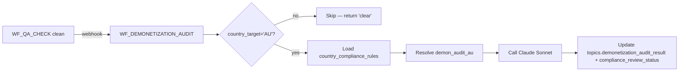

# AU compliance + demonetization audit

Australia has stricter regulatory exposure on creator finance content than
most markets — ASIC, NCCP, and YouTube's advertiser-friendly guidelines all
intersect. This page documents how the AU overlay enforces compliance.

## The 4 disclaimers (`prompt_templates`)

| ID | Title | Required for | `requires_compliance_role` |
|---|---|---|---|
| `AU:AD-01` | General Advice Warning (ASIC RG 244) | super_au, property_mortgage_au, etf_investing_au | ✅ |
| `AU:AD-02` | Past Performance | property_mortgage_au, etf_investing_au | ✅ |
| `AU:AD-03` | Affiliate Disclosure (YouTube + ACCC) | always | — |
| `AU:AD-04` | Credit Card Comparison Rate (NCCP) | credit_cards_au (when interest rates mentioned) | ✅ |

### `AU:AD-01` — General Advice Warning (verbatim)

> This video contains general information only and does not constitute personal financial advice. It does not take into account your objectives, financial situation, or needs. Before making any financial decision, consider whether the information is appropriate for your circumstances and consider seeking advice from a licensed financial adviser.

### `AU:AD-02` — Past Performance

> Past performance is not a reliable indicator of future performance. Investments can go down as well as up.

### `AU:AD-03` — Affiliate Disclosure

> Some of the links in this description are affiliate links. CardMath may earn a commission from qualifying purchases at no cost to you. This does not influence our editorial coverage.

### `AU:AD-04` — NCCP Comparison Rate (template)

> Interest rates shown are `{{rate}}`% p.a. Comparison rate: `{{comparison_rate}}`% p.a. based on `{{warning_amount}}` over `{{warning_term}}`. Warning: This comparison rate applies only to the example given and may not include all fees and charges.

The `{{rate}}`, `{{comparison_rate}}`, `{{warning_amount}}`, `{{warning_term}}` are runtime-substituted by `WF_DEMONETIZATION_AUDIT` based on the topic's content (the audit detects when a rate is mentioned and inserts the comparison-rate disclosure).

## Compliance rules (`country_compliance_rules`)

Four blocker/manual-review rules seeded by migration 032 §H:

### `au_asic_general_advice` — blocker

**Triggers when:** `niche_variant IN (super_au, property_mortgage_au, etf_investing_au)`
**Required:** general advice warning title card in first 10s + full AFSL disclaimer in description + no personal financial advice language
**Blocked phrases:** `you should buy`, `I recommend`, `guaranteed returns`, `risk-free`, `this will make you money`

### `au_credit_nccp` — blocker

**Triggers when:** `niche_variant = credit_cards_au`
**Required:** comparison rate disclosure when mentioning rates + target market determination awareness
**Blocked phrases:** `guaranteed approval`, `no credit check`

### `au_property_promotion` — blocker

**Triggers when:** `niche_variant = property_mortgage_au`
**Required:** historical volatility acknowledgment + not-personal-advice framing
**Blocked phrases:** `passive income`, `financial freedom`, `replace your salary`, `guaranteed capital growth`

### `au_bnpl_avoidance` — manual_review

**Triggers when:** primary keyword matches `(afterpay|zip|klarna|humm|bnpl|buy now pay later)`
**Action:** flag for manual review (BNPL is both ASIC-scrutinized and YouTube-ad-policy-risky)

## How `WF_DEMONETIZATION_AUDIT` works

Called pre-publish at Gate 3 (chained from `WF_QA_CHECK` completion).

**Decision flow:**

| Decision | `compliance_review_status` | Result |
|---|---|---|
| `clear` | `approved` | Topic publishes (subject to existing Gate 3 review) |
| `manual_review_required` | `pending` | Topic appears in **AU Compliance Inbox** (`/au/compliance`) — operator approves/rejects |
| `block` | `rejected` | Publish blocked. Topic returns to script revision. |

For General projects (`country_target='GENERAL'`), the audit returns `{decision: 'clear', skipped: true}` immediately. No enforcement.

## How operators edit disclaimers

The dashboard PromptCard UI surfaces all 4 disclaimers. Editing them
follows the existing prompt-versioning flow (new version, old version
`is_active=false`).

When `requires_compliance_role=true` (AD-01, AD-02, AD-04), the UI shows
a **Type CONFIRM to save** modal before the edit lands. This is a soft
gate — no role system — but it forces operators to acknowledge they're
editing legal-protection text. Detail in
[`docs/superpowers/plans/2026-04-25-au-overlay.md`](https://github.com/akinwunmi-akinrimisi/vision-gridai-platform/blob/main/docs/superpowers/plans/2026-04-25-au-overlay.md).

## ASIC enforcement context

ASIC's Regulatory Guide 244 (RG 244) governs general advice — including
finance creators who publish to AU audiences. Enforcement on YouTube
creators has increased markedly since 2024.

**The CardMath AU posture:**

- Every script for super_au / property_mortgage_au / etf_investing_au opens with an on-screen general advice warning title card (first 10 seconds)
- Every video description includes the full AFSL-style disclaimer text
- Personal advice language ("you should", "I recommend") is a Gate-3 blocker
- Credit card content with mentioned interest rates includes the NCCP comparison rate disclosure

If ASIC issues new guidance, **rotate the disclaimer text via the dashboard PromptCard** (do NOT raw-`UPDATE` the DB; that bypasses the version trail). The compliance audit will pick up the new version on the next run.
