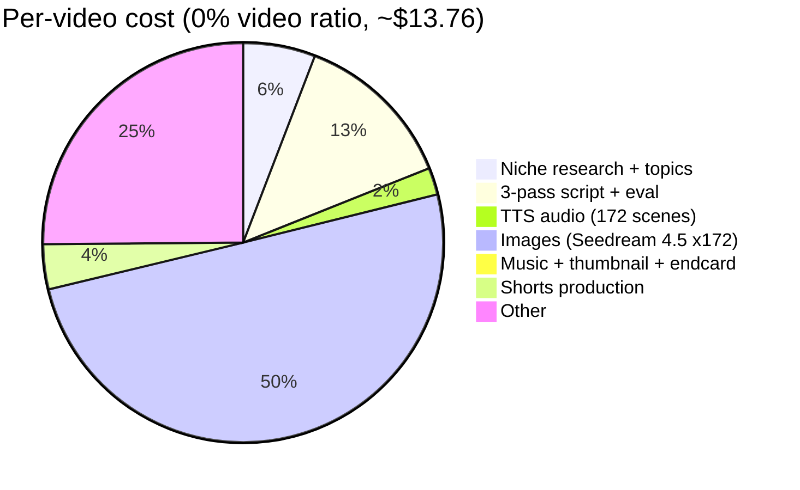

# Pipeline economics

## Per-video cost overview

A single 2-hour documentary costs **$13.76 to $76.65** end-to-end, depending on
the I2V (image-to-video) clip ratio chosen at the
[Cost Calculator gate](#the-cost-calculator-gate-stage-75) before TTS begins.
The floor of the range assumes 0% video clips (pure Ken Burns motion on every
scene); the ceiling assumes 15% of scenes upgraded to Seedance 2.0 Fast 10-second
I2V clips at $0.2419/second/720p. Source: [`CLAUDE.md`](https://github.com/akinwunmi-akinrimisi/vision-gridai-platform/blob/main/CLAUDE.md)
"Pipeline Quick Reference".

## Per-video cost table

| Phase | What | Type | Cost |
|-------|------|------|------|
| A | Project creation + niche research | Agentic | ~$0.60 |
| B | Topic + avatar generation → GATE 1 | Agentic | ~$0.20 |
| C | 3-pass script + scoring → GATE 2 | Agentic | ~$1.80 |
| D1 | TTS audio (172 scenes) | Deterministic | ~$0.30 |
| D2 | Images (Fal.ai Seedream 4.5 — all scenes) | Deterministic | ~$6.88 |
| D2.5 | I2V clips (selected scenes, Seedance 2.0 Fast) | Deterministic | $0–$62.89 |
| D3 | Ken Burns + Color Grade (FFmpeg) | Deterministic | Free |
| D4 | Captions (kinetic ASS via libass) + Transitions (xfade) + Assembly | Deterministic | Free |
| D5 | Background music (Lyria) + ducking | Deterministic | Free |
| D6 | End card + Thumbnail generation | Deterministic | ~$0.03 |
| D7 | Platform-specific renders (4 exports) | Deterministic | Free |
| E | QA check → Video review → GATE 3 → Publish | Dashboard | Free |
| F | YouTube/TikTok/Instagram analytics (daily cron) | Deterministic | Free |
| G | Shorts: clip from long-form → GATE 4 | Agentic + Det | ~$0.50 |
| H | Social posting (scheduled via calendar) | Cron | Free |
| TI | Topic Intelligence (5-source research) | On-demand | ~$0.13 |
| Sup | Supervisor + Comment sync + Engagement | Cron | ~$14/mo |
| **Total per video** | | | **~$13.76–$76.65** |

Source: [`CLAUDE.md`](https://github.com/akinwunmi-akinrimisi/vision-gridai-platform/blob/main/CLAUDE.md)
"Pipeline Quick Reference" table.

## Cost drivers

The single biggest variable is the **video ratio**. Everything else is
roughly fixed per video.

- **Cheap video (~$13.76)** — 100% Ken Burns, 0% I2V. All 172 scenes are static
  Seedream images animated in FFmpeg with `zoompan` (free). Image cost is the
  largest line item at $6.88. Ken Burns is essentially the same visual effort
  as a high-end documentary.
- **Mid video (~$32–$48)** — 5-10% I2V. Selected scenes (typically the hooks,
  emotional climaxes, and transitions) get a Seedance 2.0 Fast 10-second clip
  at 720p, upscaled to 1080p in FFmpeg. Each I2V scene costs $2.42.
- **Expensive video (~$76.65)** — 15% I2V. Roughly 26 scenes upgraded to
  Seedance clips. Adds $62.89 to the floor.

The next-largest lever is the **script generation cost** ($1.80) which scales
with target word count (default 19,000 words, 172 scenes). Cutting to a
60-minute video roughly halves it.

The third lever is **shorts** ($0.50/video). One long-form video produces ~20
shorts; if you skip the shorts pipeline entirely the per-video cost drops by
$0.50. See [`directives/09-shorts-pipeline.md:91-95`](https://github.com/akinwunmi-akinrimisi/vision-gridai-platform/blob/main/directives/09-shorts-pipeline.md)
for the breakdown (TTS $0.28 + images $0.60 = ~$0.88/topic for ~20 clips, or
~$0.04 per individual short).

## The Cost Calculator gate (Stage 7.5)

After scene segmentation but before TTS begins, the pipeline pauses at a
"Cost Calculator" gate that asks the operator to pick the video ratio. Four
options:

| Ratio | Image:Video | Estimated cost | Best for |
|-------|-------------|----------------|----------|
| 100/0 | 100% Ken Burns, 0% I2V | ~$13.76 | High-volume publishing, evergreen content |
| 95/5 | 95% Ken Burns, 5% I2V | ~$34.72 | Standard documentary, hooks have motion |
| 90/10 | 90% Ken Burns, 10% I2V | ~$55.69 | Premium production, climactic scenes have motion |
| 85/15 | 85% Ken Burns, 15% I2V | ~$76.65 | Top-tier production, near-cinematic |

The selected ratio writes to `topics.video_ratio_pct` and downstream
`WF_I2V_GENERATION` only fires for scenes flagged with `visual_type = 'i2v'`.
Source: [`CLAUDE.md`](https://github.com/akinwunmi-akinrimisi/vision-gridai-platform/blob/main/CLAUDE.md)
"Hybrid visual pipeline" + "Cost Calculator (Stage 7.5)" gotcha.

## Topic Intelligence cost

Topic Intelligence is a separate, on-demand research engine (the
[`/research`](../subsystems/topic-intelligence.md) global page) that mines 5
data sources (Reddit, YouTube Comments, TikTok, Google Trends + PAA, Quora) to
generate topic candidates. Cost: **~$0.13 per run**. At 16 runs/month that is
**~$2.08/month**.

This cost is independent of per-video cost — Topic Intelligence runs are
optional and feed into the project creation modal. Source:
[`CLAUDE.md`](https://github.com/akinwunmi-akinrimisi/vision-gridai-platform/blob/main/CLAUDE.md)
"Topic Intelligence Per Run" line +
[`skills.md`](https://github.com/akinwunmi-akinrimisi/vision-gridai-platform/blob/main/skills.md)
"Cost Reference" section.

## Monthly fixed costs

The supervisor + comment-sync + engagement crons run continuously regardless
of how many videos you produce.

| Service | Frequency | Monthly cost |
|---------|-----------|--------------|
| Supervisor watchdog (every 30 min) | Cron | included |
| Comment sync (daily) | Cron | included |
| Comment classification via Haiku (daily) | Cron | ~$0.02/day |
| Combined supervisor + engagement | — | **~$14/month** |

Supabase, n8n, and the dashboard are self-hosted on a single Hostinger VPS
(included in flat infra cost — no per-request charges).

## Cost composition

For the cheapest configuration (0% video ratio, ~$13.76):

The "Other" slice covers Topic Intelligence runs amortised across videos plus
small overheads (production logging, analytics queries, retry-budget headroom).

⚠ **Needs verification:** the $13.76 floor in `CLAUDE.md` does not exactly
sum to the line items above (research $0.60 + B $0.20 + script $1.80 + TTS
$0.30 + images $6.88 + music/end-card $0.03 + shorts $0.50 = $10.31 — leaving
~$3.45 unattributed). The published number is treated as the source of truth;
the residual is shown as "Other" in the chart and may include Topic
Intelligence amortisation, supervisor overhead, or a stale figure in
`CLAUDE.md` that should be reconciled against
[`Dashboard_Implementation_Plan.md` §10](https://github.com/akinwunmi-akinrimisi/vision-gridai-platform/blob/main/Dashboard_Implementation_Plan.md)
which uses different model assumptions (Wan 2.5 instead of Seedance 2.0 Fast).
