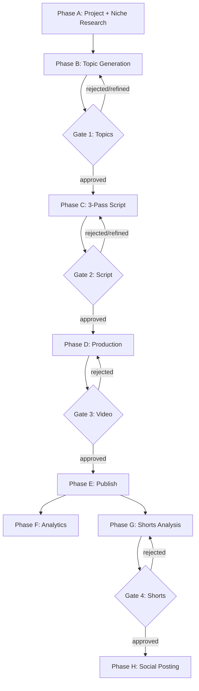

# The 4 approval gates

## Overview

The pipeline halts at four points and waits for the operator to act from the
dashboard. Each gate writes its decision to a single column on the `topics` or
`shorts` table; downstream workflows only fire when that column flips to
`approved`. Auto-pilot can skip gates 1, 2, and 3 when score thresholds are
met, but gate 3 always publishes as `unlisted` — never public. Gate 4 is never
auto-skipped.

## The 4 gates

| Gate | What's reviewed | Dashboard route | Auto-pilot behavior | Why human required |
|------|-----------------|-----------------|---------------------|--------------------|
| **1 — Topics** | 25 generated topics with avatars, outlier scores (CF01), SEO scores (CF02). | `/project/:id/topics` | Auto-approves topics whose `outlier_score` × `seo_score` exceeds `auto_pilot_topic_threshold`. | Verify titles don't overlap with red-ocean list, verify avatar fits intended audience, sanity-check SEO classification. |
| **2 — Script** | Full 3-pass script (~18-24K words), 7-dimension quality score, hook scores per chapter (CF12), CTR title variants (CF05). | `/project/:id/topics/:topicId/script` | Auto-approves if combined evaluation score > `auto_pilot_script_threshold`. Force-passed scripts (3 retries failed) always require human review. | Catch anti-pattern phrasing, verify the hook actually hooks, edit individual scenes inline. |
| **3 — Video** | Final assembled video, thumbnail, platform metadata, 13-check QA report. | `/project/:id/topics/:topicId/review` | Auto-publishes as **unlisted** if all 13 QA checks pass and `auto_pilot_enabled = true`. Public visibility always requires manual flip. | Final visual/audio QA, metadata correctness, thumbnail polish, decide visibility tier. |
| **4 — Shorts** | 20 viral-clip candidates with virality scores (1-10), rewritten short-form narration vs original side-by-side, rewritten 9:16 image prompts, emphasis-word maps, hashtags. | `/shorts/:projectId/:topicId` | Never auto-approved. Always requires human review. | Each clip must work as a standalone hook in 30-60 seconds; this judgement is harder to score than long-form. |

## Master pipeline diagram

## Auto-pilot mode

Auto-pilot is configured per project in
[`projects`](https://github.com/akinwunmi-akinrimisi/vision-gridai-platform/blob/main/supabase/migrations/004_calendar_engagement_music.sql)
columns: `auto_pilot_enabled`, `auto_pilot_topic_threshold`,
`auto_pilot_script_threshold`, `auto_pilot_default_visibility`,
`monthly_budget_usd`. Behaviour per gate:

- **Gate 1** — topics whose combined intelligence score exceeds the threshold
  flip directly to `approved`. The remainder still queue for manual review.
- **Gate 2** — scripts whose combined evaluation exceeds the threshold flip to
  `approved` and TTS begins immediately. Force-passed scripts (the 7-dim
  evaluator was unable to clear 7.0 in 3 attempts) **always** route to human
  review regardless of the auto-pilot flag.
- **Gate 3** — assembled videos whose
  [WF_QA_CHECK](https://github.com/akinwunmi-akinrimisi/vision-gridai-platform/blob/main/workflows/WF_QA_CHECK.json)
  returns 13/13 pass auto-publish at `auto_pilot_default_visibility` (which the
  schema constrains to `unlisted` or `private` — never `public`).
- **Gate 4** — never auto-approved. Human always reviews shorts.

The pipeline auto-pauses if `monthly_spend_usd > monthly_budget_usd` or if two
consecutive videos score below 6.0 on the 7-dimension evaluator. Both
conditions raise an alert on the dashboard.

!!! warning "Auto-pilot never publishes public"
    Even with all 13 QA checks passing and a perfect script score, auto-pilot
    publishes as `unlisted`. The human flips the visibility flag from the
    dashboard. See [`CLAUDE.md`](https://github.com/akinwunmi-akinrimisi/vision-gridai-platform/blob/main/CLAUDE.md)
    "Auto-pilot mode per project".

## Resumption — where state lives

If the pipeline is paused at a gate, the decision state is stored in a single
column per row. Resuming the pipeline means flipping that column from
`pending` to `approved` (or `rejected`) via a webhook from the dashboard.

| Gate | Table | Status column | Approve webhook |
|------|-------|---------------|-----------------|
| 1 | `topics` | `review_status` | `POST /webhook/topics/action` |
| 2 | `topics` | `script_review_status` | `POST /webhook/script/approve` |
| 3 | `topics` | `video_review_status` | `POST /webhook/video/approve` |
| 4 | `shorts` | `review_status` | `POST /webhook/shorts/produce` |

Refinement (Gate 1 / Gate 2) appends an entry to `topics.refinement_history`
(JSONB array of `{instruction, result, timestamp}`) and triggers a partial
regeneration. Topic refinement is expensive (~$0.15/topic) because it includes
all 24 other topics as context to avoid title overlap. Sources:
[`directives/01-topic-generation.md:46-50`](https://github.com/akinwunmi-akinrimisi/vision-gridai-platform/blob/main/directives/01-topic-generation.md),
[`directives/02-script-generation.md:70-84`](https://github.com/akinwunmi-akinrimisi/vision-gridai-platform/blob/main/directives/02-script-generation.md),
[`directives/09-shorts-pipeline.md:32-46`](https://github.com/akinwunmi-akinrimisi/vision-gridai-platform/blob/main/directives/09-shorts-pipeline.md).
