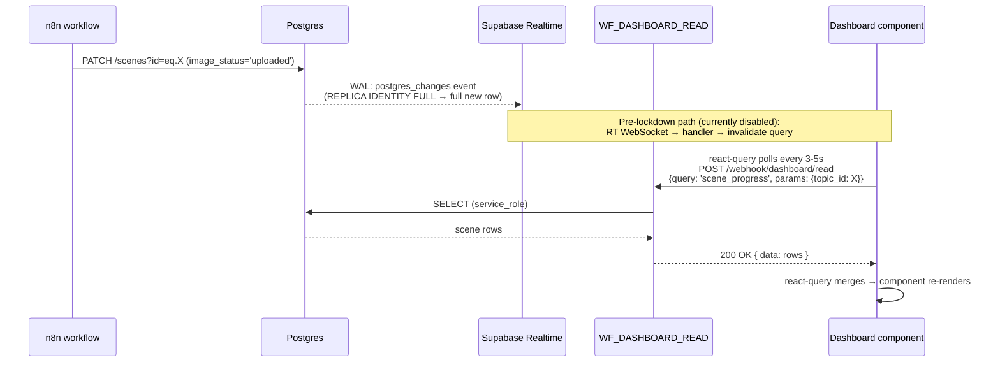

# Realtime data patterns

The dashboard's promise is that every n8n write — a TTS file landing, a
scene image rendering, a topic flipping to `approved` — appears in the
operator's UI without a refresh. Originally this was wired through
Supabase Realtime WebSocket subscriptions; after the 2026-04-21 RLS
lockdown (migration 030) it is wired through **n8n-mediated polling**
under the same shape. This page documents both the legacy Realtime model
(still the source of truth for `REPLICA IDENTITY FULL` and the
`supabase_realtime` publication) and the current shim architecture so
operators understand which knobs apply when.

## Why "Realtime" still matters

Even with the WebSocket subscriber stubbed out
([`hooks/useRealtimeSubscription.js`](https://github.com/akinwunmi-akinrimisi/vision-gridai-platform/blob/main/dashboard/src/hooks/useRealtimeSubscription.js)),
the underlying Postgres broadcast plumbing is intact. If a future batch
re-enables an authenticated Realtime proxy (tracked in
[`docs/SECURITY_REMEDIATION_2026_04_21_STATUS.md`](https://github.com/akinwunmi-akinrimisi/vision-gridai-platform/blob/main/docs/SECURITY_REMEDIATION_2026_04_21_STATUS.md)
batch B4.6 follow-on), the existing `REPLICA IDENTITY FULL` and
`supabase_realtime` publication entries pick it back up immediately. So
this page is forward-looking too: get those settings wrong and the dashboard
stays half-blind even after the proxy lands.

## Tables published to `supabase_realtime`

Tables published across the migration history. Source: every `ALTER
PUBLICATION supabase_realtime ADD TABLE` statement in
[`supabase/migrations/`](https://github.com/akinwunmi-akinrimisi/vision-gridai-platform/tree/main/supabase/migrations).

| Table | First published in | UPDATE-broadcast (REPLICA IDENTITY FULL) |
|-------|--------------------|-------------------------------------------|
| `scenes` | 001_initial_schema | yes |
| `topics` | 001_initial_schema | yes |
| `projects` | 001_initial_schema | yes |
| `production_log` | 001_initial_schema | (PK only) |
| `shorts` | 001_initial_schema | yes |
| `research_runs` | 002_research_tables | yes |
| `research_categories` | 002_research_tables | yes |
| `scheduled_posts` | 004_calendar_engagement_music | yes |
| `comments` | 004_calendar_engagement_music | yes |
| `production_logs` | 004_calendar_engagement_music | yes |
| `kinetic_jobs`, `kinetic_scenes` | 008_kinetic_typography | yes |
| `system_prompts` | 010_intelligence_foundation | (PK only) |
| `competitor_channels`, `competitor_videos`, `competitor_alerts` | 011_competitor_intel | yes |
| `ab_tests`, `ab_test_variants` | 012_ctr_and_ab_testing | yes |
| `niche_health_history`, `pps_config`, `revenue_attribution` | 016_analytics_and_niche_health | yes |
| `audience_insights`, `daily_ideas` | 017_audience_memory | yes |
| `coach_sessions`, `coach_messages` | (intelligence batch) | yes |
| `style_profiles` | 011_competitor_intel | yes |
| `cost_calculator_snapshots` | 019_hybrid_scene_pipeline | yes |
| `analysis_groups`, `channel_analyses`, `discovered_channels` | 020_channel_analyzer | yes |
| `niche_viability_reports` | 021_niche_viability | yes |
| `keywords`, `topic_keywords` | 014_keywords | yes |

Use the live list:
`grep -E "supabase_realtime ADD TABLE|REPLICA IDENTITY FULL" supabase/migrations/*.sql`.

## Standard subscription pattern (legacy / future-proof)

Hooks call `useRealtimeSubscription(table, filter, queryKeysToInvalidate)`
which previously opened a single `postgres_changes` channel and invalidated
the named React-query keys on every change. Today the function is a no-op,
but the call sites are intentionally preserved so the wiring survives a
future re-enable:

```javascript
// dashboard/src/hooks/useResearch.js:11-17
useRealtimeSubscription(
  'research_runs',
  null,
  [['research-run-latest']],
);
```

The pre-lockdown body (preserved in git history) opened a Supabase channel
shaped like:

```javascript
supabase.channel('research_runs_changes')
  .on('postgres_changes',
    { event: '*', schema: 'public', table: 'research_runs' },
    (payload) => queryClient.invalidateQueries(['research-run-latest']))
  .subscribe();
```

## Current shim — `sb_query` over `WF_DASHBOARD_READ`

Migration 030 set every VG table to `RESTRICTIVE USING (false)` for the
`anon` role, killing both direct PostgREST reads **and** any anon Realtime
subscription. To keep the 35+ hooks compiling, the dashboard now imports a
hand-rolled Supabase shim that mimics the fluent client API but POSTs each
query to the `dashboardRead('sb_query', ...)` webhook
([`dashboard/src/lib/supabase.js:1-26`](https://github.com/akinwunmi-akinrimisi/vision-gridai-platform/blob/main/dashboard/src/lib/supabase.js)):

```javascript
// dashboard/src/lib/supabase.js — shim entrypoint (excerpt)
function exec() {
  return dashboardRead('sb_query', state).then((data) => {
    if (data && 'rows' in data && 'count' in data) {
      return { data: data.rows, error: null, count: data.count };
    }
    return { data, error: null, count: null };
  });
}
```

`dashboardRead('sb_query', state)` is a thin wrapper around
`webhookCall('dashboard/read', { query: 'sb_query', params: state })` (see
[`dashboard/src/lib/api.js:62-68`](https://github.com/akinwunmi-akinrimisi/vision-gridai-platform/blob/main/dashboard/src/lib/api.js)).
Server-side, `WF_DASHBOARD_READ` validates the payload against an allowlist
of tables + operations and runs the request with the **service_role** JWT
that never leaves n8n. From the hook's perspective the call returns
`{ data, error, count }` exactly as `@supabase/supabase-js` would, so call
sites are unchanged. Mutations route the same way: an `update`/`insert` is
just another `state.action` value the workflow handles.

## Realtime autoconnect was killed

Pre-lockdown, the dashboard imported the real `@supabase/supabase-js`
client which auto-opened a Realtime WebSocket on init. After lockdown that
WebSocket failed forever (every `postgres_changes` event was filtered out
by RLS) and spammed `WebSocket not available` in the console, plus
periodic reconnect attempts. The shim replaces `supabase.channel()` with a
no-op stub that emits a single `'DISABLED'` callback and never opens a
socket:

```javascript
// dashboard/src/lib/supabase.js:138-145
function stubChannel() {
  const ch = {
    on() { return ch; },
    subscribe(cb) { if (typeof cb === 'function') cb('DISABLED'); return ch; },
    unsubscribe() { return Promise.resolve('ok'); },
  };
  return ch;
}
```

Cache freshness is now provided by **react-query polling** at 3-5 s on
active pages (scenes, production progress, script, topics) and 10 s on the
project list — fast enough that the operator perceives the same near-live
UX. The earlier `LimitedModeBanner` was removed once polling cadence was
tuned (batch B4.6 in the security remediation log).

## REPLICA IDENTITY FULL — why every Realtime table needs it

When a future Realtime proxy lands, the `UPDATE` payload broadcast on each
`postgres_changes` event will contain only the row's primary key columns
**unless** the table is set to `REPLICA IDENTITY FULL`. The dashboard
uses the `payload.new` row to update React-query caches in place — an
empty payload would force a full refetch on every change, defeating the
optimisation. Source: CLAUDE.md "Gotchas" entry *Supabase Realtime
requires the table to have REPLICA IDENTITY FULL for UPDATE events*.

Set it once per table:

```sql
ALTER TABLE scenes REPLICA IDENTITY FULL;
```

Every table the dashboard reads from should have this set. Two
exceptions visible in the migration history (`production_log`,
`system_prompts`) only get INSERT events from n8n and are read append-only
by the dashboard, so PK-only payloads are sufficient there.

## JWT rotation gotcha

When the Supabase JWT secret rotates, **`.env` is not the only place that
holds it**. Realtime stores its own per-tenant copy in
`_realtime.tenants.jwt_secret`. Forgetting to update the tenant rows
leaves Realtime returning `signature_error` on every client subscribe even
after `docker compose restart realtime`. Source:
[memory/feedback_realtime_tenant_jwt.md](https://github.com/akinwunmi-akinrimisi/vision-gridai-platform/blob/main/memory/)
and the 2026-04-23 follow-up entry in MEMORY.md (B4.7 hotfix).

The full rotation order:

```sql
-- 1. Update env files: /docker/supabase/.env, /docker/n8n/docker-compose.override.yml
-- 2. Rotate ANON + SERVICE_ROLE keys signed with the new secret
-- 3. Update both Realtime tenants:
UPDATE _realtime.tenants SET jwt_secret = '$NEW_JWT_SECRET'
WHERE external_id IN ('realtime', 'realtime-dev');

-- 4. Reload Kong consumer credentials, then:
docker compose restart realtime
docker exec supabase-kong-1 kong reload
```

Verify: `docker logs --since 2m supabase-realtime-1 | grep -c
signature_error` returns `0`.

## Write-broadcast-render flow



Once the authenticated Realtime proxy ships, the third arrow becomes a
WebSocket push instead of a poll, but the rest of the chain — including
the `dashboardRead` shim for one-off reads — is unchanged. That is why
every existing `useRealtimeSubscription` call site is left in place: the
day Realtime returns, only one file changes.
