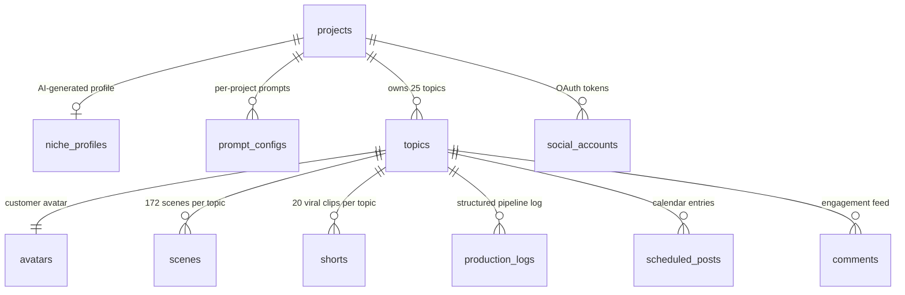

# Database schema overview

Vision GridAI runs on self-hosted Supabase Postgres at
`https://supabase.operscale.cloud`. The public schema holds **~50 tables**
that fall into seven domains: core video pipeline, production audit, shorts
+ social, engagement, Topic Intelligence research, the Intelligence Layer
(scoring, prediction, advisory, audience memory), and a small infrastructure
slice for analysis groups + production registers. All tables are owned by
`postgres`; reads flow through PostgREST on Kong; writes from n8n use the
`service_role` JWT and from the dashboard go through `WF_DASHBOARD_READ` and
dedicated mutation webhooks (see [Realtime data patterns](../dashboard/realtime-patterns.md))
because anon was locked out of every VG table by
[migration 030](migration-history.md#post-audit-lockdown-030-031).

This page is the map. For column-level detail see the
[table reference](table-reference.md). For when each table arrived see the
[migration history](migration-history.md).

## Core relationships

The pipeline backbone is one project → many topics → many scenes, with a
single avatar per topic and a parallel `shorts` stream that clips from
finished topics into 9:16 viral candidates. Cascade deletes on
`project_id` mean removing a project removes everything underneath it
(topics, scenes, shorts, avatars, scheduled_posts, comments, …).

The diagram is deliberately reduced — full FK detail sits with each table's
card in the [table reference](table-reference.md). Notable rules not shown:

- `scenes.project_id` is denormalised (a scene already has a topic FK that
  knows the project) so workflows can write a single SELECT to filter "all
  scenes for project X" without joining.
- `shorts` references `topics(id)` and `projects(id)` directly. There is no
  FK from `shorts` to `social_accounts` — instead the `shorts` row carries
  per-platform status columns (`tiktok_status`, `instagram_status`,
  `youtube_shorts_status`) and `social_accounts` is looked up by
  `(project_id, platform)` at post-time by `WF_SOCIAL_POSTER`.
- Several Intelligence Layer tables (`pps_calibration`, `revenue_attribution`,
  `coach_messages`, `competitor_videos`) denormalise `project_id` alongside
  their natural parent FK so dashboard queries can scope to a project
  without a 3-table join.

## Domains — every table grouped

### Core video pipeline (12 tables)

The 4-gate flow from project creation to a publish-ready video file. Every
row in `topics` is one video; every row in `scenes` is one of its 172
narration beats.

| Table | Purpose | Migration introduced |
|---|---|---|
| `projects` | Top-level row per niche/channel direction. Holds niche profile fields, playlists, default model IDs, auto-pilot config, music prefs, viability digest, niche health score. | 001 (extended by 004, 007, 010, 014, 015, 016, 019, 020, 021) |
| `niche_profiles` | Free-form research output from Phase A: competitor audit, audience pain points, keyword research, blue-ocean opportunities. | 001 |
| `prompt_configs` | Per-project AI prompt templates (versioned, `is_active` flag). System prompts and registry entries live in `system_prompts` instead. | 001 |
| `system_prompts` | Universal prompt library (`prompt_type` UNIQUE). Topic generator master, script pass templates, evaluators. Read by every Claude-call workflow. | 007 (`007_grand_master_integration.sql`) |
| `production_registers` | Five seeded register rows (Economist, Premium, Noir, Signal, Archive). JSONB config carries image anchors, TTS voice, music BPM, Ken Burns preset, font family. | 024 |
| `topics` | One per video. ~150 columns covering review state, script JSONB, scene/audio progress, YouTube metadata, intelligence scores, CTR predictions, hooks, viral moments, video ratio, register selection, ROI. The widest table in the schema. | 001 (extended by ~10 later migrations) |
| `avatars` | Customer avatar per topic — name/age, occupation, pain point, emotional driver, dream outcome, plus richer psychographics + audience segment from migration 007. | 001 (extended by 007) |
| `scenes` | Per-scene manifest. Narration text, image prompt, audio file URL, image URL, optional video clip URL (hybrid pipeline), per-stage status columns, cinematic fields (color_mood, zoom_direction, transition_to_next, composition_prefix, selective_color_element), production register stamp. | 001 (extended by 003, 019, 023; pruned by 009; constrained by 031) |
| `shorts` | Short-form clip rows (one per viral candidate). Carries virality score, rewritten narration JSONB, 9:16 image prompts, per-platform status + post IDs + analytics. **Created by `skills.sh` bootstrap, not by a numbered migration.** | not in `supabase/migrations/` |
| `cost_calculator_snapshots` | Audit row per Cost Calculator gate decision. Keeps the four ratio options + the user's pick. | 019 |
| `keywords` | Project-scoped keyword graph — search_volume_proxy, competition_level, opportunity_score, related_keywords JSONB. | 010 |
| `topic_keywords` | Junction table linking topics to keywords with relevance scores. | 010 |

### Production audit (3 tables)

Append-only record of what the pipeline did and what it cost.

| Table | Purpose | Migration |
|---|---|---|
| `production_log` | Original audit trail. One row per stage transition. | 001 |
| `production_logs` | Structured per-API-call log (note plural — both tables coexist). Stage, scene number, action, status, duration, cost USD, retry count, error message, metadata. Source of `topics.production_cost_usd` aggregation. | 004 |
| `renders` | Per-platform export (YouTube long, YouTube Shorts, TikTok, Instagram). CRF, preset, bitrate, file size, render time. | 004 |

### Shorts + social (3 tables)

Already shown in core: `shorts`. Plus:

| Table | Purpose | Migration |
|---|---|---|
| `social_accounts` | Per-project OAuth tokens (TikTok, Instagram, YouTube). Token + refresh + expiry. **Like `shorts`, created by `skills.sh` rather than a numbered migration.** Locked down by 030 since it carries OAuth secrets. | not in `supabase/migrations/` |
| `scheduled_posts` | Calendar scheduling state. `(topic_id, platform, scheduled_at)` rows that the every-15-min cron picks up and publishes. | 004 |
| `platform_metadata` | Per-platform title/description/tags/hashtags/thumbnail. Unique on `(topic_id, platform)`. | 004 |

### Engagement (3 tables)

| Table | Purpose | Migration |
|---|---|---|
| `comments` | Unified engagement feed across YouTube/TikTok/Instagram. Sentiment, intent_score, intent_signals, replied flag. | 004 |
| `audience_comments` | Per-comment classification with Haiku — question/complaint/praise/suggestion/noise. Distinct from `comments` (this one is project-scoped audience memory; the other is per-video conversation). | 017 |
| `audience_insights` | Weekly project-scoped synthesis from Opus. Renders `audience_context_block` injected into Pass 1 of script generation. | 017 |

### Topic Intelligence research (3 tables)

The 5-source on-demand research engine. See [Topic Intelligence subsystem](../subsystems/topic-intelligence.md).

| Table | Purpose | Migration |
|---|---|---|
| `research_runs` | One row per `/webhook/research/run` invocation. Status, sources_completed, derived_keywords, platforms (extended by 006), time_range. | 002 (extended by 006) |
| `research_results` | ~50 raw scraped items per run, 10 per source. Engagement score, source URL, ai_video_title, category_id. | 002 |
| `research_categories` | 4-8 AI-clustered groups per run, ranked. `top_video_title`, `total_engagement`, `result_count`. | 002 |

### Intelligence Layer (~16 tables)

Built across S1-S8 sprints (migrations 010-017). Adds outlier scoring, SEO,
RPM, CTR optimisation, A/B testing, prediction, advisory, niche health,
revenue attribution, audience memory.

| Table | Purpose | Migration |
|---|---|---|
| `rpm_benchmarks` | Static lookup of 12 niche RPM ranges (finance, credit_cards, gaming, …). | 010 |
| `competitor_channels` | Per-project tracked YouTube channels with rolling 30/90d view averages. | 011 |
| `competitor_videos` | Tracked uploads from competitor channels with outlier flag + ratio. | 011 |
| `competitor_alerts` | Dashboard notifications (outlier_breakout, topic_match, rapid_growth, channel_surge, style_dna_ready). | 011 |
| `competitor_intelligence` | Weekly Claude synthesis per project with cluster summaries. | 011 |
| `style_profiles` | CF14 Style DNA per analysed channel — title formulas, thumbnail DNA, content pillars, upload cadence. | 011 |
| `ab_tests` | Per-topic A/B test config (title \| thumbnail \| combined). | 012 |
| `ab_test_variants` | A/B/C variants with predicted CTR + cumulative impressions/views. | 012 |
| `ab_test_impressions` | Time-series snapshot of CTR per rotation window. | 012 |
| `pps_config` | Per-project Predicted Performance Score weights (sum-to-1.0 enforced). | 013 |
| `pps_calibration` | Post-publish predicted-vs-actual variance for weight regression. | 013 |
| `daily_ideas` | CF08 — daily Opus-generated batch of 15-20 ranked topic ideas. | 015 |
| `coach_sessions` | CF09 AI Coach conversation threads. | 015 |
| `coach_messages` | Individual conversation turns with context_snapshot JSONB. | 015 |
| `niche_health_history` | Weekly 0-100 niche health score per project with momentum trend. | 016 |
| `revenue_attribution` | Per-topic monthly snapshot — production cost, views, revenue, RPM, ROI. | 016 |

### Channel analyzer + viability (4 tables)

| Table | Purpose | Migration |
|---|---|---|
| `channel_analyses` | Standalone YouTube channel deep-dives — top videos, blue-ocean opportunities, verdict. | 020 |
| `channel_comparison_reports` | Multi-channel comparison with combined topic landscape + differentiation strategy. | 020 |
| `analysis_groups` | Named container for channel analyses (counters self-healed by triggers in 026, viability progress in 027). | 022 |
| `discovered_channels` | Auto-discovered competitors staged before deep analysis. | 021 |
| `niche_viability_reports` | One per analysis group — viability score, four weighted factors (monetization, audience demand, competition gap, entry ease), revenue projections, blue-ocean opportunities, topics to avoid. | 021 (column rename in 026) |

### YouTube discovery + per-video analysis (3 tables)

These three tables (`yt_discovery_runs`, `yt_discovery_results`,
`yt_video_analyses`) are referenced by `WF_YOUTUBE_DISCOVERY` and migration
029's intelligence renderer but are **not created by any numbered migration
in this repo** — they were applied directly to the live VPS. Documented in
the table reference for completeness.

### Auth / RLS

There are no auth-domain tables in this schema — Supabase Auth (`auth.users`,
`auth.sessions`, etc.) lives in the `auth` schema and is not used by Vision
GridAI's single-operator model. RLS is the only enforcement layer for
public-schema access. After
[migration 030](migration-history.md#post-audit-lockdown-030-031) every
table carries an `_anon_deny` restrictive policy and a `_service_role`
permissive policy, so anon is blocked at the policy layer **and** revoked
at the GRANT layer.

## Realtime publication

Most operator-facing tables are on the `supabase_realtime` publication with
`REPLICA IDENTITY FULL` so the dashboard can subscribe to UPDATE payloads.
The full set is recorded per-table in the
[table reference](table-reference.md) — examples: `topics`, `scenes`,
`projects`, `shorts`, `research_runs`, `research_categories`,
`scheduled_posts`, `comments`, `production_logs`, `competitor_alerts`,
`channel_analyses`, `analysis_groups`, `niche_viability_reports`,
`audience_insights`, `daily_ideas`, `niche_health_history`. After the RLS
lockdown the dashboard hits these via authenticated `WF_DASHBOARD_READ`
proxy reads rather than direct Supabase Realtime subscriptions in most
places — see [Realtime data patterns](../dashboard/realtime-patterns.md).
