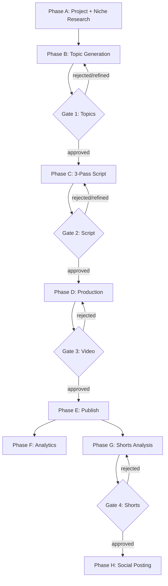

# Vision GridAI Platform

> Operator reference for the multi-niche AI video production platform.

## What this is

Vision GridAI turns any niche into a YouTube channel. You input a niche;
the platform researches it, generates topics, scripts a 2-hour
documentary, produces it (TTS + AI imagery + Ken Burns motion +
captions + assembly + publishing), and feeds analytics back into
intelligence loops that improve the next video. Four human review
gates keep quality high; everything else is automated.

This site is the operator's reference — how the parts fit together,
where every prompt and table lives, what each of the ~50 n8n workflows
does, and how to debug the platform when something stops moving.

## The pipeline at a glance

Each phase has a dedicated page under [Pipeline](pipeline/phase-a-project-creation.md);
each gate's mechanics are covered in [The 4 approval gates](concepts/gates.md).

## Where to start

| If you want to… | Go to |
|---|---|
| Understand the platform end-to-end | [Concepts → Why](concepts/why.md) → [Concepts → Gates](concepts/gates.md) → [Pipeline](pipeline/phase-a-project-creation.md) phase pages |
| Look up a specific workflow | [Workflows → Reference](workflows/reference.md) (~55 cards) |
| Find what a database table holds | [Database → Schema overview](database/schema-overview.md) → [Database → Table reference](database/table-reference.md) |
| Debug a production failure | [Operations → Debugging recipes](operations/debugging-recipes.md) |
| Inspect a recent incident | [Operations → Incident log](operations/incident-log.md) |
| Learn how a subsystem works (Topic Intelligence, Style DNA, Caption Burn, etc.) | [Subsystems](subsystems/topic-intelligence.md) |
| See where prompts physically live | [Prompts → Where they live](prompts/where-they-live.md) |
| Understand the VPS + service mesh | [Infrastructure → VPS layout](infrastructure/vps-layout.md) → [Infrastructure → Service mesh](infrastructure/service-mesh.md) |
| Rotate JWT keys safely | [Infrastructure → Auth + Secrets](infrastructure/auth-secrets.md) |
| Review the dashboard pages | [Dashboard → Page map](dashboard/page-map.md) → [Dashboard → Page reference](dashboard/page-reference.md) |
| Estimate cost before running | [Operations → Cost economics](operations/cost-economics.md) |

## Source-of-truth note

This site is **hand-curated from repo state** as of the last commit on
`main`. Where a fact comes from `MEMORY.md` rather than checked-in
files, the page says so explicitly (typically as
"Snapshot from `MEMORY.md` only" on workflow cards or
"Live differs from JSON" on tables). When the live VPS state and the
checked-in artifacts disagree, the canonical source is whichever was
listed in the page footer for that section.

If a page carries a `⚠ Needs verification` note, it means the author
couldn't fully resolve the fact from the canonical sources at write
time. Treat those as hypotheses to confirm before relying on.

## Build metadata

This site is built and deployed automatically by the
[`Deploy docs site` GitHub Action](https://github.com/akinwunmi-akinrimisi/vision-gridai-platform/actions)
on every push to `main` that touches `docs-site/`. The footer of every
page links to the GitHub source for that page; the action build log
has the commit SHA and timestamp.
