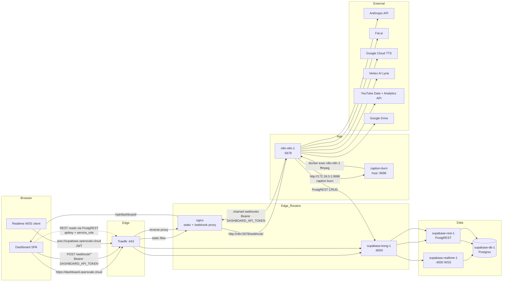

# Service mesh

How traffic flows from a browser click to an Anthropic call and back.
For service inventory and filesystem locations, see
[VPS Layout](vps-layout.md). For auth on every edge, see
[Auth + Secrets](auth-secrets.md).

## Request paths



## Edge routing

**Traefik** terminates TLS for all three public hostnames:

| Hostname | Routes to |
|---|---|
| `dashboard.operscale.cloud` | nginx → `/opt/dashboard/` (static), nginx `/webhook/*` → `n8n-n8n-1:5678` |
| `n8n.srv1297445.hstgr.cloud` | `n8n-n8n-1:5678` directly (n8n editor + webhook endpoints) |
| `supabase.operscale.cloud` | `supabase-kong-1:8000` (Kong gateway in front of REST + Realtime) |

The dashboard and the n8n endpoints are reachable two ways: via the
dashboard hostname (proxied through nginx) and via the n8n hostname
(direct). The dashboard prefers the proxied path so the bearer-token
header doesn't leak out of the dashboard origin.

## Internal proxy: nginx

The dashboard's nginx container (inside the Traefik network) is a
two-purpose proxy:

```nginx
# 1. SPA routing — non-file requests serve index.html
location / {
    try_files $uri $uri/ /index.html;
}

# 2. Reverse proxy n8n webhooks
location /webhook/ {
    proxy_pass http://n8n:5678/webhook/;
    proxy_set_header Host $host;
    proxy_set_header Authorization $http_authorization;
}
```

The dashboard SPA hits `/webhook/<endpoint>` on the same origin. nginx
strips the dashboard host header and forwards into the n8n container
on the internal Docker network. From inside Traefik's network,
`http://n8n:5678` resolves directly because Traefik containers and the
`n8n-n8n-1` container share a Docker network (defined in
`/docker/n8n/docker-compose.yml`).

## Supabase: Kong gateway

Kong is **the only public path into Postgres**. Both PostgREST and
Realtime sit behind it, and Kong's `key-auth` plugin enforces ANON +
SERVICE_ROLE keys per route.

| Path | Backend | Auth |
|---|---|---|
| `/rest/v1/*` | PostgREST (`supabase-rest-1`) | `apikey` header (ANON) + `Authorization: Bearer <SERVICE_ROLE_JWT>` |
| `/realtime/v1/*` | Realtime (`supabase-realtime-1:4000`) | JWT in WSS subprotocol |
| `/auth/*` | GoTrue | (unused) |
| `/storage/*` | Storage API | (unused) |

After a JWT secret rotation, Kong's consumer credentials in
`kong.yml` must be updated and `kong reload` run inside the container —
without that step, Kong keeps caching the old keys.
[Auth + Secrets](auth-secrets.md) covers the full propagation list.

## Caption burn: host-side bridge

```text
   n8n container (Code node)
   |
   | http://172.18.0.1:9998/burn
   |   Authorization: Bearer DASHBOARD_API_TOKEN
   v
   caption-burn host service (systemd, :9998)
   |
   | docker exec n8n-n8n-1 ffmpeg -i ... -vf subtitles=...
   v
   FFmpeg inside n8n container
   (uses container's Drive creds + production volume)
```

The service lives on the **host** to avoid an n8n task-runner OOM when
running libass through `-vf subtitles`, but the actual FFmpeg invocation
runs **inside the n8n container** via `docker exec`. That keeps the
work near the source files (Drive download, production volume) without
crashing the runner.

The `172.18.0.1` address is the Docker bridge gateway; from inside any
container on that bridge, it's the host. Using `localhost` instead
silently fails — Node resolves `localhost` to `::1` (IPv6 loopback),
which doesn't route off the container.

## Realtime path

The dashboard subscribes to `scenes` and `topics` row changes via WSS
through Traefik → Kong → Realtime. Two requirements for the path to
work end-to-end:

1. **`REPLICA IDENTITY FULL`** must be set on every published table.
   Migration 001 sets it for `scenes`, `topics`, `projects`,
   `production_log`, `shorts`. Without it, UPDATE events arrive without
   the changed columns.
2. **JWT secret synchronization.** The Realtime container reads its
   secret from `_realtime.tenants.jwt_secret` (per-tenant) **not** from
   the shared `.env`. After a rotation, both the `realtime` and
   `realtime-dev` tenant rows must be updated.

When the dashboard reports "Realtime connected" but never receives
events, check `REPLICA IDENTITY` first; when it reports "JWT invalid"
after a rotation, check the tenant rows.

## External APIs

n8n is the only egress origin — the dashboard never calls Anthropic /
Fal.ai / Google directly. Every external call goes through
`WF_RETRY_WRAPPER` for backoff, and through the n8n credential store
for auth (no raw keys in workflow JSON).

| API | Used by | Quota concern |
|---|---|---|
| Anthropic Claude | `WF_TOPICS_GENERATE`, `WF_SCRIPT_PASS`, `WF_VIDEO_METADATA`, all intelligence-layer workflows | Tier rate limits per model |
| Fal.ai | `WF_IMAGE_GENERATION`, `WF_THUMBNAIL_GENERATE`, `WF_SEEDANCE_I2V`, shorts visuals | Async queue: 2 image / 10s, 1 T2V / 60s, 2 I2V / 10s |
| Google Cloud TTS | `WF_TTS_AUDIO` | None operationally |
| Vertex AI Lyria | `WF_MUSIC_GENERATE` | Project quota |
| YouTube Data API v3 | `WF_YOUTUBE_UPLOAD`, `WF_YOUTUBE_DISCOVERY`, `WF_AB_TEST_ROTATE` | **10,000 units/day**. Upload = 1,600 units → max 6 uploads/day |
| YouTube Analytics API | `WF_ANALYTICS_CRON`, `WF_AB_TEST_ROTATE` | Daily |
| Google Drive | every workflow that uploads a file | None operationally |
| TikTok Content API | `WF_SOCIAL_POSTER`, `WF_SOCIAL_ANALYTICS` | Per-app |
| Instagram Graph API | `WF_SOCIAL_POSTER`, `WF_SOCIAL_ANALYTICS` | Per-app |
| Apify | `WF_RESEARCH_REDDIT` (fallback), `WF_RESEARCH_TIKTOK`, `WF_RESEARCH_QUORA` | Cold start ~120s |
| SerpAPI | `WF_RESEARCH_GOOGLE_TRENDS`, `WF_KEYWORD_SCAN` | Per-month |

The first ~95% of platform incidents are at one of the **internal**
edges (n8n ↔ Kong, n8n ↔ caption burn, dashboard ↔ Realtime). External
APIs almost always work; when they don't, `WF_RETRY_WRAPPER`'s
exponential backoff handles transients and `production_logs` records
the rest.
