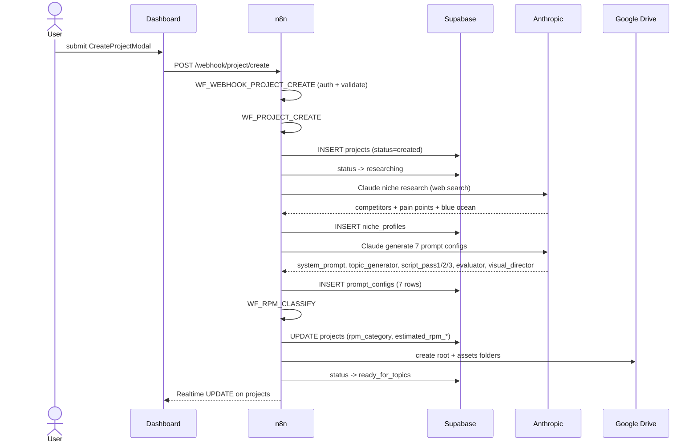

# Phase A · Project Creation + Niche Research

> Spin up a new niche project: research the market, classify RPM, generate the locked prompt set, and seed the database for topic generation. **Cost:** ~$0.60. **Duration:** 2-5 minutes.

## Goal

Phase A turns a one-line niche description ("US Credit Cards", "Stoic Philosophy") into a fully provisioned project: a `projects` row with locked Style DNA and RPM tier, a `niche_profiles` row holding competitor + audience research, seven `prompt_configs` entries that every downstream phase reads from, and Google Drive folders for asset storage. Nothing about the niche is hardcoded — every prompt is AI-generated and stored per project so the same pipeline can drive a finance channel and a philosophy channel side by side.

## Sequence diagram

## Inputs (read from)

- `webhook payload` — `{ niche, description, target_video_count, reference_analyses[] }`. Sent by the dashboard via `webhookCall('project/create', ...)` in [`dashboard/src/hooks/useProjects.js:25-27`](https://github.com/akinwunmi-akinrimisi/vision-gridai-platform/blob/main/dashboard/src/hooks/useProjects.js).
- `research_runs` / `research_categories` / `research_results` (optional) — when the user picked a topic from a prior Topic Intelligence run, the modal prefills `niche` + `description` from the latest complete run. See [`dashboard/src/components/projects/CreateProjectModal.jsx:52-80`](https://github.com/akinwunmi-akinrimisi/vision-gridai-platform/blob/main/dashboard/src/components/projects/CreateProjectModal.jsx).
- `rpm_benchmarks` — lookup table mapping niche category to RPM range (Finance $25-$50, Tech $15-$30, General $8-$15 default).

## Outputs (writes to)

- `projects` — one new row, status transitions `created` → `researching` → `ready_for_topics`. Populated columns: `name`, `niche`, `niche_description`, `niche_system_prompt`, `niche_expertise_profile`, `niche_red_ocean_topics[]`, `playlist1/2/3_name + theme`, `style_dna`, `niche_rpm_category`, `estimated_rpm_low/mid/high`, `drive_root_folder_id`, `drive_assets_folder_id`. Schema: [`supabase/migrations/001_initial_schema.sql`](https://github.com/akinwunmi-akinrimisi/vision-gridai-platform/blob/main/supabase/migrations/001_initial_schema.sql).
- `niche_profiles` — one row with `competitor_analysis`, `audience_pain_points`, `keyword_research`, `blue_ocean_opportunities` (all JSONB), plus `search_queries_used[]` and `search_results_raw` for audit.
- `prompt_configs` — 7 rows, one per `prompt_type`: `system_prompt`, `topic_generator`, `script_pass1`, `script_pass2`, `script_pass3`, `evaluator`, `visual_director`. Active version flagged via `is_active = true`; previous versions deactivated. Consumed by Phase B (topic_generator) and Phase C (script_pass1/2/3, evaluator).
- `production_logs` — `started`, `research_complete`, `prompts_generated`, `completed` rows for observability.

## Gate behavior

No human gate. The phase runs end-to-end and surfaces completion via Supabase Realtime. The dashboard's [`ProjectCard`](https://github.com/akinwunmi-akinrimisi/vision-gridai-platform/blob/main/dashboard/src/components/projects/ProjectCard.jsx) flips status when `projects.status` reaches `ready_for_topics`, at which point the user can trigger Phase B from the project dashboard.

## Workflows involved

- `WF_WEBHOOK_PROJECT_CREATE` — auth (Bearer token check), payload validation, dispatch to WF_PROJECT_CREATE. Webhook path `project/create` (POST).
- `WF_PROJECT_CREATE` — main orchestrator. 30 nodes covering: idempotency check (skips if `niche_profiles` already exists for this project), Claude niche research call, parse + insert niche profile, Claude prompt-generation call (7 prompts in one structured response), insert prompt_configs with version bump + deactivate-old. See nodes "Claude: Niche Research" and "Claude: Generate Prompts" inside [`workflows/WF_PROJECT_CREATE.json`](https://github.com/akinwunmi-akinrimisi/vision-gridai-platform/blob/main/workflows/WF_PROJECT_CREATE.json).
- `WF_RPM_CLASSIFY` — webhook `rpm/classify`. Maps the AI-classified niche category into a numeric RPM tier from `rpm_benchmarks` and writes `niche_rpm_category`, `estimated_rpm_low/mid/high` back to `projects`. Defaults to `General` ($8-$15) on lookup miss.

## Failure modes + recovery

- **Claude niche research returns an error** — the "Check Research Error" + "IF Research Error" nodes route to "Error → Research Failed", which sets `projects.status = 'research_failed'` and writes a `failed` row to `production_logs`. Recovery: re-trigger the same `project_id` via `POST /webhook/project/create` with `{ project_id }` (per `useReRunNicheResearch` at [`dashboard/src/hooks/useProjects.js:72-74`](https://github.com/akinwunmi-akinrimisi/vision-gridai-platform/blob/main/dashboard/src/hooks/useProjects.js)). The "Idempotency Check" node detects the existing `niche_profiles` row and skips re-research; only the prompt-generation half re-runs. Set `force_regenerate = true` in the payload to fully re-run.
- **Web search timeout / Anthropic 429** — wrapped in WF_RETRY_WRAPPER (1s → 2s → 4s → 8s, max 4 attempts). Each retry logs to `production_logs.action = 'fal_ai_seedream'`-equivalent action label.
- **Prompt generation passes TOPC-02 check** — the "Parse Prompts + TOPC-02 Check" node validates that all 7 prompt types are present and non-empty. If validation fails, the run errors with `prompts_invalid` and the project is left at `researching` status until manual intervention.
- **Drive folder creation failure** — retried via WF_RETRY_WRAPPER. If still failing, the project is created without a `drive_root_folder_id`; subsequent phases skip Drive uploads but the dashboard surfaces a warning. See [`directives/00-project-creation.md:42`](https://github.com/akinwunmi-akinrimisi/vision-gridai-platform/blob/main/directives/00-project-creation.md).

## Code references

- [`directives/00-project-creation.md:1-56`](https://github.com/akinwunmi-akinrimisi/vision-gridai-platform/blob/main/directives/00-project-creation.md) — SOP source of truth.
- [`workflows/WF_PROJECT_CREATE.json`](https://github.com/akinwunmi-akinrimisi/vision-gridai-platform/blob/main/workflows/WF_PROJECT_CREATE.json) — n8n workflow snapshot (30 nodes, including idempotency, retry wrapper invocations, and prompt-version handling).
- [`workflows/WF_WEBHOOK_PROJECT_CREATE.json`](https://github.com/akinwunmi-akinrimisi/vision-gridai-platform/blob/main/workflows/WF_WEBHOOK_PROJECT_CREATE.json) — auth + dispatch wrapper.
- [`workflows/WF_RPM_CLASSIFY.json`](https://github.com/akinwunmi-akinrimisi/vision-gridai-platform/blob/main/workflows/WF_RPM_CLASSIFY.json) — RPM tier classification (webhook path `rpm/classify`).
- [`dashboard/src/components/projects/CreateProjectModal.jsx:34-80`](https://github.com/akinwunmi-akinrimisi/vision-gridai-platform/blob/main/dashboard/src/components/projects/CreateProjectModal.jsx) — UI entry point, includes prefill from latest research run.
- [`dashboard/src/hooks/useProjects.js:25-74`](https://github.com/akinwunmi-akinrimisi/vision-gridai-platform/blob/main/dashboard/src/hooks/useProjects.js) — `useCreateProject` + `useReRunNicheResearch` mutations.
- [`Dashboard_Implementation_Plan.md`](https://github.com/akinwunmi-akinrimisi/vision-gridai-platform/blob/main/Dashboard_Implementation_Plan.md) §4 Phase A — narrative spec for the niche-research handoff.

!!! info "Pipeline_stage column"
    Phase A is the first writer of `projects.status`. It does not write to `topics.pipeline_stage` — that column is created and managed by Phase B onward, once topic rows exist.
