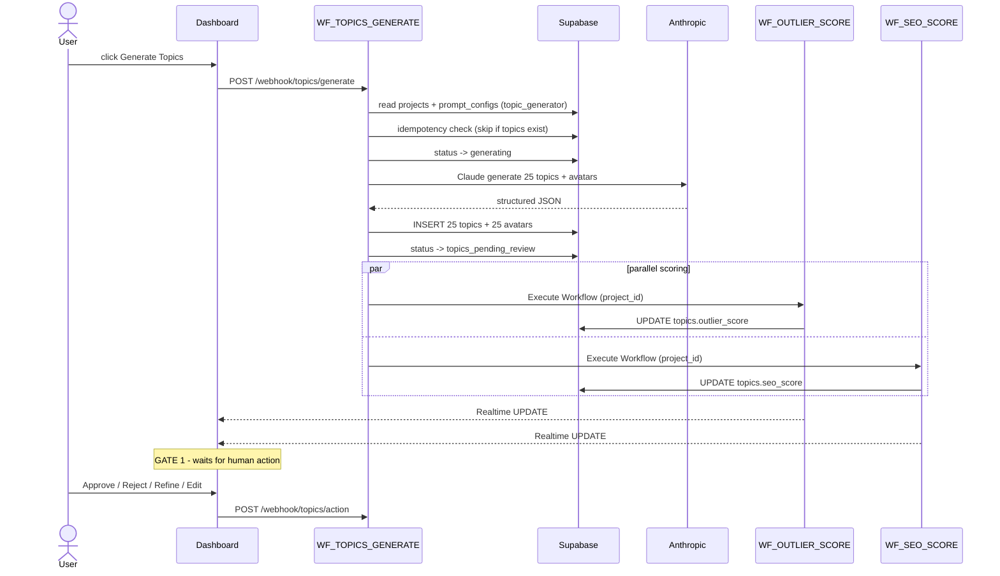

# Phase B · Topic Generation (Gate 1)

> Generate 25 SEO-optimised topics + customer avatars for an approved niche, score each in parallel for outlier potential and SEO strength, then halt at Gate 1. **Cost:** ~$0.20 generation + ~$0.15/topic if refined. **Duration:** 1-2 minutes generation, then waits indefinitely for Gate 1.

## Goal

Phase B produces the 25-row topic backlog the rest of the pipeline draws from. Each topic carries a 10-field customer avatar, an outlier intelligence score (CF01 — algorithm-push potential), and an SEO score (CF02 — search-pull potential). The phase pauses at Gate 1 once all 25 are inserted; nothing in Phase C can start until at least one topic is `approved`.

## Sequence diagram

## Inputs (read from)

- `webhook payload` — `{ project_id }` POSTed to `topics/generate` from `useGenerateTopics`. Auth via Bearer token.
- `projects` — `niche_system_prompt`, `niche_expertise_profile`, `niche_red_ocean_topics[]`, `playlist1/2/3_name + theme`, `style_dna`. Written by Phase A.
- `prompt_configs` — `prompt_text` where `prompt_type = 'topic_generator'` AND `is_active = true`. Written by Phase A.
- `niche_profiles` — competitor + audience data injected into the prompt for blue-ocean targeting.

## Outputs (writes to)

- `topics` — 25 new rows. Per-row: `topic_number` (1-25), `playlist_group` (1-3), `playlist_angle`, `original_title`, `seo_title`, `narrative_hook`, `key_segments`, `estimated_cpm`, `viral_potential`, `review_status = 'pending'`, plus `outlier_score` + `algorithm_momentum` (from WF_OUTLIER_SCORE) and `seo_score` + `seo_classification` + `primary_keyword` (from WF_SEO_SCORE). Schema in [`supabase/migrations/001_initial_schema.sql`](https://github.com/akinwunmi-akinrimisi/vision-gridai-platform/blob/main/supabase/migrations/001_initial_schema.sql). Consumed by Phase C (script generation reads `seo_title`, `narrative_hook`, `key_segments`).
- `avatars` — 25 rows linked 1:1 to topics. 10 fields per the SOP: `avatar_name_age`, `occupation_income`, `life_stage`, `pain_point`, `spending_profile`, `knowledge_level`, `emotional_driver`, `online_hangouts`, `objection`, `dream_outcome`. Consumed by Phase C as variable injection into script prompts.
- `projects.status` — transitions `ready_for_topics` → `generating` → `topics_pending_review`.
- `topics.refinement_history` (JSONB array) — appended on every Gate 1 refine action: `{instruction, result, timestamp}`.

## Gate behavior

**Gate 1.** Dashboard route `/project/:id/topics` ([`TopicReview`](https://github.com/akinwunmi-akinrimisi/vision-gridai-platform/blob/main/dashboard/src/pages/TopicReview.jsx)). All 25 cards display with outlier + SEO scores once those workflows complete. Actions:

| Action | Webhook | Effect |
|--------|---------|--------|
| Approve | `POST /webhook/topics/action` (action=`approve`) | `review_status = 'approved'`. Topic enters Phase C queue. |
| Reject | same (action=`reject`) | `review_status = 'rejected'`. Removed from pipeline. |
| Refine | same (action=`refine`) + `instruction` | Claude regenerates that one topic; **all 24 other topics are passed as context** to avoid title overlap. New version replaces fields; old version appended to `refinement_history`. ~$0.15 per refinement. |
| Edit | same (action=`edit`) + field overrides | Direct PATCH of title/hook/avatar fields without AI. |
| Approve All | bulk action | Approves all 25 in one call. |

**Auto-pilot:** when `projects.auto_pilot_enabled = true`, topics whose combined intelligence score exceeds `auto_pilot_topic_threshold` flip to `approved` automatically. The remainder still queue for manual review. See [Gates](../concepts/gates.md).

The pipeline pauses indefinitely until at least one topic is `approved`. There is no timeout.

## Workflows involved

- `WF_TOPICS_GENERATE` — webhook `topics/generate`. 26 nodes: idempotency guard, prompt build, Claude call, parse, INSERT topics + avatars, then "Trigger WF_OUTLIER_SCORE" + "Trigger WF_SEO_SCORE" fired in parallel via Execute Workflow. See [`workflows/WF_TOPICS_GENERATE.json`](https://github.com/akinwunmi-akinrimisi/vision-gridai-platform/blob/main/workflows/WF_TOPICS_GENERATE.json).
- `WF_OUTLIER_SCORE` — Execute Workflow trigger (no public webhook). Splits topics into batches, scores each via YouTube Data API + Claude Opus, writes `outlier_score` + `algorithm_momentum`. Auth-credential fix landed 2026-04-20 (see Session 38 part 8 in `MEMORY.md`).
- `WF_SEO_SCORE` — Execute Workflow trigger. Splits topics into batches, scores via Google Autocomplete + Search + Claude Opus, writes `seo_score` + `seo_classification` + `primary_keyword`.
- `WF_TOPICS_ACTION` — webhook `topics/action`. 29 nodes routing approve / reject / refine / edit branches, with refine-failure logging back to dashboard.

!!! info "WF_NICHE_VIABILITY is a sibling flow, not part of this chain"
    `WF_NICHE_VIABILITY` (webhook `niche-viability`) runs in the channel-analysis tooling — it scores whether a competitor channel's overall niche is worth entering. It is **not** invoked by `WF_TOPICS_GENERATE`. ⚠ Needs verification if the doc-site spec wanted this scored per-topic; the live wiring scores it per channel-analysis.

## Failure modes + recovery

- **Claude generation error** — "Check Claude Error" + "IF Generation Error" nodes set `projects.status = 'topic_generation_failed'` and write `failed` to `production_logs`. Recovery: re-POST `topics/generate` with the same `project_id`. The "Idempotency Guard" node skips re-generation if any topics already exist; pass `force_regenerate = true` to force.
- **Partial generation** (e.g., 20 of 25 parsed) — saved rows are inserted; the run logs a warning. The dashboard surfaces the gap and the user can refine the missing slots.
- **Outlier or SEO scoring failure** — non-blocking. Topics persist with NULL scores. Dashboard renders "Score unavailable." Re-trigger by posting to the corresponding workflow via Execute Workflow API.
- **Refinement loop** — refinement that itself errors writes a `refine_failed` log row and returns the original topic unchanged. The user can retry with a clearer instruction. The previously-stored version remains in `refinement_history`.
- **Webhook auth failure (401)** — Bearer token mismatch. See `MEMORY.md` "2026-04-23 follow-up patch" for the credential rotation procedure if Phase B suddenly stops accepting requests after a JWT rotation.

All external API calls (Claude, YouTube Data API, Google Search) are wrapped in `WF_RETRY_WRAPPER` (1s → 2s → 4s → 8s, max 4 attempts).

## Code references

- [`directives/01-topic-generation.md:1-64`](https://github.com/akinwunmi-akinrimisi/vision-gridai-platform/blob/main/directives/01-topic-generation.md) — SOP source of truth.
- [`workflows/WF_TOPICS_GENERATE.json`](https://github.com/akinwunmi-akinrimisi/vision-gridai-platform/blob/main/workflows/WF_TOPICS_GENERATE.json) — 26-node generator + scoring fan-out.
- [`workflows/WF_TOPICS_ACTION.json`](https://github.com/akinwunmi-akinrimisi/vision-gridai-platform/blob/main/workflows/WF_TOPICS_ACTION.json) — Gate 1 action handler.
- [`workflows/WF_OUTLIER_SCORE.json`](https://github.com/akinwunmi-akinrimisi/vision-gridai-platform/blob/main/workflows/WF_OUTLIER_SCORE.json) — algorithm-push intelligence.
- [`workflows/WF_SEO_SCORE.json`](https://github.com/akinwunmi-akinrimisi/vision-gridai-platform/blob/main/workflows/WF_SEO_SCORE.json) — search-pull intelligence.
- [`dashboard/src/App.jsx:52`](https://github.com/akinwunmi-akinrimisi/vision-gridai-platform/blob/main/dashboard/src/App.jsx) — Gate 1 route registration `/project/:id/topics`.
- `MEMORY.md` "Production Workflow IDs" — live n8n IDs.
- [`Dashboard_Implementation_Plan.md`](https://github.com/akinwunmi-akinrimisi/vision-gridai-platform/blob/main/Dashboard_Implementation_Plan.md) §4 Phase B + Page 3 — UI spec for the topic-review cards.
