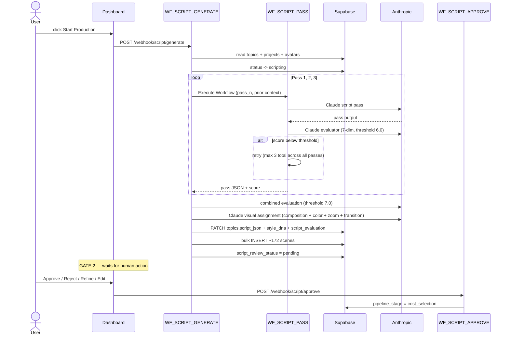

# Phase C · 3-Pass Script Generation (Gate 2)

> Generate an 18,000-24,000 word documentary script across three passes with per-pass and combined evaluation gates, lock the project's Style DNA, and pause at Gate 2. **Cost:** ~$1.80. **Duration:** 8-15 minutes.

## Goal

Phase C produces the master script that drives every downstream production stage. Three sequential Claude calls (Foundation → Depth → Resolution) each get evaluated against a 7-dimension rubric. The combined script is then evaluated as a whole, parsed into ~172 scene rows, and the project's Style DNA is locked here so every Phase D image prompt can append it for visual consistency. The pipeline halts at Gate 2 until the operator approves the script.

## Sequence diagram

## Inputs (read from)

- `webhook payload` — `{ topic_id }` POSTed to `script/generate`. Auth via Bearer token.
- `topics` — `seo_title`, `narrative_hook`, `key_segments`, `playlist_angle` for the chosen topic.
- `projects` — `niche_system_prompt`, `niche_expertise_profile`, `style_dna` (if previously generated; otherwise generated and locked here).
- `avatars` — all 10 fields, injected verbatim into pass prompts as `{{avatar_*}}` variables. See [`directives/02-script-generation.md:14-17`](https://github.com/akinwunmi-akinrimisi/vision-gridai-platform/blob/main/directives/02-script-generation.md).
- `prompt_configs` — active `script_pass1`, `script_pass2`, `script_pass3`, `evaluator` rows generated in Phase A.

## Outputs (writes to)

- `topics.script_json` — full scene array as JSONB. Per-scene fields: `narration_text`, `image_prompt`, `visual_type` (initial value `static_image` — Phase D2.5 may upgrade some to `i2v` after the Cost Calculator gate), `color_mood` (1 of 7), `zoom_direction` (1 of 6), `composition_prefix` (1 of 8), `caption_highlight_word`, `transition_to_next`, `emotional_beat`, `chapter`, `selective_color_element` (mostly null). See [`directives/02-script-generation.md:39-46`](https://github.com/akinwunmi-akinrimisi/vision-gridai-platform/blob/main/directives/02-script-generation.md) for the full schema.
- `topics.script_metadata` — `{ video_metadata: { title, description, tags, thumbnail_prompt } }`.
- `topics.word_count`, `topics.scene_count`, `topics.script_quality_score` (combined), `topics.script_evaluation` (per-dimension JSONB), `topics.script_pass_scores` (each pass's score), `topics.script_attempts` (1-3), `topics.script_force_passed` (true if 3 attempts couldn't clear 7.0).
- `projects.style_dna` — locked once and never regenerated mid-project. Appended to every Phase D image prompt as `composition_prefix + scene_subject + style_dna`.
- `topics.title_options` — CTR title variants from `WF_CTR_OPTIMIZE` (CF05).
- `topics.viral_moments` — per-chapter hook scores from `WF_HOOK_ANALYZER` (CF12).
- `scenes` — bulk INSERT of ~172 rows, one per scene. All status fields default to `pending`.
- `topics.script_review_status` — `pending` until Gate 2 acts.
- `topics.pipeline_stage` — set to `cost_selection` on Gate 2 approval (see [`workflows/WF_SCRIPT_APPROVE.json`](https://github.com/akinwunmi-akinrimisi/vision-gridai-platform/blob/main/workflows/WF_SCRIPT_APPROVE.json) "Patch Topic Approved" + "Trigger Production").

## Gate behavior

**Gate 2.** Dashboard route `/project/:id/topics/:topicId/script` ([`ScriptReview`](https://github.com/akinwunmi-akinrimisi/vision-gridai-platform/blob/main/dashboard/src/pages/ScriptReview.jsx); registered at [`dashboard/src/App.jsx:56`](https://github.com/akinwunmi-akinrimisi/vision-gridai-platform/blob/main/dashboard/src/App.jsx)). Renders full script (collapsible by chapter), 7-dimension score breakdown, hook scores per chapter, CTR title variants, visual type distribution, force-pass warning if applicable.

| Action | Webhook | Effect |
|--------|---------|--------|
| Approve | `POST /webhook/script/approve` | `script_review_status = 'approved'`, `pipeline_stage = 'cost_selection'`. Pipeline advances to the Cost Calculator gate (Phase D2.5 ratio selection). |
| Reject | `POST /webhook/script/reject` | `script_review_status = 'rejected'`. Option to regenerate with feedback. |
| Refine | (refine action via custom webhook) | Claude regenerates only the affected pass(es). Other passes preserved. |
| Edit Scenes | inline UI edits via Supabase PATCH | Direct edits to `narration_text` / `image_prompt` per scene. |

**Auto-pilot:** when enabled, scripts where the combined evaluation exceeds `auto_pilot_script_threshold` flip directly to `approved`. **Force-passed scripts (could not clear 7.0 in 3 attempts) always require manual review** regardless of the auto-pilot flag — see [Gates](../concepts/gates.md).

## Workflows involved

- `WF_SCRIPT_GENERATE` — orchestrator. 26 nodes including `Prep & Read Avatar`, `Call Pass 1`, `Handle Pass 1 + Prep Pass 2`, `Call Pass 2`, `Extract Metadata + Prep Pass 3`, `Call Pass 3`, `Assemble Script`, `Claude: Visual Assignment`, `Build Scenes Array`, `Bulk Insert Scenes`. Webhook path `script/generate`. See [`workflows/WF_SCRIPT_GENERATE.json`](https://github.com/akinwunmi-akinrimisi/vision-gridai-platform/blob/main/workflows/WF_SCRIPT_GENERATE.json).
- `WF_SCRIPT_PASS` — unified per-pass executor (Execute Workflow trigger, no public webhook). Single `Generate With Retry` node handles the Claude generate → evaluate → retry loop. Per-pass threshold 6.0, max 3 retries shared across all passes.
- `WF_SCRIPT_APPROVE` — webhook `script/approve`. 10 nodes: auth, validate, read topic, PATCH approved, trigger downstream, log. Sets `pipeline_stage = 'cost_selection'`.
- `WF_SCRIPT_REJECT` — webhook `script/reject`. 8 nodes mirroring approve.
- `WF_CTR_OPTIMIZE` — fires after script assembly, generates title variants → `topics.title_options`.
- `WF_HOOK_ANALYZER` — fires after script assembly, scores each chapter's opening hook → `topics.viral_moments`.

## Failure modes + recovery

- **Pass scores below 6.0** — `WF_SCRIPT_PASS` retries internally up to 3 times **shared across all passes**. If Pass 1 burns 2 retries and Pass 3 still fails, only 1 retry remains for Pass 3.
- **Combined evaluation < 7.0 after retries** — script flagged `script_force_passed = true` and surfaced to Gate 2 with a warning. Auto-pilot will not skip these even if force-passed.
- **Anthropic API timeout / 429** — wrapped in `WF_RETRY_WRAPPER` (1s → 2s → 4s → 8s, max 4 attempts per call).
- **Partial-pass failure** — completed passes are preserved in workflow state; only the failed pass re-runs. The Collect Error → PATCH Status Failed → Log Failed branch fires for unrecoverable errors.
- **Style DNA inconsistency** — Style DNA is generated once per project (in Phase A or here on first script run) and stored in `projects.style_dna`. **Never regenerate mid-project.** If a script run produces a different DNA, the existing column is preserved.
- **ALL_CAPS in narration** — must be preprocessed to title case before TTS or Google Chirp 3 spells it letter-by-letter. See `CLAUDE.md` Gotchas.
- **Mechanical segmentation rule** — Claude only adds image prompts and cinematic metadata. It must not rewrite narration. The `Build Scenes Array` node enforces this by carrying narration verbatim into the scene rows.

## Code references

- [`directives/02-script-generation.md:1-91`](https://github.com/akinwunmi-akinrimisi/vision-gridai-platform/blob/main/directives/02-script-generation.md) — SOP source of truth (3-pass architecture, scene schema, Gate 2 actions).
- [`workflows/WF_SCRIPT_GENERATE.json`](https://github.com/akinwunmi-akinrimisi/vision-gridai-platform/blob/main/workflows/WF_SCRIPT_GENERATE.json) — orchestrator (26 nodes).
- [`workflows/WF_SCRIPT_PASS.json`](https://github.com/akinwunmi-akinrimisi/vision-gridai-platform/blob/main/workflows/WF_SCRIPT_PASS.json) — unified per-pass executor with retry.
- [`workflows/WF_SCRIPT_APPROVE.json`](https://github.com/akinwunmi-akinrimisi/vision-gridai-platform/blob/main/workflows/WF_SCRIPT_APPROVE.json) — Gate 2 approval handler (sets `pipeline_stage = 'cost_selection'`, no direct production trigger).
- [`workflows/WF_SCRIPT_REJECT.json`](https://github.com/akinwunmi-akinrimisi/vision-gridai-platform/blob/main/workflows/WF_SCRIPT_REJECT.json) — Gate 2 rejection handler.
- [`dashboard/src/App.jsx:56`](https://github.com/akinwunmi-akinrimisi/vision-gridai-platform/blob/main/dashboard/src/App.jsx) — Gate 2 dashboard route.
- `CLAUDE.md` "3-pass script generation" + "Style DNA is LOCKED per project" rules.
- `MEMORY.md` "Production Workflow IDs" — n8n IDs (`WF_SCRIPT_GENERATE` = `DzugaN9GtVpTznvs`, `WF_SCRIPT_APPROVE` = `qRsX9Ec7DWxqJiaS`, `WF_SCRIPT_PASS` = `CRC9USwaGgk7x6xN`, `WF_SCRIPT_REJECT` = `7yo7dZAtewNxK9TE`).

!!! info "visual_type is `static_image` until the Cost Calculator gate"
    The script-generation directive locks every scene to `visual_type = 'static_image'`. Phase D2.5 (Cost Calculator) gives the operator the option to upgrade 5%, 10%, or 15% of scenes to hybrid I2V scenes via `WF_SCENE_CLASSIFY` (webhook `scene-classify`), which selects high-impact scenes and writes `visual_type = 'i2v'` before TTS begins. See [Phase D · Production](phase-d-production.md).
