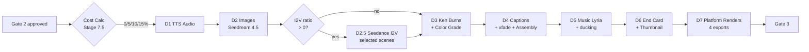

# Phase D · Production Pipeline

> Deterministic batch production: TTS → images → optional I2V clips → Ken Burns motion → captions + xfade transitions + assembly → music + end card → 4 platform-specific renders. **Cost:** ~$7-69 per video (variable by I2V ratio). **Duration:** 1-4 hours depending on scene count + I2V usage.

## Goal

Phase D turns the approved script (~172 scenes) into four platform-ready video files. Every stage is deterministic and resumable — if assembly crashes mid-batch at 3 AM, it picks back up at 8 AM from the last completed scene. The phase has one human pause: the **Cost Calculator gate** between scene segmentation and TTS, where the operator picks the I2V ratio (0%, 5%, 10%, 15%) that determines cost and runtime.

The seven sub-stages run in strict order. Each writes its outputs to Supabase scene-by-scene (never in batch), and each transitions `topics.pipeline_stage` on completion so the dashboard can render progress live.

## Sequence diagram

## Inputs (read from)

- `topics.pipeline_stage` — set to `cost_selection` by Gate 2 approval. After the operator picks the I2V ratio, `WF_SCENE_CLASSIFY` (webhook `scene-classify`) selects high-impact scenes and writes `visual_type = 'i2v'` for the chosen percentage, then transitions `pipeline_stage = 'tts'` and triggers Phase D1 via `/webhook/production/trigger`.
- `scenes` — full row per scene: `narration_text`, `image_prompt`, `composition_prefix`, `color_mood`, `zoom_direction`, `transition_to_next`, `caption_highlight_word`, `selective_color_element`, `visual_type`.
- `projects.style_dna` — locked in Phase C; appended to every Phase D2 image prompt.
- `prompt_templates` — composition prefix templates + universal negative prompt (Fal.ai-wide guard).

## Outputs (writes to)

- `scenes` — per scene: `audio_*`, `image_*`, `clip_*`, `video_*` columns + status enums (`audio_status`, `image_status`, `clip_status`, `video_status`). All flip `pending` → `uploaded` as each asset lands.
- `scenes.start_time_ms` / `end_time_ms` — cumulative timeline positions written by D1.
- `topics.audio_progress` / `images_progress` / `t2v_progress` / `i2v_progress` / `assembly_status` — live progress strings (`done:N/172` or `complete`).
- `topics.pipeline_stage` — transitions: `tts` → `tts_complete` → `images_complete` → `i2v_complete` (if I2V ratio > 0) → `ken_burns_complete` → `assembled` → `music_complete` → `endcard_complete` → `renders_complete`.
- `topics.drive_video_url` / `drive_subfolder_ids` — Drive paths to assembled video + per-stage subfolders (audio, images, video_clips, captions, final).
- `topics.predicted_performance_score` — written by CF13 PPS after assembly, before Gate 3.
- `renders` — one row per platform export (4 rows: YouTube long, YouTube Shorts, TikTok, Instagram).
- `platform_metadata` — thumbnail URL written by `WF_THUMBNAIL_GENERATE`.
- `production_logs` — every external-API call (Google TTS, Fal.ai Seedream, Fal.ai Seedance, Lyria, FFmpeg invocations) writes a row.

## Gate behavior

**No Gate 3 until D7 completes.** Phase D itself contains one operator pause:

- **Cost Calculator (Stage 7.5)** — between scene segmentation and TTS. Pipeline halts at `pipeline_stage = 'cost_selection'`. The operator picks one of four ratios for hybrid scenes:

| Ratio | Image-only / I2V | Cost impact |
|-------|------------------|-------------|
| 100/0 | All static + Ken Burns | $0 added |
| 95/5 | ~9 scenes get Seedance I2V | ~$21 added |
| 90/10 | ~17 scenes get I2V | ~$42 added |
| 85/15 | ~26 scenes get I2V | ~$63 added |

Selection happens on the dashboard (Cost Calculator UI) and triggers `WF_SCENE_CLASSIFY` (webhook `scene-classify`) which marks the chosen scenes `visual_type = 'i2v'` before TTS begins. See [Phase C](phase-c-script-generation.md) for the upstream context.

## Sub-stages

### D1 · TTS Audio

Google Cloud TTS Chirp 3 HD voice generates one MP3 per scene. **Audio is the master clock**: FFprobe measures actual duration in milliseconds and writes `scenes.audio_duration_ms` — every downstream visual derives its `-t` flag from this. ALL_CAPS narration is preprocessed to title case (Journey-D voice spells caps letter-by-letter; pitch parameter is omitted entirely or returns `INVALID_ARGUMENT`). After each scene, cumulative `start_time_ms` / `end_time_ms` are written so the assembly stage can compute transition offsets without re-summing. Resume logic queries `WHERE audio_status = 'pending'` so a crashed run picks up where it stopped. **Workflow:** `WF_TTS_AUDIO` (webhook `production/tts`, n8n ID `4L2j3aU2WGnfcvvj`, 39 nodes).

### D2 · Images (Fal.ai Seedream 4.5)

All 172 scenes get a Fal.ai Seedream 4.5 image at `landscape_16_9` (long-form) or `portrait_9_16` (shorts — never cropped from 16:9). The final prompt is constructed mechanically: `composition_prefix + scene_subject + style_dna`. Style DNA is locked at the project level and never varies between scenes. The universal negative prompt (stored in `prompt_templates`) is included on every call to prevent text-in-image artifacts and style drift. Fal.ai is async — POST to `queue.fal.run` creates a task, then poll the result endpoint. Rate limit is 2 concurrent requests per 10s. **Workflows:** `WF_IMAGE_GENERATION` (webhook `production/images`, n8n ID `ScP3yoaeuK7BwpUo`) + `WF_SCENE_IMAGE_PROCESSOR` per-scene (n8n ID `Lik3MUT0E9a6JUum`).

### D2.5 · I2V Clips (Seedance 2.0 Fast — selected scenes only)

Only fires if the operator picked a ratio > 0 at the Cost Calculator gate. Seedance 2.0 Fast generates 10-second 720p video clips from each selected image, then FFmpeg upscales to 1080p with `scale=1920:1080:flags=lanczos`. The Seedance audio is discarded — TTS remains the single audio source. **Workflows:** `WF_SEEDANCE_I2V` (webhook `production/i2v-hybrid`) + `WF_SCENE_I2V_PROCESSOR` (n8n ID `TOkpPY35veSf5snS`). I2V rate limit: 2 concurrent / 10s.

### D3 · Ken Burns + Color Grade (FFmpeg)

Each scene image becomes a per-scene MP4 via FFmpeg `zoompan`. The `zoom_direction` field maps to one of 6 templates (zoom_in_center, zoom_out_center, pan_left, pan_right, pan_up, pan_down) with intensity `0.0008-0.001` for long-form (subtle) or `0.0015` for short-form (aggressive). `color_mood` maps to one of 7 filter chains (warm_golden, cool_blue, neutral, dramatic, vintage, neon, desaturated) using `eq` + `colorbalance`. **Selective-color scenes skip the color grade entirely** — if `selective_color_element IS NOT NULL`, the filter chain is omitted. Frame rate is locked to 30fps and codec to `libx264 + yuv420p` so the downstream concat works without re-encoding. Process in batches of 20 to manage VPS memory. **Workflow:** `WF_KEN_BURNS` (webhook `production/ken-burns`, 11 nodes).

### D4 · Captions + Transitions + Assembly

The biggest stage. Whisper forced alignment generates word-level timings from each TTS clip. `generate_kinetic_ass.py` builds an ASS subtitle file with word-by-word pop-in animation; emphasis words (from `caption_highlight_word`) render in yellow/red, center screen, bold sans-serif, drop shadow. Scenes are joined with `xfade` transitions per the `transition_to_next` field (5 types: crossfade, hard_cut, zoom_blur, wipe_left, dissolve_slow). **172-scene xfade chains hit FFmpeg memory limits**, so assembly runs in batches of 15-20 scenes per `batch_N.mp4`, then crossfades the batches. Audio is normalized to `-16 LUFS / -1.5 TP` via `loudnorm`, then captions are burned by the **caption burn service** on host (port 9998, systemd `caption-burn.service`, 3-hour timeout) which executes `docker exec n8n-n8n-1 ffmpeg ... subtitles=...:force_style='...'` — host-side because the n8n task runner OOMs on libass. WF_CAPTIONS_ASSEMBLY has 3-layer crash prevention: per-clip fps/sample_rate validation + auto re-encode, pre-concat outlier scan + fix, and post-concat duration drift check (>5% short triggers a WARNING). **Workflow:** `WF_CAPTIONS_ASSEMBLY` (webhook `production/assembly`, n8n ID `Fhdy66BLRh7rAwTi`, 47 nodes). See [Subsystems · Caption Burn](../subsystems/caption-burn.md) for service operations detail.

### D5 · Background Music (Lyria) + Ducking

Claude Haiku analyzes the script's `music_sections` to determine mood/tempo/instruments per chapter. Vertex AI Lyria (`lyria-002`) generates custom 30-second clips per mood section, FFmpeg loops + crossfades them at chapter boundaries, then mixes under the voiceover at **`volume=0.12` — NOT 0.5**. Music must be barely perceptible; this is non-negotiable per the directive. **Workflow:** `WF_MUSIC_GENERATE` (Execute Workflow trigger, no public webhook).

### D6 · End Card + Thumbnail

End card: static branded PNG (dark `#0A0A1A` background + channel logo + subscribe CTA), FFmpeg fade in/out, 5-8s for long-form / 3s for shorts. **Included in total video length calculation** (affects YouTube watch-time math). Thumbnail: Fal.ai Seedream 4.5 generates a photorealistic image (Canon EOS R5, RAW look, teal-orange grade — explicitly NOT illustration), then Sharp/Jimp overlays text via an n8n Code node. Text fills 70-75% of allotted space, **always in question format**, with 2-4 keywords in contrasting color (per user feedback files in `MEMORY.md`). Three styles are supported: `single_face`, `dual_face`, `scene_overlay`. CF06 `WF_THUMBNAIL_SCORE` then sends the thumbnail to Claude Vision for 7-factor CTR scoring; if below threshold, regenerate (max 2 attempts). **Workflows:** `WF_ENDCARD` + `WF_THUMBNAIL_GENERATE` (n8n ID `7GqpEAug8hxxU7f6`) + `WF_THUMBNAIL_SCORE`.

### D7 · Platform-Specific Renders

Four exports, each with different CRF / bitrate / resolution targets. Do **not** reuse one export across platforms — bitrate and CRF differ deliberately for each platform's encoder.

| Platform | Resolution | CRF | Preset | Bitrate | Audio |
|----------|-----------|-----|--------|---------|-------|
| YouTube Long | 1920x1080 | 17-19 | slow | 12 Mbps | 192k AAC |
| YouTube Shorts | 1080x1920 | 18-20 | slow | 6 Mbps | 192k AAC |
| TikTok | 1080x1920 | 20-23 | medium | 4 Mbps | 128k AAC |
| Instagram | 1080x1920 | 20-23 | medium | 3.5 Mbps | 128k AAC |

All exports include `-movflags +faststart`. Each render is stored as a row in the `renders` table.

## Workflows involved

- `WF_TTS_AUDIO` — D1, n8n ID `4L2j3aU2WGnfcvvj`.
- `WF_IMAGE_GENERATION` + `WF_SCENE_IMAGE_PROCESSOR` — D2, IDs `ScP3yoaeuK7BwpUo` + `Lik3MUT0E9a6JUum`.
- `WF_SCENE_CLASSIFY` — selects I2V scenes after the Cost Calculator gate (webhook `scene-classify`, n8n ID `WaPnGhyhQO2gDemX`).
- `WF_SEEDANCE_I2V` + `WF_SCENE_I2V_PROCESSOR` — D2.5, IDs include `TOkpPY35veSf5snS`.
- `WF_KEN_BURNS` — D3.
- `WF_CAPTIONS_ASSEMBLY` — D4, ID `Fhdy66BLRh7rAwTi`.
- `WF_ASSEMBLY_WATCHDOG` — monitors stuck assembly runs and intervenes (n8n ID `Exm836gCGtxNKOeD`).
- `WF_MUSIC_GENERATE` — D5.
- `WF_ENDCARD` + `WF_THUMBNAIL_GENERATE` + `WF_THUMBNAIL_SCORE` — D6.
- `WF_PLATFORM_METADATA` — also runs in this phase to prepare per-platform metadata for D7 + Phase E.

All external API calls (Google TTS, Fal.ai, Lyria, FFmpeg shell) are wrapped in `WF_RETRY_WRAPPER` (1s → 2s → 4s → 8s, max 4 attempts).

## Failure modes + recovery

- **TTS API failure on a single scene** — retried 4x via WF_RETRY_WRAPPER. After all retries fail: `scenes.audio_status = 'failed'`. If 3+ scenes fail, `topics.supervisor_alerted = true` and the supervisor cron auto-retries.
- **Fal.ai NSFW / content-filter rejection** — single scene marked `image_status = 'failed'`. Pipeline continues; the operator can regenerate the scene from the dashboard. 5+ failures alert supervisor.
- **FFmpeg OOM during Ken Burns batch** — batch size auto-reduced from 20 to 10 and retried. Mismatched fps detected pre-concat triggers auto re-encode to 30fps before proceeding.
- **Assembly truncation (Session 35 root cause)** — mixed fps/sample_rate clips cause `-c copy` concat to silently truncate. WF_CAPTIONS_ASSEMBLY auto-validates per-clip + auto-re-encodes outliers + post-concat duration drift check. Drift > 5% short triggers WARNING; the If-node downstream catches it and routes to fix.
- **Caption burn service hang or 3hr timeout** — service is host-side at `/opt/caption-burn/caption_burn_service.py`. Restart with `systemctl restart caption-burn.service`. Re-trigger assembly only for the affected topic.
- **Lyria generation failure** — non-blocking. Pipeline proceeds with silence under voiceover. Music is enhancement, not gating.
- **Thumbnail generation failure** — retried 2x. If still failing, video proceeds without custom thumbnail (manual upload from Gate 3).
- **All scene-level resume logic** — every workflow queries `WHERE {stage}_status = 'pending'` first. A crashed pipeline restart skips already-completed scenes automatically.

## Code references

- [`directives/03-tts-audio.md:1-60`](https://github.com/akinwunmi-akinrimisi/vision-gridai-platform/blob/main/directives/03-tts-audio.md) — D1 SOP (master clock rule, Journey-D quirks).
- [`directives/04-image-generation.md:1-82`](https://github.com/akinwunmi-akinrimisi/vision-gridai-platform/blob/main/directives/04-image-generation.md) — D2 SOP (prompt construction, Style DNA lock).
- [`directives/05-ken-burns-color.md:1-82`](https://github.com/akinwunmi-akinrimisi/vision-gridai-platform/blob/main/directives/05-ken-burns-color.md) — D3 SOP including all 6 zoom direction expressions and 7 color mood filter chains.
- [`directives/06-captions-assembly.md:1-86`](https://github.com/akinwunmi-akinrimisi/vision-gridai-platform/blob/main/directives/06-captions-assembly.md) — D4 SOP (xfade table, batched assembly, 3-layer crash prevention).
- [`directives/07-music-endcard.md:1-95`](https://github.com/akinwunmi-akinrimisi/vision-gridai-platform/blob/main/directives/07-music-endcard.md) — D5 + D6 SOP (volume=0.12, thumbnail style rules).
- [`directives/08-platform-publish.md:6-16`](https://github.com/akinwunmi-akinrimisi/vision-gridai-platform/blob/main/directives/08-platform-publish.md) — D7 platform export profiles table.
- [`workflows/WF_CAPTIONS_ASSEMBLY.json`](https://github.com/akinwunmi-akinrimisi/vision-gridai-platform/blob/main/workflows/WF_CAPTIONS_ASSEMBLY.json) — 47 nodes, 3-layer assembly crash prevention.
- [`workflows/WF_KEN_BURNS.json`](https://github.com/akinwunmi-akinrimisi/vision-gridai-platform/blob/main/workflows/WF_KEN_BURNS.json) — D3 implementation with zoompan + color grade dispatch.
- `MEMORY.md` Sessions 32, 34, 35 — assembly truncation root-cause + permanent fixes.
- `CLAUDE.md` "Pipeline Quick Reference" — cost table source.

!!! warning "FFmpeg concat with `-c copy` requires homogeneous clips"
    Mixed fps / sample_rate / codec causes silent truncation — the output appears to succeed but is shorter than expected. WF_CAPTIONS_ASSEMBLY auto-validates and fixes, but if you bypass that workflow ensure all inputs are 30fps / 24kHz / h264 / aac. See `MEMORY.md` Session 35 for the historical truncation incident.

!!! info "Audio is the master clock"
    Every visual's duration = its TTS audio duration via FFmpeg `-t scenes.audio_duration_ms / 1000`. Never derive from word count or estimated file size. See [Concepts · Why](../concepts/why.md) "The 3 invariants".
