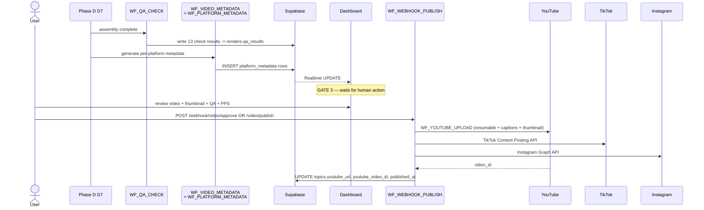

# Phase E · Video Review (Gate 3) + Publish

> Run 13 automated QA checks, halt at Gate 3 for human review, then upload to YouTube + TikTok + Instagram with platform-specific metadata. **Cost:** ~$0 platform fees + YouTube quota (1,600 units / upload, max 6 / day). **Duration:** 5-15 minutes upload time per platform.

## Goal

Phase E is the final gate. The fully assembled video runs through `WF_QA_CHECK`'s 13 automated tests (visual, caption, audio, platform-compliance), the dashboard renders pass/fail badges plus PPS + thumbnail + metadata + 5 title variants, and the operator decides whether to publish, schedule, or reject. Auto-pilot can skip Gate 3 only if all 13 QA checks pass — and even then, it publishes as `unlisted`, never public.

## Sequence diagram

## Inputs (read from)

- `topics.pipeline_stage = 'renders_complete'` — set by D7. Triggers QA + metadata generation.
- `renders` — 4 rows (YouTube long, YouTube Shorts, TikTok, Instagram) with file paths + render specs from D7.
- `topics.script_metadata` — title / description / tags / thumbnail_prompt seed data from Phase C.
- `topics.predicted_performance_score` — CF13 PPS computed pre-Gate 3.
- `topics.title_options` — CF05 5-variant title picker.
- `platform_metadata.thumbnail_url` — written by `WF_THUMBNAIL_GENERATE` in D6.
- `topics.thumbnail_score` — CF06 Claude Vision CTR score.

## Outputs (writes to)

- `renders.qa_results` (JSONB) — per-render 13-check pass/fail results.
- `platform_metadata` — one row per platform with platform-specific title (60 chars for YouTube, punchy 150 chars for TikTok, storytelling for Instagram), 3-5K char description, 15-30 hashtags/tags, optional chapter timestamps. Generated by `WF_VIDEO_METADATA` (n8n live ID `k0F6KAtkn74PEIDl`) + `WF_PLATFORM_METADATA`. Schema: `supabase/migrations/004_calendar_engagement_music.sql`.
- `topics.video_review_status` — `pending` → `approved` / `rejected` on Gate 3 action.
- `topics.youtube_url`, `topics.youtube_video_id`, `topics.youtube_caption_id`, `topics.thumbnail_url`, `topics.published_at` — written after successful YouTube upload.
- `topics.yt_tags`, `topics.yt_description` — full SEO description (Session 33 added these columns; the dashboard surfaces the full description scrollably).
- `production_logs` — every YouTube / TikTok / Instagram API call writes a row with `cost_usd = 0` (just quota).

## Gate behavior

**Gate 3.** Dashboard route `/project/:id/topics/:topicId/review` ([`VideoReview`](https://github.com/akinwunmi-akinrimisi/vision-gridai-platform/blob/main/dashboard/src/pages/VideoReview.jsx); registered at [`dashboard/src/App.jsx:57`](https://github.com/akinwunmi-akinrimisi/vision-gridai-platform/blob/main/dashboard/src/App.jsx)). The route is `/review`, not `/video`. The page renders:

- Embedded video player streaming from the Drive URL.
- Thumbnail preview + Regenerate button (calls `POST /webhook/thumbnail/regenerate`).
- Editable YouTube/TikTok/Instagram metadata pulled from `platform_metadata`.
- PPS card (CF13).
- 5-variant title picker (CF05) — operator picks one before publishing.
- Thumbnail CTR score (CF06).
- 13-check QA pass/fail checklist with badges.
- Total production cost from `topics.cost_breakdown`.
- Platform selector checkboxes (YouTube ✓, TikTok ✓, Instagram ✓).
- Visibility toggle (public / unlisted / private — defaults to **unlisted**).

| Action | Webhook | Effect |
|--------|---------|--------|
| Approve & Publish | `POST /webhook/video/publish` | Immediate upload to selected platforms via `WF_YOUTUBE_UPLOAD` + TikTok/Instagram APIs. |
| Approve & Schedule | `POST /webhook/video/schedule` | Sets future publish time; YouTube uploads as private + scheduled, social posts queued. |
| Reject | `POST /webhook/video/reject` | `video_review_status = 'rejected'`. Operator can re-trigger a specific Phase D stage. |
| Edit Metadata | `POST /webhook/video/update-metadata` | Inline edit of title / description / tags before publish. |
| Regenerate Thumbnail | `POST /webhook/thumbnail/regenerate` | Re-fires `WF_THUMBNAIL_GENERATE`. |
| Batch Publish | `POST /webhook/video/batch-publish` | Bulk publish across multiple approved topics. |

**Auto-pilot:** if `auto_pilot_enabled = true` AND all 13 QA checks pass, the video auto-publishes at `auto_pilot_default_visibility` (schema-constrained to `unlisted` or `private` — never `public`). Failed QA never auto-publishes regardless of the auto-pilot flag. See [Concepts · Gates](../concepts/gates.md).

## Workflows involved

- `WF_QA_CHECK` — Execute Workflow trigger (no public webhook). 13 automated checks broken into 4 categories:
    - **Visual (5):** resolution matches target, file size in expected range, no black frames > 2s, frame rate = 30fps, aspect ratio correct.
    - **Caption (3):** ASS/SRT exists + non-empty, no overflow beyond safe area, highlight words match narration.
    - **Audio (3):** duration match (video vs sum of scene audio, ±500ms), loudness in target (-16 LUFS ±1), no silence gaps > 2s.
    - **Platform (2):** H.264 + AAC + .mp4 + faststart moov atom present.
    Results written as JSONB to `renders.qa_results`.
- `WF_VIDEO_METADATA` (live n8n ID `k0F6KAtkn74PEIDl`) — 10 nodes generating 3-5K char descriptions, SEO doc + Drive upload, `yt_description` / `yt_tags` columns. Session 33 brought this online; see `MEMORY.md`.
- `WF_PLATFORM_METADATA` — per-platform variants (YouTube SEO long-form, TikTok punchy, Instagram storytelling).
- `WF_THUMBNAIL_GENERATE` (live ID `7GqpEAug8hxxU7f6`) — 3-style thumbnails (single_face / dual_face / scene_overlay). Photorealistic, question format, 70-75% text fill, 2-4 keywords in contrasting color.
- `WF_YOUTUBE_UPLOAD` — 30 nodes, resumable upload + captions.insert + thumbnails.set + playlist assignment.
- `WF_WEBHOOK_PUBLISH` — front door for Gate 3 actions. 63 nodes, 8 webhook entry points (approve, reject, publish, batch-publish, update-metadata, thumbnail/regenerate, retry-upload, schedule).

## Failure modes + recovery

- **QA check failure** — non-blocking for Gate 3 review. The operator can still approve a video with failed checks; the dashboard surfaces the failures inline. Auto-pilot **will not** publish if any check fails.
- **YouTube quota exceeded** — quota is 10,000 units/day, each upload costs 1,600. Max 6 uploads/day. On 403 quotaExceeded, `WF_WEBHOOK_PUBLISH` queues the upload via `POST /webhook/video/retry-upload` for the next day's reset.
- **YouTube upload network failure** — resumable upload via `WF_YOUTUBE_UPLOAD` retries from the last byte offset (handled by the YouTube client, not WF_RETRY_WRAPPER).
- **Metadata generation failure** — falls back to a template (just title + basic description) and flags the topic for manual edit.
- **Thumbnail upload failure** — video can publish without custom thumbnail; YouTube auto-generates one. Failed thumbnails are retried 2x by `WF_THUMBNAIL_GENERATE` before fallback.
- **TikTok / Instagram API failures** — non-blocking; YouTube continues. Each platform has its own retry envelope and writes failures to `production_logs`.

## Code references

- [`directives/08-platform-publish.md:1-95`](https://github.com/akinwunmi-akinrimisi/vision-gridai-platform/blob/main/directives/08-platform-publish.md) — SOP source of truth (QA checks, Gate 3 actions, export profiles).
- [`workflows/WF_QA_CHECK.json`](https://github.com/akinwunmi-akinrimisi/vision-gridai-platform/blob/main/workflows/WF_QA_CHECK.json) — 13-check executor.
- [`workflows/WF_PLATFORM_METADATA.json`](https://github.com/akinwunmi-akinrimisi/vision-gridai-platform/blob/main/workflows/WF_PLATFORM_METADATA.json) — per-platform metadata generator.
- [`workflows/WF_YOUTUBE_UPLOAD.json`](https://github.com/akinwunmi-akinrimisi/vision-gridai-platform/blob/main/workflows/WF_YOUTUBE_UPLOAD.json) — 30-node resumable upload + captions + thumbnail + playlist assignment.
- [`workflows/WF_WEBHOOK_PUBLISH.json`](https://github.com/akinwunmi-akinrimisi/vision-gridai-platform/blob/main/workflows/WF_WEBHOOK_PUBLISH.json) — Gate 3 webhook front door (8 endpoints).
- [`dashboard/src/App.jsx:57`](https://github.com/akinwunmi-akinrimisi/vision-gridai-platform/blob/main/dashboard/src/App.jsx) — Gate 3 dashboard route `/project/:id/topics/:topicId/review`.
- [`Dashboard_Implementation_Plan.md`](https://github.com/akinwunmi-akinrimisi/vision-gridai-platform/blob/main/Dashboard_Implementation_Plan.md) §4 Phase E + Page 4-5 — UI spec.
- `MEMORY.md` Session 33 — `yt_description` / `yt_tags` columns + 3-style thumbnail rollout.

!!! info "WF_VIDEO_METADATA is live but not in the workflows snapshot"
    `WF_VIDEO_METADATA` runs in n8n (ID `k0F6KAtkn74PEIDl`) but the JSON snapshot is not committed to `workflows/`. Live source of truth is the n8n instance at `https://n8n.srv1297445.hstgr.cloud`. ⚠ Needs verification: confirm whether the snapshot should be exported and committed for parity with other workflows.

!!! warning "Auto-pilot never publishes public"
    Even with 13/13 QA passing and auto-pilot enabled, the video is published `unlisted`. The operator manually flips visibility to `public` from the dashboard. See [Concepts · Gates](../concepts/gates.md).
