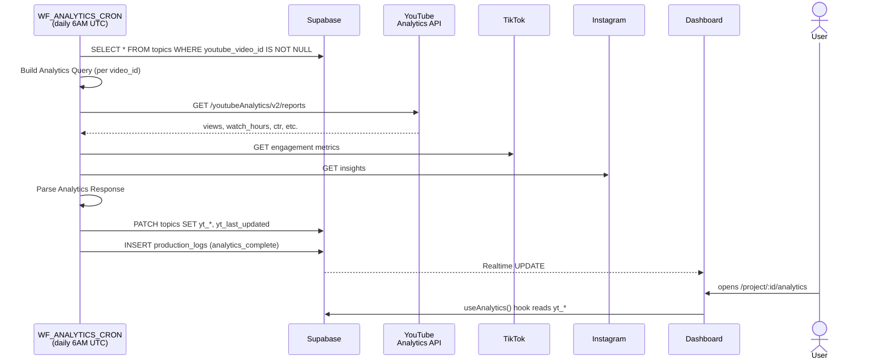

# Phase F · Analytics

> Daily cron pulls YouTube / TikTok / Instagram metrics, writes them to per-topic columns, and surfaces trends + cross-platform comparison + revenue attribution on the dashboard. **Cost:** ~$0 platform fees (API quota only). **Duration:** 5-15 min per cron run.

## Goal

Phase F is the post-publish observation loop. A single daily cron (`WF_ANALYTICS_CRON`, 6 AM UTC) hits the YouTube Analytics API for every published topic, parses the response into a uniform shape, and writes it to `topics.yt_*` columns. The dashboard's [`Analytics`](https://github.com/akinwunmi-akinrimisi/vision-gridai-platform/blob/main/dashboard/src/pages/Analytics.jsx) page reads those columns via `useAnalytics` and renders trends, per-video performance, and per-niche revenue. Two slower crons follow weekly/monthly: `WF_REVENUE_ATTRIBUTION` ties production cost to actual ad revenue per topic, and `WF_NICHE_HEALTH` rolls per-topic data into per-niche health scores.

## Sequence diagram

## Inputs (read from)

- Cron trigger: 6 AM UTC daily via the `Daily 6AM UTC` schedule node in `WF_ANALYTICS_CRON`.
- Manual override: `POST /webhook/analytics/refresh` for on-demand runs (the dashboard exposes a "Refresh now" button).
- `topics` — the cron filters `WHERE youtube_video_id IS NOT NULL` (Fetch Published Topics + Fetch Project Topics nodes). Optional `?project_id` filter narrows scope.
- `topics.published_at` — used to skip videos newer than ~24 hours (YouTube Analytics has a reporting delay).
- YouTube Analytics API + TikTok Content Posting API + Instagram Graph API (read scopes only).

## Outputs (writes to)

- `topics.yt_views`, `topics.yt_watch_hours`, `topics.yt_avg_view_duration`, `topics.yt_avg_view_pct`, `topics.yt_ctr`, `topics.yt_impressions`, `topics.yt_likes`, `topics.yt_comments`, `topics.yt_subscribers_gained`, `topics.yt_estimated_revenue`, `topics.yt_actual_cpm`, `topics.yt_last_updated` — full set per `supabase/migrations/001_initial_schema.sql`.
- `topics.tiktok_views` / `tiktok_likes` / `tiktok_comments` / `tiktok_shares` (when shorts have been posted to TikTok) and the equivalent Instagram + YouTube Shorts columns. Schema: `shorts` table in [`supabase/migrations/001_initial_schema.sql`](https://github.com/akinwunmi-akinrimisi/vision-gridai-platform/blob/main/supabase/migrations/001_initial_schema.sql).
- `production_logs` — `analytics_complete` action with the count of topics updated.
- `niche_health_scores` (when `WF_NICHE_HEALTH` runs) — per-niche aggregates.
- `revenue_attribution` (when `WF_REVENUE_ATTRIBUTION` runs) — per-topic cost-vs-revenue with computed ROI.

## Gate behavior

No human gate. Phase F is a pure observation loop. The only operator interaction is the optional "Refresh now" button on `/project/:id/analytics` and the cross-niche comparison view.

## Workflows involved

- `WF_ANALYTICS_CRON` — daily 6 AM UTC schedule + `analytics/refresh` webhook for manual runs. 23 nodes including: project-filter branching, YouTube Set-Public for `scheduled` → `public` transitions, YouTube Analytics API call per video, parse + bulk PATCH, completion logging. See [`workflows/WF_ANALYTICS_CRON.json`](https://github.com/akinwunmi-akinrimisi/vision-gridai-platform/blob/main/workflows/WF_ANALYTICS_CRON.json).
- `WF_REVENUE_ATTRIBUTION` — Schedule Trigger + webhook `revenue/attribute`. Joins `topics.cost_breakdown` with `topics.yt_estimated_revenue` to compute ROI per topic.
- `WF_NICHE_HEALTH` — Schedule Trigger + webhook `niche-health/compute`. Aggregates per-niche stats (avg CPM, avg watch %, monthly spend, monthly revenue).
- `WF_PPS_CALIBRATE` — monthly. Tunes the CF13 PPS model by comparing `topics.predicted_performance_score` to actual `yt_views` / `yt_watch_hours`.
- `WF_PREDICT_PERFORMANCE` (CF13) — fires post-assembly to compute the predicted score before Gate 3 (technically Phase D6 work; calibration belongs to Phase F).

All API calls wrap through `WF_RETRY_WRAPPER` (1s → 2s → 4s → 8s).

## Failure modes + recovery

- **YouTube Analytics API quota exhaustion** — quota is 10,000 units/day shared with uploads. The cron skips topics that fail with 403 and re-tries on the next run. Logged via `production_logs.action = 'analytics_quota_exceeded'`.
- **YouTube Analytics reporting delay** — the API doesn't surface metrics for videos < 24-48h old. The cron just gets `0` for those rows; the next run picks them up.
- **TikTok / Instagram token expiry** — both platforms use OAuth2 stored in `social_accounts.access_token` + `refresh_token`. On 401, the cron triggers a refresh; on refresh failure, surfaces an alert on the dashboard's Settings page.
- **Schema mismatch on `yt_*` columns** — the `Parse Analytics Response` node shapes the API response into the column-set; if YouTube adds/removes fields, the parse fails with `KeyError` and writes a single `production_logs` failure row, then continues to the next video.
- **No videos to analyze** — the `Has Videos to Analyze?` IF-node short-circuits to `No Videos — Skip` and exits cleanly.

## Code references

- [`workflows/WF_ANALYTICS_CRON.json`](https://github.com/akinwunmi-akinrimisi/vision-gridai-platform/blob/main/workflows/WF_ANALYTICS_CRON.json) — 23-node daily analytics cron.
- [`workflows/WF_REVENUE_ATTRIBUTION.json`](https://github.com/akinwunmi-akinrimisi/vision-gridai-platform/blob/main/workflows/WF_REVENUE_ATTRIBUTION.json) — cost-to-revenue join.
- [`workflows/WF_NICHE_HEALTH.json`](https://github.com/akinwunmi-akinrimisi/vision-gridai-platform/blob/main/workflows/WF_NICHE_HEALTH.json) — per-niche aggregator.
- [`workflows/WF_PPS_CALIBRATE.json`](https://github.com/akinwunmi-akinrimisi/vision-gridai-platform/blob/main/workflows/WF_PPS_CALIBRATE.json) — monthly CF13 model calibration.
- [`dashboard/src/hooks/useAnalytics.js`](https://github.com/akinwunmi-akinrimisi/vision-gridai-platform/blob/main/dashboard/src/hooks/useAnalytics.js) — 131-line query hook over `topics.yt_*`.
- [`dashboard/src/pages/Analytics.jsx`](https://github.com/akinwunmi-akinrimisi/vision-gridai-platform/blob/main/dashboard/src/pages/Analytics.jsx) — analytics dashboard page (cross-platform comparison, performance heatmap, revenue waterfall).
- [`supabase/migrations/001_initial_schema.sql`](https://github.com/akinwunmi-akinrimisi/vision-gridai-platform/blob/main/supabase/migrations/001_initial_schema.sql) — `topics.yt_*` and shorts platform columns.
- [`Dashboard_Implementation_Plan.md`](https://github.com/akinwunmi-akinrimisi/vision-gridai-platform/blob/main/Dashboard_Implementation_Plan.md) Page 6 — analytics UI spec.

!!! info "MEMORY note: WF_ANALYTICS_CRON had a JWT auth bug fixed 2026-04-23"
    The cron silently failed every 30 minutes for 30+ days because 6 HTTP nodes were missing the leading `=` on `Authorization: Bearer {{$env.SUPABASE_SERVICE_ROLE_KEY}}`. Fixed in Session 38 part 9; the n8n workflow linter `tools/lint_n8n_workflows.py` now enforces the rule. See `MEMORY.md` "2026-04-23 follow-up patch".
