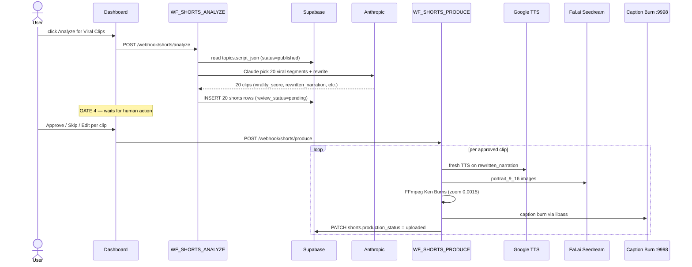

# Phase G · Shorts (Gate 4)

> Analyze a published long-form video for ~20 viral-worthy clips, halt at Gate 4 for human review, then produce native 9:16 shorts with fresh TTS + 9:16 images + kinetic captions. **Cost:** ~$0.50 analysis + ~$0.88 production per topic (~20 clips). **Duration:** ~2 minutes analysis, then waits for Gate 4; production ~30-60 minutes per topic.

## Goal

Phase G turns a published 2-hour video into 20 standalone short-form clips. Claude analyzes the script, picks viral-worthy segments by `start_scene` → `end_scene`, scores each 1-10 for virality, and **rewrites narration + image prompts from scratch** (never reuses long-form audio or 16:9 images). All visuals are produced as native 9:16 in TikTok-bold style; captions use the same kinetic ASS pipeline as long-form but tuned for shorts (bigger text, dynamic positioning, emphasis-driven). Phase G ends when clips are uploaded to Drive — Phase H handles social posting.

## Sequence diagram

## Inputs (read from)

- `webhook payload` — `{ topic_id }` POSTed to `shorts/analyze`. Auth via Bearer token. Topic must be `status = 'published'` (long-form already on YouTube).
- `topics.script_json` — full scene array from Phase C, used to pick clip boundaries by `start_scene` / `end_scene`.
- `topics.youtube_url` — for cross-reference and posting credit.
- `projects.style_dna` — appended to all rewritten 9:16 image prompts.
- `prompt_templates` — universal negative prompt + 9:16 composition templates.

## Outputs (writes to)

- `shorts` — one row per analyzed clip (typically 20). Per-row: `topic_id`, `clip_number`, `start_scene`, `end_scene`, `estimated_duration_ms` / `actual_duration_ms`, `virality_score` (1-10, ≥8 gets the fire emoji), `virality_reason`, `clip_title`, `hook_text`, `hashtags[]`, `caption`, `rewritten_narration` (JSONB scene-level), `rewritten_image_prompts` (JSONB 9:16-specific), `emphasis_word_map` (JSONB), `short_form_style` (default `tiktok_bold`), `audio_scenes` / `visual_scenes` (per-scene asset paths after production), `portrait_drive_id`, `portrait_drive_url`, `thumbnail_drive_id`, `thumbnail_url`, `srt_text`, `review_status`, `production_status`, `production_progress`. Schema: `shorts` table in [`supabase/migrations/001_initial_schema.sql`](https://github.com/akinwunmi-akinrimisi/vision-gridai-platform/blob/main/supabase/migrations/001_initial_schema.sql).
- `production_logs` — analyze + per-clip production events.

## Gate behavior

**Gate 4.** Dashboard route `/shorts/:projectId/:topicId` ([`ShortsCreator`](https://github.com/akinwunmi-akinrimisi/vision-gridai-platform/blob/main/dashboard/src/pages/ShortsCreator.jsx); registered at [`dashboard/src/App.jsx:67`](https://github.com/akinwunmi-akinrimisi/vision-gridai-platform/blob/main/dashboard/src/App.jsx) as `/shorts`). Renders all 20 candidate clips as cards:

- Virality score (with fire emoji for ≥8).
- Original narration vs rewritten narration side by side.
- Rewritten image prompts preview.
- Emphasis words highlighted in narration.
- Editable hashtags + clip title.

| Action | Webhook | Effect |
|--------|---------|--------|
| Approve | `POST /webhook/shorts/produce` (per-clip subset) | `review_status = 'approved'` for selected clips. Production fires immediately. |
| Skip | dashboard PATCH | `review_status = 'rejected'`. Excluded from production. |
| Edit | dashboard PATCH | Modify narration / prompts / hashtags / title before approval. |
| Approve All | bulk action | All 20 approved at once. |
| Approve Top 10 | bulk by score | Approves the 10 highest virality scores. |

**Gate 4 is never auto-approved.** Even with auto-pilot enabled, every shorts batch requires human review — short-form virality is harder to score than long-form, and the rewritten narration deserves operator eyes. See [Concepts · Gates](../concepts/gates.md).

## Workflows involved

- `WF_SHORTS_ANALYZE` — webhook `shorts/analyze`. Live n8n ID `pbh7LaZI9kua5oxI`. Reads the published topic's full script, prompts Claude to pick 20 viral segments and rewrite each into short-form. Inserts 20 `shorts` rows. JSON snapshot is not in `workflows/` — live source of truth is the n8n instance.
- `WF_SHORTS_PRODUCE` — webhook `shorts/produce`. Live n8n ID `mg9gWUz2yiGhOq7r`. Per approved clip: fresh Google TTS on rewritten narration → Fal.ai Seedream `portrait_9_16` images → FFmpeg Ken Burns at zoom intensity `0.0015` (aggressive) → 7-mood color grade → Whisper word alignment → kinetic ASS captions (bigger text, dynamic positioning) → assembly + loudnorm → caption burn via the `:9998` service → Drive upload.

All external API calls wrap through `WF_RETRY_WRAPPER` (1s → 2s → 4s → 8s).

## Failure modes + recovery

- **Viral analysis failure** — Claude call retried once. If still failing, the dashboard surfaces "Analysis failed" with an empty list and a Retry button.
- **Single clip production failure** — `shorts.production_status = 'failed'`. Other clips continue. Operator can re-trigger that clip from the dashboard.
- **Resume on every step** — like long-form Phase D, every production step queries `WHERE production_status = 'pending'` first, so a crashed run resumes scene-by-scene.
- **Caption burn 3hr timeout / service hang** — same caption burn service (port 9998) as long-form. Restart with `systemctl restart caption-burn.service`. See [Subsystems · Caption Burn](../subsystems/caption-burn.md).
- **Fal.ai NSFW or content filter** — clip marked failed, others continue; operator can re-prompt via Edit.

## Code references

- [`directives/09-shorts-pipeline.md:1-99`](https://github.com/akinwunmi-akinrimisi/vision-gridai-platform/blob/main/directives/09-shorts-pipeline.md) — SOP source of truth (viral analysis, Gate 4 actions, production rules).
- `MEMORY.md` "Production Workflow IDs" — `WF_SHORTS_ANALYZE` (`pbh7LaZI9kua5oxI`) + `WF_SHORTS_PRODUCE` (`mg9gWUz2yiGhOq7r`). Live-only (no JSON snapshot in `workflows/`).
- [`dashboard/src/App.jsx:67`](https://github.com/akinwunmi-akinrimisi/vision-gridai-platform/blob/main/dashboard/src/App.jsx) — Gate 4 dashboard route `/shorts`.
- [`dashboard/src/pages/ShortsCreator.jsx`](https://github.com/akinwunmi-akinrimisi/vision-gridai-platform/blob/main/dashboard/src/pages/ShortsCreator.jsx) — clip-list UI.
- [`supabase/migrations/001_initial_schema.sql`](https://github.com/akinwunmi-akinrimisi/vision-gridai-platform/blob/main/supabase/migrations/001_initial_schema.sql) — `shorts` table (per-platform status columns).
- [`Dashboard_Implementation_Plan.md`](https://github.com/akinwunmi-akinrimisi/vision-gridai-platform/blob/main/Dashboard_Implementation_Plan.md) Page 8 — UI spec.
- `MEMORY.md` `feedback_shorts_caption_style.md` — bigger text, dynamic positioning, emphasis-driven placement.
- `MEMORY.md` `feedback_thumbnail_style.md` — thumbnail must fill 70-75% of allotted space, **always question format**.
- `MEMORY.md` `feedback_thumbnail_keyword_emphasis.md` — 2-4 core keywords in contrasting color (black+white outline on yellow / red+black outline on white).

## Thumbnail spec

Per `feedback_thumbnail_style.md`: diagonal slant divider, AI-generated 9:16 image on one side, bold short phrase (3-6 words) filling 70-80% of the text area on the other. Vibrant TikTok aesthetic. Always frame as a question. 2-4 core keywords highlighted in contrasting color.

## Caption spec

Per `feedback_shorts_caption_style.md`: kinetic ASS subtitles with word-by-word pop-in, **dynamic positioning per emphasis** (not fixed center like long-form), bigger sans-serif font, emphasis words in yellow / red, strong drop shadow. Burned via FFmpeg libass through the host-side caption burn service (`:9998`).

!!! warning "Phase G is the only phase with no auto-pilot path"
    Even projects in full auto-pilot mode pause Gate 4 for human review. Short-form virality judgement is too high-variance to automate. See [Concepts · Gates](../concepts/gates.md).
