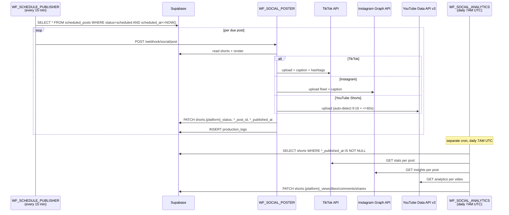

# Phase H · Social Posting

> 15-min cron picks up due `scheduled_posts` and dispatches to TikTok / Instagram Reels / YouTube Shorts via per-platform APIs. Engagement metrics return daily via a sibling cron. **Cost:** ~$0 platform fees (API quota only). **Duration:** seconds per post; minutes if rate-limited.

## Goal

Phase H is the post-Gate-4 publishing layer for short-form. Once an operator approves shorts at Gate 4 (Phase G), they're queued in `scheduled_posts` either for immediate posting or for a peak-hour slot. `WF_SCHEDULE_PUBLISHER` cron checks every 15 minutes for posts whose `scheduled_at <= NOW()` and dispatches to `WF_SOCIAL_POSTER`, which routes by platform. A separate daily cron (`WF_SOCIAL_ANALYTICS`) pulls back engagement metrics. There is no human gate in this phase — gating already happened at Gate 4.

## Sequence diagram

## Inputs (read from)

- Cron triggers:
    - `WF_SCHEDULE_PUBLISHER` — every 15 min via Schedule Trigger.
    - `WF_SOCIAL_ANALYTICS` — daily 7 AM UTC via Schedule Trigger (also exposes manual webhook `/webhook/social/analytics/refresh`).
- `scheduled_posts` table — `status = 'scheduled'` rows with `scheduled_at <= NOW()`. Schema: `supabase/migrations/004_calendar_engagement_music.sql`.
- `shorts` — for the production output URLs (`portrait_drive_url`).
- `renders` — for any Phase E platform-render output if posting long-form (TikTok/Instagram long-form variants reuse Phase E renders, not Phase G shorts).
- `platform_metadata` — per-platform caption / hashtags for the shorts.
- `social_accounts` — OAuth `access_token` + `refresh_token` per project per platform. Schema in [`supabase/migrations/001_initial_schema.sql`](https://github.com/akinwunmi-akinrimisi/vision-gridai-platform/blob/main/supabase/migrations/001_initial_schema.sql).
- `projects.auto_pilot_default_visibility` — schema-constrained to `unlisted` or `private`. Used as the default for auto-published posts.

## Outputs (writes to)

- `scheduled_posts.status` — `scheduled` → `publishing` → `published` (or `failed`). `published_at` written on success, `error_message` on failure.
- `shorts.tiktok_status` / `tiktok_post_id` / `tiktok_published_at` / `tiktok_caption`. Same pattern for `instagram_*` and `youtube_shorts_*`.
- `shorts.tiktok_views` / `tiktok_likes` / `tiktok_comments` / `tiktok_shares` (and the equivalents for Instagram + YouTube Shorts) — written by `WF_SOCIAL_ANALYTICS`.
- `production_logs` — `social_posted`, `social_failed`, `social_analytics_complete` action rows.

## Gate behavior

No human gate. Gating happened at Gate 4 (Phase G). The dashboard's [`ContentCalendar`](https://github.com/akinwunmi-akinrimisi/vision-gridai-platform/blob/main/dashboard/src/pages/ContentCalendar.jsx) page (route `/project/:id/calendar`, registered at [`dashboard/src/App.jsx:60`](https://github.com/akinwunmi-akinrimisi/vision-gridai-platform/blob/main/dashboard/src/App.jsx)) lets operators reschedule via drag-and-drop (PATCH `scheduled_posts.scheduled_at`), edit per-platform captions, or trigger immediate post via [`SocialPublisher`](https://github.com/akinwunmi-akinrimisi/vision-gridai-platform/blob/main/dashboard/src/pages/SocialPublisher.jsx) (route `/social`).

**Auto-scheduling defaults** (peak hours):

| Platform | Default time slots |
|----------|---------------------|
| TikTok | 6 PM / 8 PM / 10 PM EST |
| Instagram | 12 PM / 6 PM EST |
| YouTube Shorts | same as TikTok |

**Cross-platform stagger** (toggle on `SocialPublisher`): TikTok first → Instagram 24h later → YouTube Shorts same day as TikTok. Disabled by default.

## Workflows involved

- `WF_SCHEDULE_PUBLISHER` — 15-min cron. 2 nodes: Schedule Trigger + Check Due Posts. Dispatches each due row to `WF_SOCIAL_POSTER` via Execute Workflow.
- `WF_SOCIAL_POSTER` — webhook `social/post`. 15 nodes: Auth check, Read Short, Read Render, Switch Platform → Post TikTok / Post Instagram / Post YouTube Shorts → Merge Results → Update Short Status → Log Posted. Handle Error branch covers all platforms.
- `WF_SOCIAL_ANALYTICS` — daily 7 AM UTC + manual webhook `social/analytics/refresh`. 12 nodes: Get Published Shorts → SplitInBatches → Fetch Stats → PATCH Shorts → Log Refresh.

All API calls wrap through `WF_RETRY_WRAPPER` (1s → 2s → 4s → 8s, max 4 attempts).

## Failure modes + recovery

- **Single-platform API failure** — `Handle Error` branch sets `scheduled_posts.status = 'failed'` and `error_message = <error>`. Next cron cycle retries up to a per-row `retry_count` cap (default 3); after that, requires manual re-trigger from the dashboard.
- **OAuth token expiry** — TikTok / Instagram / YouTube each expose `refresh_token`. The poster attempts refresh on 401; on refresh failure, sets `social_accounts.is_active = false` and surfaces an alert on the dashboard.
- **TikTok 24h posting cap / Instagram rate limits** — caught as 429, retried by WF_RETRY_WRAPPER. Persistent 429 reschedules the post for `+1 hour` automatically.
- **YouTube Shorts auto-detect** — YouTube auto-classifies a video as a Short if it's 9:16 AND ≤ 60s. Clips > 60s upload as regular vertical videos on the same channel. The dashboard surfaces this distinction so the operator can pick the right clip length at Gate 4.
- **Default visibility** — auto-publishes use `projects.auto_pilot_default_visibility` (schema-constrained to `unlisted` or `private`, **never `public`**). Manual posts inherit visibility from the dashboard's per-post toggle.

## Code references

- [`workflows/WF_SCHEDULE_PUBLISHER.json`](https://github.com/akinwunmi-akinrimisi/vision-gridai-platform/blob/main/workflows/WF_SCHEDULE_PUBLISHER.json) — 15-min cron dispatcher.
- [`workflows/WF_SOCIAL_POSTER.json`](https://github.com/akinwunmi-akinrimisi/vision-gridai-platform/blob/main/workflows/WF_SOCIAL_POSTER.json) — 15-node per-platform router.
- [`workflows/WF_SOCIAL_ANALYTICS.json`](https://github.com/akinwunmi-akinrimisi/vision-gridai-platform/blob/main/workflows/WF_SOCIAL_ANALYTICS.json) — daily 7 AM UTC engagement-pull cron.
- [`dashboard/src/pages/ContentCalendar.jsx`](https://github.com/akinwunmi-akinrimisi/vision-gridai-platform/blob/main/dashboard/src/pages/ContentCalendar.jsx) — calendar UI + drag-to-reschedule.
- [`dashboard/src/pages/SocialPublisher.jsx`](https://github.com/akinwunmi-akinrimisi/vision-gridai-platform/blob/main/dashboard/src/pages/SocialPublisher.jsx) — manual post / bulk schedule UI.
- [`dashboard/src/App.jsx:60,68`](https://github.com/akinwunmi-akinrimisi/vision-gridai-platform/blob/main/dashboard/src/App.jsx) — `/project/:id/calendar` and `/social` route registrations.
- [`Dashboard_Implementation_Plan.md`](https://github.com/akinwunmi-akinrimisi/vision-gridai-platform/blob/main/Dashboard_Implementation_Plan.md) Page 9 — Social Publisher UI spec.
- `MEMORY.md` "2026-04-23 follow-up patch" — `WF_SOCIAL_ANALYTICS` was one of the workflows whose JWT Bearer credential was rotated 2026-04-21 and re-imported 2026-04-23.

!!! info "TikTok and Instagram require approved Developer accounts"
    TikTok Content Posting API requires a Developer account + app approval. Instagram Graph API requires a Facebook Business account linked to the Instagram account. Without these, Phase H falls back to manual upload via the dashboard. See `CLAUDE.md` Gotchas.
