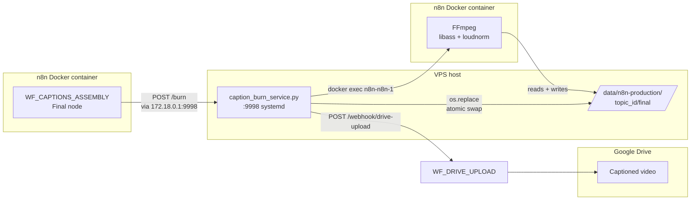
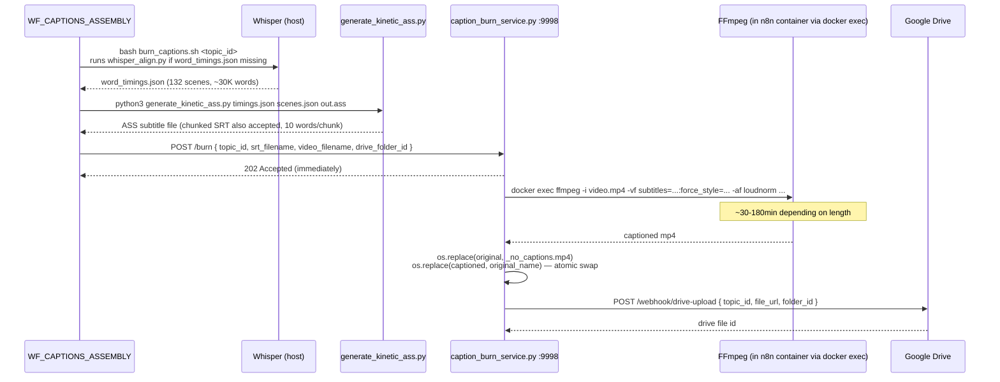

# Caption Burn Service

The caption burn service is a small Python HTTP service that lives **on the
VPS host** (not inside the n8n container) and exists for one reason: the n8n
task runner OOMs when re-encoding video with `libass` subtitles. The fix is
to run FFmpeg via `docker exec` from the host, which piggybacks the n8n
container's FFmpeg binary while keeping the Python HTTP listener outside the
container's memory budget.

The service runs on **port 9998**, is managed by `systemd` as
`caption-burn.service`, and has a **3-hour timeout** for long videos with
heavy subtitle overlays. It accepts `POST /burn` from
`WF_CAPTIONS_ASSEMBLY` after the assembled video is uploaded to Drive,
re-encodes it with kinetic ASS subtitles burned in, swaps the original file
for the captioned version, and triggers a Drive re-upload via the
`/webhook/drive-upload` n8n endpoint.

!!! warning "Don't try to do this inside n8n"
    The n8n task runner crashes on `-c:v libx264` for videos > ~10 minutes.
    Caption burn was attempted inside n8n in early sprints and consistently
    OOMed. CLAUDE.md gotcha: *"Caption burn service (:9998) runs host-side
    (not inside n8n container) because n8n task runner OOMs when re-encoding
    with libass. Uses `docker exec n8n-n8n-1 ffmpeg ...` to piggyback FFmpeg
    inside the container while the HTTP service itself stays on the host."*

## Architecture



The trick is that `docker exec` lets the host's Python service execute
commands inside the container's filesystem namespace. Path mapping:
`/data/n8n-production/<topic>/final/` on the host is bind-mounted to
`/tmp/production/<topic>/final/` inside the container. The service builds
the FFmpeg command with container paths, then runs:

```
docker exec n8n-n8n-1 sh -c 'ffmpeg -y -i /tmp/production/<id>/final/<v>.mp4 \
  -vf "subtitles='/tmp/production/<id>/captions/<v>.srt':force_style=...'" \
  -af "loudnorm=I=-16:TP=-1.5:LRA=11" \
  -c:v libx264 -preset medium -crf 18 \
  -c:a aac -ar 48000 -ac 1 -b:a 128k \
  -movflags +faststart \
  /tmp/production/<id>/final/<v>_captioned.mp4'
```

Source:
[`execution/caption_burn_service.py:51-88`](https://github.com/akinwunmi-akinrimisi/vision-gridai-platform/blob/main/execution/caption_burn_service.py).

## Service deployment

The service is at `/opt/caption-burn/caption_burn_service.py` on the VPS,
managed by a systemd unit:

```
systemctl status caption-burn.service        # check
systemctl restart caption-burn.service       # after editing service file
journalctl -u caption-burn.service -f        # tail logs
```

Health check: `GET http://172.18.0.1:9998/health` returns
`{"status":"ok","service":"caption-burn","port":9998}`.

The service accepts `POST /burn` with body
`{ topic_id, srt_filename, video_filename, drive_folder_id }`. It responds
**immediately with `202 Accepted`** and runs the burn in a background daemon
thread. The orchestrator workflow does not block on the response — instead it
polls `topics.assembly_status` for the final state.

## Generating kinetic ASS

The "kinetic" in `generate_kinetic_ass.py` describes **caption animation**
(word-by-word reveal with scale-bounce pop-in), **not** the removed Kinetic
Typography production style. The two share a vocabulary but are unrelated —
Kinetic Typography was a full-frame animated-text production format that
Vision GridAI abandoned in favor of static-image + Ken Burns. The caption
animation persists because Hormozi/MrBeast-style word-by-word reveals
demonstrably lift retention.

`generate_kinetic_ass.py`
([`execution/generate_kinetic_ass.py:1-80`](https://github.com/akinwunmi-akinrimisi/vision-gridai-platform/blob/main/execution/generate_kinetic_ass.py))
ingests two files:

1. `word_timings.json` — output of Whisper forced alignment, one entry per
   scene with word-level start/end timestamps in milliseconds.
2. `scenes.json` — per-scene narration + cumulative timestamps from Supabase.

It emits an ASS subtitle file with these style choices:

| Property | Value | Why |
|----------|-------|-----|
| Font | Inter | High readability at small sizes, modern feel |
| Normal size | 68pt | Visible on mobile + 4K |
| Emphasis size | 88pt | ~30% larger so emphasis pops |
| Outline | 5px black | Survives over any background |
| Shadow | 4px 60% black | Reinforces outline depth |
| Margin from bottom | 140px | Safe-area for mobile, above nav bars |
| Words per group | 4 max | Reading-eye-fixation count |
| Pop-in animation | 100% → 115% → 100% over 200ms | Bounce that settles fast enough not to distract |

Emphasis word detection ([`execution/generate_kinetic_ass.py:54-80`](https://github.com/akinwunmi-akinrimisi/vision-gridai-platform/blob/main/execution/generate_kinetic_ass.py))
catches: numbers/money (`$5,000`, `2026`), all-caps tokens (`CRITICAL`),
words after negation (`never SHARED`, `not ENOUGH`), and a curated power-word
list (`secret, hidden, exposed, shocking, billion, illegal, scam, fraud,
truth, lies, corrupt, broken, massive, dangerous, deadly, critical, urgent,
emergency, crisis, collapse, destroy, exactly, literally, everything, …`).
Emphasis words render in **yellow `#FFD700`** with optional **red `#FF4444`**
escalation; the rest in white.

## End-to-end sequence



The sequence has a few critical idempotency choices:

- **`os.replace` instead of move** — atomic swap so a crash mid-rename doesn't
  leave the topic without a final video.
- **Original kept as `_no_captions.mp4`** — if the burn produced bad output,
  the operator can restore the pre-caption version.
- **Resume via scene status** — `WF_CAPTIONS_ASSEMBLY` checks `clip_status`
  per scene before processing, so a failed run picks back up where it
  stopped without recomputing completed clips.

## Webhook + path conventions

- POST URL from inside Docker: `http://172.18.0.1:9998/burn` (CLAUDE.md
  gotcha: *"Docker bridge gateway: `172.18.0.1` (n8n container → host)"*).
- Re-upload webhook: `${N8N_WEBHOOK_BASE}/drive-upload` (this was renamed
  from `/webhook/kinetic/drive-upload` after Remotion/Kinetic removal — see
  CLAUDE.md gotcha *"Caption burn service (:9998) timeout is 3 hours…
  `/webhook/drive-upload` (renamed from `/webhook/kinetic/drive-upload`)"*).
- File-bridge: the host runs a small static HTTP server at port 9999
  (`python3 -m http.server 9999`) so the Drive-upload webhook can stream the
  large captioned MP4 from the host filesystem rather than uploading via
  Docker bind-mount. URL pattern:
  `http://172.18.0.1:9999/<topic_id>/final/<filename>.mp4`.

## Failure modes + recovery

- **Service crashed / unresponsive** — `systemctl restart caption-burn.service`,
  then re-trigger assembly only for the affected topic. The 3-hour timeout
  inside the service catches runaway FFmpeg; it logs `[BURN] FFmpeg timed out
  after 60 minutes` (the message is older than the timeout — the timeout was
  bumped to 10800s but the log string was not updated).
- **OOM during FFmpeg** — symptom: `FFmpeg FAILED: <stderr tail>` in service
  logs. Fix: assemble the video in batches first (Phase D4 already does this)
  so the input MP4 is well-formed before captioning.
- **Drive re-upload fails after successful burn** — service returns
  `{"success": true, "size_mb": …, "upload_triggered": false, "upload_error":
  …}`. The captioned video still exists on the host; manually trigger
  `/webhook/drive-upload` to retry.
- **Bad output captioned video** — restore from `_no_captions.mp4` backup
  next to the final.

## Code references

- [`execution/caption_burn_service.py`](https://github.com/akinwunmi-akinrimisi/vision-gridai-platform/blob/main/execution/caption_burn_service.py) — 196-line HTTP service (no extra deps).
- [`execution/generate_kinetic_ass.py`](https://github.com/akinwunmi-akinrimisi/vision-gridai-platform/blob/main/execution/generate_kinetic_ass.py) — 238-line ASS generator with emphasis detection.
- [`execution/burn_captions.sh`](https://github.com/akinwunmi-akinrimisi/vision-gridai-platform/blob/main/execution/burn_captions.sh) — local-development orchestration wrapper.
- [`execution/whisper_align.py`](https://github.com/akinwunmi-akinrimisi/vision-gridai-platform/blob/main/execution/whisper_align.py) — Whisper forced-alignment (`whisper.transcribe(word_timestamps=True)`), runs from `/opt/whisper-env/bin/python3`.
- CLAUDE.md gotchas: *"Caption burn service (:9998) runs host-side"*, *"Caption burn service (:9998) timeout is 3 hours"*, *"`generate_kinetic_ass.py` + `burn_captions.sh` build animated caption STYLE — the word 'kinetic' here describes caption motion, NOT the removed Kinetic Typography production style."*
- MEMORY: Session 32, 34, 35 — caption burn rollout + script-preservation fixes + concat-truncation root-cause.
