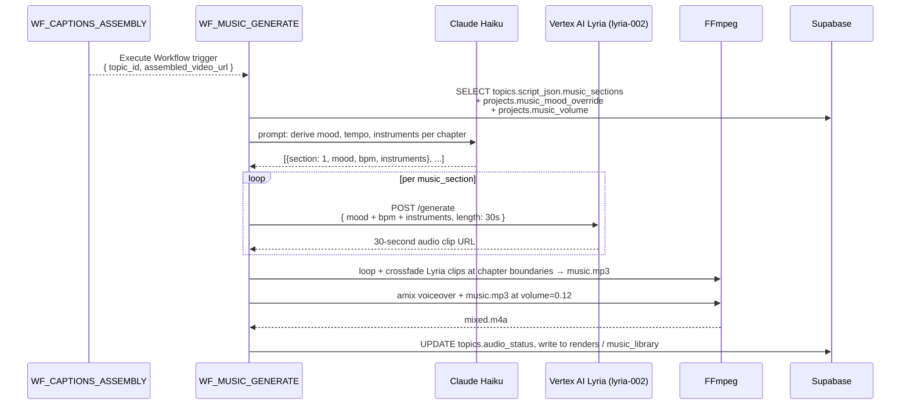

# Background Music (Lyria + ducking)

Vision GridAI generates **custom background music per video** via Google's
Vertex AI Lyria model (`lyria-002`), then ducks it under the voiceover at
exactly `volume=0.12` so the music adds atmosphere without competing with
the narration. There is no licensed-music library, no royalty-free stock
crate — every track is generated specifically for the script's mood
sections.

The full chain runs as `WF_MUSIC_GENERATE` (Phase D5), which is triggered
after `WF_CAPTIONS_ASSEMBLY` completes and writes its output back into the
mixed final video before end-card and platform-render stages.

## Flow — analyze → generate → loop → mix



The entire pipeline is **non-blocking** — if Lyria generation fails (region
quota exhausted, model unavailable), the workflow proceeds with silent
audio. Music is enhancement, not gating. CLAUDE.md / directive 07 rule:
*"Lyria generation failure: use silence + proceed. Music is enhancement,
not blocker."*

## The ducking formula — `volume=0.12`, not `0.5`

The single most important tuning parameter in this entire subsystem is the
ducking volume. Verbatim from
[`directives/07-music-endcard.md:21-29`](https://github.com/akinwunmi-akinrimisi/vision-gridai-platform/blob/main/directives/07-music-endcard.md):

```bash
ffmpeg -i voiceover.wav -i music.mp3 \
  -filter_complex "[1:a]volume=0.12[bg];[0:a][bg]amix=inputs=2:duration=first:dropout_transition=2[out]" \
  -map "[out]" -c:a aac -b:a 192k mixed.m4a
```

!!! danger "Music volume is `0.12` — NOT `0.5`"
    `0.5` is the FFmpeg default suggestion in many tutorials and produces a
    mix where the music actively fights the voice. `0.12` puts the music
    just above the noise floor — present, but never competing. CLAUDE.md
    gotcha: *"Background music ducking uses `volume=0.12` — NOT 0.5. Music
    should be barely perceptible under voice."* This is non-negotiable per
    directive 07's "Critical Rule" callout.

The default `0.12` lives in `projects.music_volume` and is overridable per
project within `0.05 - 0.25` — wider values are CHECK-constrained out at the
DB layer
([`supabase/migrations/014_music_settings.sql:21,28-30`](https://github.com/akinwunmi-akinrimisi/vision-gridai-platform/blob/main/supabase/migrations/014_music_settings.sql)).
The `dropout_transition=2` smooths the volume ramp at the end of the mix so
the track doesn't cut mid-fade.

## Multi-section handling

Long-form videos (~120 minutes, ~5 chapters) carry multiple
`script_json.music_sections` entries — one mood per chapter. The workflow
generates a separate Lyria clip per section, then **crossfades between
sections at chapter boundaries** so the mood shift feels intentional rather
than abrupt.

| Stage | Behavior |
|-------|----------|
| 1 chapter | One Lyria clip looped to fit duration |
| 2-5 chapters | One Lyria clip per chapter, crossfaded at chapter start_time_ms |
| Crossfade duration | 2-3 seconds (matches FFmpeg `dropout_transition`) |
| Loop strategy | `aloop=loop=-1` plus `-t` clipped to chapter length |

## Storage + project-level overrides

Music settings live entirely on the `projects` row plus an optional library
table. From migration 014:

```sql
projects.music_enabled        BOOLEAN DEFAULT true
projects.music_volume         FLOAT   DEFAULT 0.12   -- 0.05-0.25 CHECK
projects.music_mood_override  VARCHAR(30)            -- NULL = auto-derive
projects.music_source         VARCHAR(20) DEFAULT 'lyria'
                                                     -- 'lyria' | 'library' | 'auto'
projects.music_prefs_updated_at TIMESTAMPTZ
```

`music_mood_override` accepts one of: `cinematic | upbeat | somber | tense |
inspirational | ambient | epic | mysterious` — a CHECK-enforced enum
([`014_music_settings.sql:38-48`](https://github.com/akinwunmi-akinrimisi/vision-gridai-platform/blob/main/supabase/migrations/014_music_settings.sql)).
When NULL, Claude Haiku derives the mood per-chapter from the script. When
set, it overrides every chapter to use the same mood (useful for projects
where the operator wants a consistent emotional register).

`music_source` toggles the generation path:

- `lyria` (default) — always generate via Vertex AI Lyria.
- `library` — pick from `music_library` table (rows with mood/BPM tags
  uploaded by the operator).
- `auto` — try Lyria first, fall back to library on failure.

The `music_library` table
([`supabase/migrations/004_calendar_engagement_music.sql:57-67`](https://github.com/akinwunmi-akinrimisi/vision-gridai-platform/blob/main/supabase/migrations/004_calendar_engagement_music.sql))
is a flat catalog with `title`, `mood_tags TEXT[]`, `bpm`,
`duration_seconds`, `file_url`, and `instrument_palette`. It exists for
operators who want consistent branded music across videos, but the default
flow does not touch it.

## Register integration

Each [Production Register](registers.md) ships with `music_bpm_min`,
`music_bpm_max`, and `music_mood_keywords` in its `production_registers.config`
JSONB. `WF_MUSIC_GENERATE` reads these alongside the script's per-chapter
mood and passes them into the Lyria prompt — so REGISTER_03 Noir generates
55-65 BPM dark-ambient drone-heavy music while REGISTER_04 Signal produces
80-100 BPM electronic-orchestral. The register is the floor; the script's
mood section refines on top.

## Cost + duration

| Item | Cost | Notes |
|------|------|-------|
| Lyria generation | $0.00 | Vertex AI free tier covers production volume |
| FFmpeg loop + crossfade | $0.00 | Local CPU only |
| Voice ducking mix | $0.00 | Local CPU only |
| **Total** | **$0.00** per video | |

Generation typically completes in 30-90 seconds per chapter. A 5-chapter
2-hour video → ~5-7 minutes total music generation, then ~2-3 minutes for
the FFmpeg loop + amix.

## Failure modes

- **Lyria region quota exhausted** — workflow proceeds with silent audio, logs
  the failure. Operator can re-run music generation later from the
  ProjectDashboard or trigger `WF_MUSIC_GENERATE` directly.
- **Mood enum violation** — DB CHECK constraint rejects the write. Symptom:
  `projects_music_mood_override_chk` violation in n8n logs. Fix: use one of
  the 8 allowed enum values.
- **Volume out of range** — `projects_music_volume_range_chk` rejects values
  outside `0.0 - 1.0`. Practical range is `0.05 - 0.25`; values above `0.3`
  will overpower the voiceover.
- **`amix` produces clipped output** — set the master output to `-c:a aac
  -b:a 192k` and verify peaks stay under -1.5 TP via the same `loudnorm`
  pass that runs in the caption-burn stage.

## Code references

- `directives/07-music-endcard.md` — full Lyria + ducking SOP including the
  exact FFmpeg command.
- `workflows/WF_MUSIC_GENERATE.json` — Execute Workflow trigger (no public
  webhook), 5-section orchestration.
- `supabase/migrations/014_music_settings.sql` — per-project music
  preferences (`music_enabled`, `music_volume`, `music_mood_override`,
  `music_source`).
- `supabase/migrations/004_calendar_engagement_music.sql:57-67` —
  `music_library` table.
- `supabase/migrations/024_register_specs.sql` — per-register `music_bpm_min/max`
  + `music_mood_keywords` in the register `config` JSONB.
- CLAUDE.md gotcha: *"Background music ducking uses `volume=0.12` — NOT
  0.5. Music should be barely perceptible under voice."*
