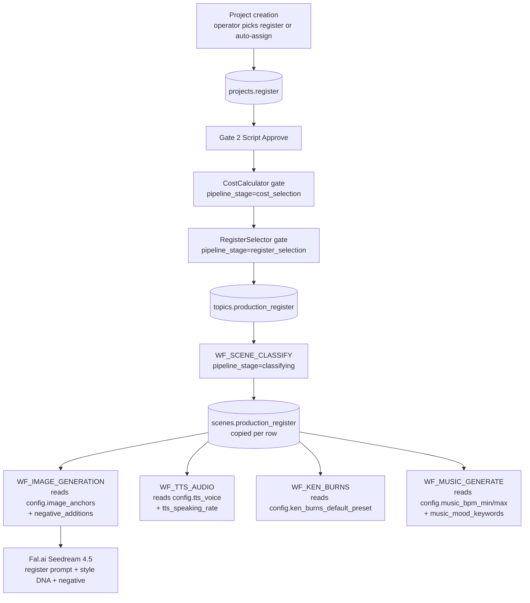
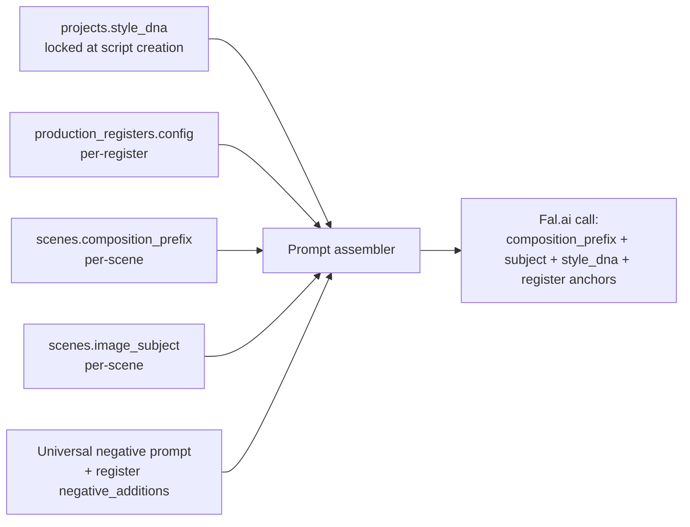

# Production Registers (5 visual styles)

A **register** is the locked visual + sonic + motion DNA for a video. The
operator picks one of five registers at project creation time (or
auto-assigns one based on niche); from that moment, every subsystem in the
pipeline — image generation, TTS voice, music tempo, Ken Burns motion,
typography — pulls its parameters from that register's row in
`production_registers`. The choice is locked per topic in
`topics.production_register` and stamped on every scene
([`supabase/migrations/023_production_register.sql:18-44`](https://github.com/akinwunmi-akinrimisi/vision-gridai-platform/blob/main/supabase/migrations/023_production_register.sql)).

Registers compose with — but override — the project's Style DNA. Style DNA
governs subject-matter (recurring motifs, branded composition), the register
governs cinematic grammar (grade, motion, typography). Where they conflict,
register wins. See the README header note quoted in every
`video_production/REGISTER_*.md` file.

## The 5 registers

!!! example "REGISTER_01 · The Economist"
    **Tone:** Documentary-grade explainer — authoritative, calm, data-rich.
    Visual reference: Johnny Harris, Wendover, Polymatter, RealLifeLore.

    - **Palette:** Muted color with controlled warmth, subtle film grain, 35mm look.
    - **Composition:** Rule of thirds, generous negative space for text overlays, shallow depth of field.
    - **Voice:** `en-US-Studio-M` at speaking_rate `0.95`. Music BPM 60-75. Font: **Inter Tight**. Accent: `#F5A623`.
    - **Fits:** Personal Finance, Credit Card economics, Legal/Tax/Insurance explainers, B2B SaaS, Real-Estate analysis.

!!! example "REGISTER_02 · Premium Authority"
    **Tone:** Luxury editorial — golden, measured, aspirational. Visual
    reference: Chase Private Client ad, Bloomberg Originals, Robb Report.

    - **Palette:** Warm tungsten + amber, deep shadows with preserved detail, Kodak Portra 400.
    - **Composition:** 85mm lens look, creamy bokeh, centered symmetrical or rule-of-thirds.
    - **Voice:** `en-US-Studio-O` at `0.92`. Music BPM 55-70 (orchestral minimalism, neoclassical piano). Font: **GT Sectra**. Accent: `#D4AF37`.
    - **Fits:** Premium credit cards (Platinum/Reserve/Centurion), HNW finance, luxury real estate, top-tier travel hacking.

!!! example "REGISTER_03 · Investigative Noir"
    **Tone:** True-crime investigation — shadows, tension, evidence. Visual
    reference: Netflix true-crime documentaries, LEMMiNO, MrBallen.

    - **Palette:** Heavy chiaroscuro, desaturated muted browns + cold blues, bleach bypass, 16mm grain.
    - **Composition:** Single harsh light source, low-key lighting, surveillance-photo quality.
    - **Voice:** `en-US-Studio-Q` at `0.90`. Music BPM 55-65 (dark ambient, drone, Hildur Gudnadottir / Reznor-Ross). Font: **Courier Prime**. Accent: `#B32020`.
    - **Fits:** Crime, fraud exposés, predatory-product takedowns, company-collapse stories (SVB, FTX, Theranos), legal scandals.

!!! example "REGISTER_04 · Signal (Tech Futurist)"
    **Tone:** Tech/fintech precision — clinical, HUD-accented, future. Visual
    reference: ColdFusion, Cleo Abram, Apple keynote B-roll.

    - **Palette:** Cool color temperature with selective warm accents, deep blue-black shadows, subtle bloom on bright elements.
    - **Composition:** Macro or architectural perspective, tack-sharp focus, minimalist Dieter Rams sensibility.
    - **Voice:** `en-US-Studio-M` at `1.00`. Music BPM 80-100 (Hans Zimmer-tech, Pemberton, Holly Herndon adjacent). Font: **JetBrains Mono**. Accent: `#00D4FF`.
    - **Fits:** B2B SaaS reviews, AI tools, cybersecurity, NFC/biometric payment tech, crypto/CBDC, fintech innovation.

!!! example "REGISTER_05 · Archive"
    **Tone:** Historical/biographical/intimate — warm, patient, sepia. Visual
    reference: Magnates Media, Business Casual, Biographics, Ken Burns / PBS.

    - **Palette:** Warm faded amber, period-accurate film simulation per era (1920s sepia → modern Portra 400). The only register with **per-era image anchors** (`config.image_anchors_by_era` keyed `1920s | 1960s | 1980s | 2000s | modern`).
    - **Composition:** Photo-album aesthetic, archival quality with gentle degradation, Ken Burns pan-and-zoom in its truest form.
    - **Voice:** `en-US-Studio-O` at `0.93`. Music BPM 60-75 (acoustic-orchestral, era-appropriate). Font: **Playfair Display**. Accent: `#8B6F47`.
    - **Fits:** Founder/company origin stories, family-saga drama, real-estate-empire biographies, retrospective revenge stories, any "how we got here" narrative.

Source for all 5: seed rows in
[`supabase/migrations/024_register_specs.sql:34-123`](https://github.com/akinwunmi-akinrimisi/vision-gridai-platform/blob/main/supabase/migrations/024_register_specs.sql)
+ full SOPs in `video_production/REGISTER_01_THE_ECONOMIST.md` through
`REGISTER_05_ARCHIVE.md`.

## Where register data lives + how it routes



The pipeline-stage flow is documented in the migration 023 header comment
block: `Gate 2 Script Approve → cost_selection → register_selection →
classifying → tts → ...`. Migration 025 backfilled the
`topics.pipeline_stage` CHECK constraint to actually allow
`register_selection` and `classifying` after Session 38 shipped the gates
without DB-layer support
([`supabase/migrations/025_pipeline_stage_register_flow.sql:1-31`](https://github.com/akinwunmi-akinrimisi/vision-gridai-platform/blob/main/supabase/migrations/025_pipeline_stage_register_flow.sql)).

## What a register row looks like

Every row in `production_registers` carries a JSONB `config` payload with the
per-subsystem parameters. Excerpt of REGISTER_01 below — the full set of keys
is documented in the table comment:

```sql
-- production_registers (one row per register)
register_id TEXT PRIMARY KEY,            -- 'REGISTER_01_ECONOMIST' …
name TEXT,                               -- 'The Economist'
short_description TEXT,
accent_color_hex TEXT,                   -- '#F5A623'
config JSONB,                            -- see below
version INTEGER, is_active BOOLEAN,
created_at, updated_at

-- config JSONB keys (per migration 024 table comment):
--   image_anchors            (or image_anchors_by_era for REGISTER_05)
--   negative_additions       (appended to universal negative prompt)
--   tts_voice, tts_speaking_rate
--   music_bpm_min, music_bpm_max, music_mood_keywords
--   ken_burns_default_preset (slow_push | breath_push | creep_in | precision_push | burns_pan_right)
--   typical_scene_length_sec
--   transition_duration_ms
--   font_family
```

Production workflows read this row directly. For example, `WF_IMAGE_GENERATION`
appends `config.image_anchors` to the prompt and merges `config.negative_additions`
into the universal negative prompt. `WF_TTS_AUDIO` looks up `config.tts_voice`
and `config.tts_speaking_rate` per scene. `WF_MUSIC_GENERATE` passes
`music_bpm_min/max` and `music_mood_keywords` to Lyria as part of the mood
prompt.

## Composition with Style DNA



Style DNA is the project-level fingerprint. The register layers on cinematic
grammar (lighting, lens look, grain, palette). The scene layer adds
composition prefix + subject. Result: every image looks like a scene from a
single coherent production, not 172 standalone AI generations. See
[Subsystems · Style DNA + Composition](style-dna.md) for the prompt assembly
formula in detail.

## Era detection (REGISTER_05 only)

The Archive register is the only one with **sub-LUT** dispatch. Because a
1920s sepia photo and a modern intimate documentary photo share the
"warm + nostalgic" register but require completely different image anchors,
`topics.register_era_detected` (`1920s | 1960s | 1980s | 2000s | modern`)
selects the appropriate `config.image_anchors_by_era` entry per topic. Era
detection happens at the RegisterSelector gate alongside register choice,
populated by `WF_REGISTER_ANALYZE`.

!!! tip "Add a new register"
    To add a register: (1) write the SOP at `video_production/REGISTER_06_*.md`,
    (2) write image-prompt assets at `image_creation_guidelines_prompts/REGISTER_06_IMAGE_PROMPTS.md`,
    (3) extend the CHECK constraints in migration 023 to allow the new ID,
    (4) `INSERT INTO production_registers` with the JSONB config, (5) update
    `WF_REGISTER_ANALYZE` to consider it. ⚠ Needs verification — the precise
    flow for adding a 6th register is not documented anywhere I could find;
    this is a reconstruction from the migration + workflow shape.

## Code references

- `video_production/REGISTER_01_THE_ECONOMIST.md` through `REGISTER_05_ARCHIVE.md` — full SOPs.
- `image_creation_guidelines_prompts/REGISTER_01_IMAGE_PROMPTS.md` through `_05_*` — register-tuned image prompt assets.
- `supabase/migrations/023_production_register.sql` — `topics` + `scenes` register columns + CHECK constraints.
- `supabase/migrations/024_register_specs.sql` — `production_registers` table + 5 seed rows with full JSONB config.
- `supabase/migrations/025_pipeline_stage_register_flow.sql` — pipeline_stage CHECK extension.
- `image_creation_guidelines_prompts/REGISTER_PROMPT_IMPLEMENTATION_GUIDE_v2.md` — implementation notes for downstream workflows.
