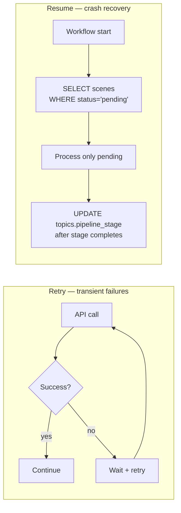
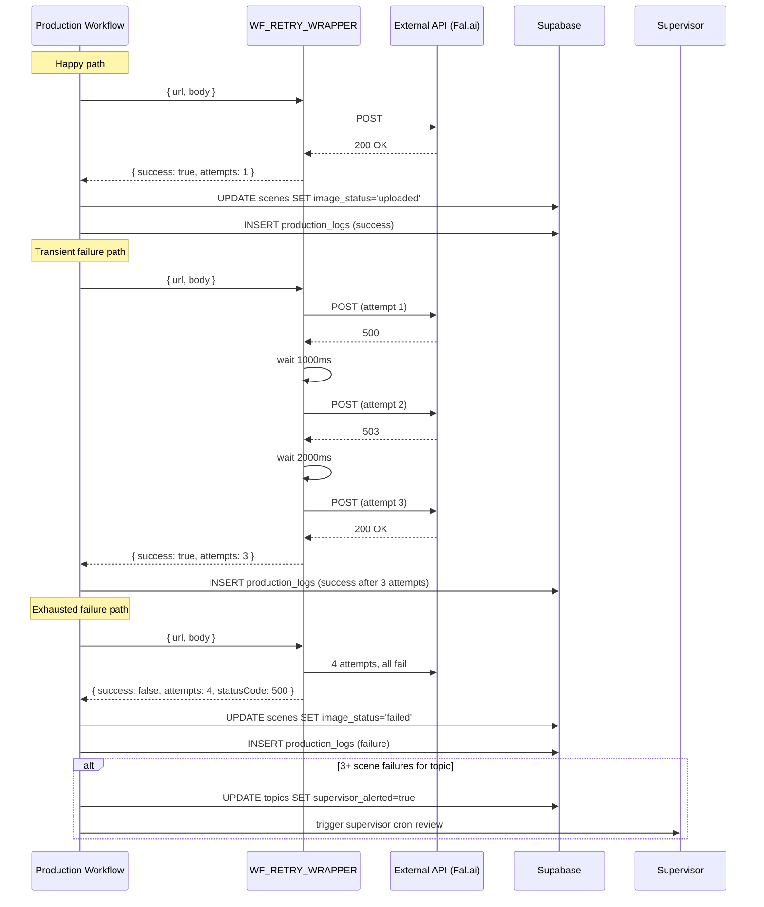

# Resume / Retry Architecture

Long-running pipelines on shared infra fail. The platform deals with this
through **two complementary mechanisms** that operate at different scopes:

- **Retry** absorbs transient API failures (Fal.ai 503, Anthropic rate
  limit, Google TTS timeout). Same workflow, same scene, just try again.
- **Resume** handles the case where the entire pipeline crashed or was
  killed mid-run. Restart the workflow and it skips completed scenes,
  picking up exactly where it stopped.

Both rely on per-scene status columns + a global per-topic stage column
that act as an idempotent state machine. Together they're why the pipeline
can survive a 3 AM caption-burn timeout, an Apify cold-start, or an n8n
container restart without losing work.

## Two-mechanism overview



## WF_RETRY_WRAPPER — the retry sub-workflow

Every external API call (Fal.ai, Anthropic, Google TTS, Vertex AI Lyria,
SerpAPI, Apify, YouTube Data API) is wrapped in `WF_RETRY_WRAPPER`
([`workflows/WF_RETRY_WRAPPER.json`](https://github.com/akinwunmi-akinrimisi/vision-gridai-platform/blob/main/workflows/WF_RETRY_WRAPPER.json)).
It's a 3-node Execute Workflow trigger — call it as a sub-workflow, get back
either a success payload or a failure marker.

| Input | Default | Meaning |
|-------|---------|---------|
| `url` | required | Target URL |
| `method` | `GET` | HTTP method |
| `headers` | `{}` | Headers to inject |
| `body` | `null` | JSON body (auto-stringified for POST/PATCH/PUT) |
| `maxRetries` | `4` | Total attempts (1 initial + 3 retries) |
| `description` | `'API call'` | Used in logs |

The backoff is exponential: **1s → 2s → 4s → 8s**, capped at 30s. The
core formula is `baseDelay * 2^(attempt-1)`, then `Math.min(..., 30000)`.
After `maxRetries` failures the wrapper returns
`{ success: false, error, statusCode, attempts, description }` rather than
throwing — so the caller decides whether to abort the topic or proceed.

CLAUDE.md rule: *"Exponential backoff retry on ALL external API calls. 1s →
2s → 4s → 8s, max 4 attempts. Applied via WF_RETRY_WRAPPER sub-workflow."*

## Per-scene status fields

The `scenes` table carries four status columns that drive resume — every
production stage owns one
([`supabase/migrations/001_initial_schema.sql:187-197`](https://github.com/akinwunmi-akinrimisi/vision-gridai-platform/blob/main/supabase/migrations/001_initial_schema.sql)):

| Column | Owned by | States |
|--------|----------|--------|
| `audio_status` | Phase D1 (TTS) | `pending` → `generated` → `uploaded` → `failed` |
| `image_status` | Phase D2 (Seedream) | `pending` → `generated` → `uploaded` → `failed` |
| `clip_status` | Phase D3 (Ken Burns + Color Grade) | `pending` → `generated` → `uploaded` → `failed` |
| `video_status` | Phase D2.5 (I2V Seedance) — only for I2V scenes | `pending` → `generated` → `uploaded` → `failed` |

Each production workflow's first node queries
`SELECT id FROM scenes WHERE topic_id = X AND <stage>_status = 'pending'`
and only processes those rows. Already-completed scenes are skipped without
re-running their (potentially expensive) generation.

## Global pipeline stage

`topics.pipeline_stage` tracks where the topic is overall. Migration 003
seeded the column; migration 025 finalized the CHECK enum
([`supabase/migrations/025_pipeline_stage_register_flow.sql:13-31`](https://github.com/akinwunmi-akinrimisi/vision-gridai-platform/blob/main/supabase/migrations/025_pipeline_stage_register_flow.sql)):

```
pending → scripting → cost_selection → register_selection → classifying →
tts → images → i2v → ken_burns → color_grade → captions → assembly →
render → complete | failed
```

Each workflow flips the stage as it completes — so a restart can route
directly to the correct next workflow rather than replaying upstream stages.
For example: if `pipeline_stage = 'ken_burns'`, the master orchestrator
knows TTS + Images already finished and only needs to fire
`WF_KEN_BURNS` (which itself queries per-scene `clip_status` to skip done
scenes).

## Parallel completion sync

Some stages run multiple workflows in parallel — Phase D2 (images) and
Phase D2.5 (I2V) can fire concurrently for different scenes within the same
topic. Each worker independently updates its scene's status column. The
**Parallel Completion Sync** logic checks completeness per scene's
`visual_type`:

| `visual_type` | Required column for completion |
|---------------|--------------------------------|
| `static_image` | `image_status = 'uploaded'` |
| `i2v` | `video_status = 'uploaded'` |
| `t2v` | `video_status = 'uploaded'` |

The downstream watchdog
(`WF_ASSEMBLY_WATCHDOG`, n8n ID `Exm836gCGtxNKOeD`) waits until **all**
scenes for a topic report completion in their respective column before
flipping `topics.pipeline_stage` to `assembly` and firing
`WF_CAPTIONS_ASSEMBLY`. CLAUDE.md learning: *"Parallel Completion Sync:
check per visual_type (static_image→image_status, i2v/t2v→video_status)."*

## Sequence — happy path + failure path



The supervisor cron periodically scans for `topics.supervisor_alerted =
true` and either retries the failed scenes (if the API returned to health)
or surfaces the topic in the dashboard for the operator.

## Production log — the audit trail

Every retry attempt + final outcome writes a row to
`production_logs` (table from migration 004). Schema: `topic_id, stage,
scene_number, action, status, duration_ms, cost_usd, retry_count`. This is
the table the ProductionMonitor dashboard reads to render per-video logs +
the Settings page reads to compute per-API health metrics (last response
time, error rate). It also gives the supervisor cron the data it needs to
distinguish "API was down for 30 min, scene failed 3x in a row" from
"persistent failure on this specific scene".

## Resume in practice

Three concrete scenarios:

1. **n8n container restart mid-TTS** — `WF_TTS_AUDIO` was processing scene
   97 of 172. After restart, the workflow's first node queries
   `WHERE audio_status = 'pending'` and gets back rows 97-172. Scenes 1-96
   are skipped untouched.
2. **Caption burn service hung at 3-hour timeout** — assembled video
   exists, kinetic ASS exists, but burn never finished. Re-trigger
   `WF_CAPTIONS_ASSEMBLY` for the topic — the resume logic detects
   `assembly_status != 'complete'` and re-fires the burn step only. Earlier
   per-scene clips are not regenerated because `clip_status = 'uploaded'`
   for all of them.
3. **Fal.ai had 6-hour outage during image generation** — 47 scenes hit
   `image_status = 'failed'` during the outage. The supervisor cron
   notices `topics.supervisor_alerted = true`, waits for Fal.ai health to
   recover, then resets those 47 rows back to `pending` and re-triggers
   `WF_IMAGE_GENERATION`. The other 125 scenes that succeeded stay
   untouched.

!!! warning "Resume only works because writes are scene-by-scene"
    CLAUDE.md rule: *"Write to Supabase after EVERY asset. Each scene row
    is updated immediately — not in batch. Dashboard uses Supabase Realtime
    and depends on instant writes."* Batching the writes would break resume
    (a crash mid-batch would leave rows that succeeded marked as pending,
    forcing duplicate generation). The dashboard's live progress also
    depends on the per-scene write cadence.

## Code references

- [`workflows/WF_RETRY_WRAPPER.json`](https://github.com/akinwunmi-akinrimisi/vision-gridai-platform/blob/main/workflows/WF_RETRY_WRAPPER.json) — 3-node sub-workflow with the exponential backoff loop.
- [`supabase/migrations/001_initial_schema.sql:187-197`](https://github.com/akinwunmi-akinrimisi/vision-gridai-platform/blob/main/supabase/migrations/001_initial_schema.sql) — `scenes.audio_status / image_status / clip_status / video_status` columns.
- [`supabase/migrations/003_cinematic_fields.sql:14-21`](https://github.com/akinwunmi-akinrimisi/vision-gridai-platform/blob/main/supabase/migrations/003_cinematic_fields.sql) — `scenes.pipeline_stage` + `topics.pipeline_stage` introduction.
- [`supabase/migrations/025_pipeline_stage_register_flow.sql`](https://github.com/akinwunmi-akinrimisi/vision-gridai-platform/blob/main/supabase/migrations/025_pipeline_stage_register_flow.sql) — final `pipeline_stage` enum after Sprint R1/R2.
- CLAUDE.md rules: *"Resume/checkpoint on every production workflow"*, *"Exponential backoff retry on ALL external API calls"*, *"Write to Supabase after EVERY asset"*.
- CLAUDE.md learning: *"Parallel Completion Sync: check per visual_type"*.
- MEMORY: `WF_ASSEMBLY_WATCHDOG` (n8n ID `Exm836gCGtxNKOeD`) — parallel-completion gate before assembly fires.
