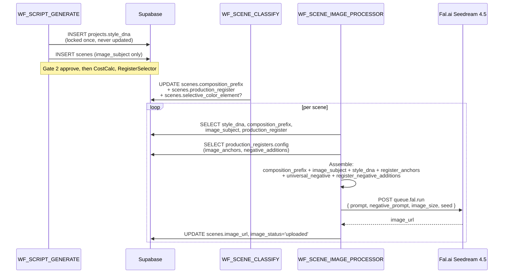

# Style DNA + Composition System

The platform's image-generation prompts are not free-form — they're assembled
mechanically from three locked layers + a per-scene composition cue. This is
what keeps 172 scenes feeling like one coherent production instead of 172
standalone AI generations.

## The assembly formula

```
final_prompt = composition_prefix + scene_subject + style_dna
+ register_anchors  (appended to style_dna)

negative_prompt = universal_negative + register_negative_additions
```

Spelled literally — every Fal.ai Seedream 4.5 call is built by concatenating
those parts in that order. Source:
[`image_creation_guidelines_prompts/REGISTER_01_IMAGE_PROMPTS.md:23-84`](https://github.com/akinwunmi-akinrimisi/vision-gridai-platform/blob/main/image_creation_guidelines_prompts/REGISTER_01_IMAGE_PROMPTS.md)
+ CLAUDE.md rule *"Style DNA is LOCKED per project"*. The same formula
applies for both 16:9 long-form and 9:16 shorts — only `image_size` changes.

## Style DNA — what it is + why it's locked

Style DNA is a paragraph-long visual fingerprint stored in
`projects.style_dna`. It describes the project's recurring visual motifs
(camera-look, color palette, grain, lens characteristics) in language Fal.ai
understands. It is **generated once during script creation** (Pass 3 / metadata
extraction) and **never modified between scenes**.

> *"editorial documentary photography, natural cinematic lighting with
> single-source directional key, shallow depth of field, muted controlled-
> warmth color palette, subtle 35mm film grain, rule-of-thirds composition
> with negative space preserved for overlay typography, professional color
> grading, 4K sharpness, documentary photorealism, cinematic still frame
> aesthetic, no stylization"*

That's the Economist (REGISTER_01) primary variant — verbatim from
`image_creation_guidelines_prompts/REGISTER_01_IMAGE_PROMPTS.md:33-37`. The
locked-once-per-project rule is non-negotiable: drift in Style DNA produces
visible style breaks scene to scene, which the eye reads as
amateur-hour AI assembly.

!!! warning "Never regenerate Style DNA mid-video"
    The DNA must be IDENTICAL across all scenes of one video. Store it once
    on the `projects` row, never on individual scenes. CLAUDE.md gotcha:
    *"Style DNA must be IDENTICAL across all scenes. Store once in projects
    table, never regenerate mid-video."*

## Composition prefix library — the 8 prefixes

The `scenes.composition_prefix` field
([`supabase/migrations/003_cinematic_fields.sql:12`](https://github.com/akinwunmi-akinrimisi/vision-gridai-platform/blob/main/supabase/migrations/003_cinematic_fields.sql))
takes one of 8 enum values. Each maps to a camera/framing intent that the
script generator picks per scene based on that scene's role in the narrative.

| Prefix | Use case |
|--------|----------|
| `wide_establishing` | Opening hooks, market overviews, geographic scene-setting. |
| `medium_closeup` | Human-element scenes (hands, silhouettes from behind), intimate but not close. |
| `over_shoulder` | Conversational/observational POV — used sparingly outside Archive register. |
| `extreme_closeup` | Data-image B-roll: charts, documents, product details, single objects. |
| `high_angle` | Overhead desk shots, document reveals, "looking down on" scenes. |
| `low_angle` | Institutional/corporate establishing — confers authority. |
| `symmetrical` | Chart reveals, formal explanatory composition, architectural framing. |
| `leading_lines` | Corridors, roads, architectural transitions between concepts. |

Per-register priority differs. For REGISTER_01 The Economist, the priority
order is `wide_establishing → extreme_closeup → symmetrical → medium_closeup`
([`image_creation_guidelines_prompts/REGISTER_01_IMAGE_PROMPTS.md:74-84`](https://github.com/akinwunmi-akinrimisi/vision-gridai-platform/blob/main/image_creation_guidelines_prompts/REGISTER_01_IMAGE_PROMPTS.md)).
Other registers reorder this priority — for example, Archive favors
`medium_closeup` and `over_shoulder` over `extreme_closeup`.

## Universal negative prompt

Every Fal.ai call carries a universal negative prompt that prevents the most
common artifact classes. Stored in n8n workflow static data (per CLAUDE.md
rule *"Universal negative prompt on ALL Fal.ai calls"*) and merged with the
register-specific `negative_additions` from
[`production_registers.config.negative_additions`](https://github.com/akinwunmi-akinrimisi/vision-gridai-platform/blob/main/supabase/migrations/024_register_specs.sql).
Verbatim, the universal negative for REGISTER_01 ends up as:

> *"text, watermark, signature, logo, UI elements, blurry, low quality,
> distorted faces, extra fingers, mutated hands, bad anatomy, deformed,
> disfigured, out of frame, cropped, duplicate, error, jpeg artifacts, low
> resolution, cartoon, anime, painting, illustration, 3D render, CGI,
> oversaturated colors, cartoonish style, anime, garish neon, grunge
> aesthetic, heavy motion blur, dramatic lens flares, aggressive chromatic
> aberration, VHS artifacts, glitch effects, surveillance camera quality,
> dark noir aesthetic, warm golden luxurious aesthetic, futuristic tech
> aesthetic"*

The first half is universal; the second half is register-specific
(notice it explicitly forbids the *other* registers' aesthetics — REGISTER_01
forbids "warm golden luxurious aesthetic" because that's REGISTER_02
Premium's territory). Fal.ai tolerates duplicates (`anime` appears twice in
the merged string) so the assembly does not dedupe.

## Selective Color exception

When a scene has `scenes.selective_color_element IS NOT NULL` (e.g., "red
umbrella", "yellow taxi"), the FFmpeg color grading filter chain in Phase D3
**is skipped entirely** for that scene. The selective-color effect already
saturates one specific element against a desaturated background — running the
register's color-mood filter on top would muddy the contrast.

This carve-out is the single deviation from the otherwise-mechanical Phase D3
filter chain. CLAUDE.md gotcha: *"Selective color scenes SKIP FFmpeg color
grading — check `selective_color_element IS NOT NULL`."* See
[Phase D · Production](../pipeline/phase-d-production.md) D3 sub-stage for
the FFmpeg filter chain that gets bypassed.

## End-to-end sequence



The order matters: composition prefix sets the camera intent, the subject
defines what's in frame, Style DNA defines how the project sees the world,
and the register anchors enforce cinematic grammar. Reversing the order
produces noticeably different outputs because Fal.ai's encoder weights early
tokens more heavily.

## Where the templates live

- `prompt_templates` table — keyed by `template_key` such as
  `style_dna_register_01_primary`, `style_dna_register_01_real_estate`,
  `negative_additions_register_01`. The script generator pulls these by key
  rather than embedding the literal strings.
- `production_registers.config.image_anchors` — register-level anchor block
  appended to Style DNA at prompt-build time
  ([`supabase/migrations/024_register_specs.sql:36-49`](https://github.com/akinwunmi-akinrimisi/vision-gridai-platform/blob/main/supabase/migrations/024_register_specs.sql)).
- `production_registers.config.negative_additions` — appended to the
  universal negative.

!!! tip "Three Style DNA variants per register"
    Most registers ship with 2-3 Style DNA variants keyed by sub-niche
    (Economist Primary / Real Estate / Legal-Tax). The script generator
    selects the variant based on the project's niche. See
    [`image_creation_guidelines_prompts/REGISTER_01_IMAGE_PROMPTS.md:25-50`](https://github.com/akinwunmi-akinrimisi/vision-gridai-platform/blob/main/image_creation_guidelines_prompts/REGISTER_01_IMAGE_PROMPTS.md)
    for the three Economist variants.

## Code references

- CLAUDE.md rules: *"Style DNA is LOCKED per project"*, *"Universal negative prompt on ALL Fal.ai calls"*.
- `image_creation_guidelines_prompts/REGISTER_01_IMAGE_PROMPTS.md` — full Economist variant set + composition priority.
- `image_creation_guidelines_prompts/REGISTER_PROMPT_IMPLEMENTATION_GUIDE_v2.md` — implementation notes.
- `supabase/migrations/003_cinematic_fields.sql` — `composition_prefix`, `selective_color_element`, `caption_highlight_word` columns.
- `supabase/migrations/024_register_specs.sql` — `production_registers.config.image_anchors` + `negative_additions` per register.
- `directives/04-image-generation.md` — D2 SOP. ⚠ Some claims in this directive (e.g., "no I2V/T2V") have been superseded by CLAUDE.md and live workflows; cross-check before relying on it.
- `workflows/WF_SCENE_IMAGE_PROCESSOR.json` — per-scene prompt assembly + Fal.ai dispatch.
