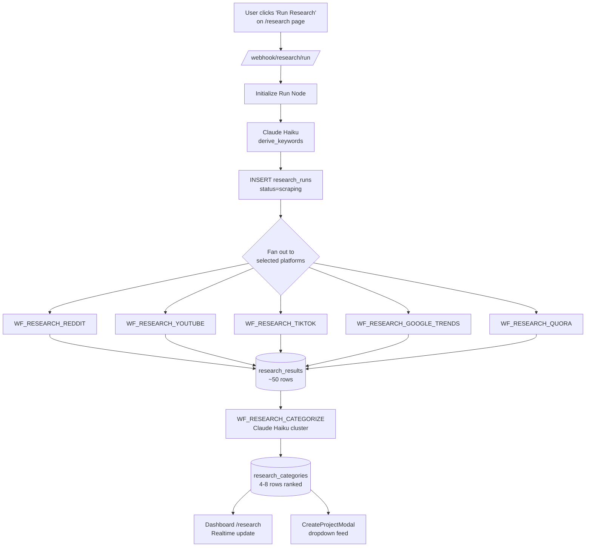

# Topic Intelligence (5-source research)

Topic Intelligence is the global, on-demand research engine that mines five
external data sources — Reddit, YouTube comments, TikTok, Google Trends (with
People Also Ask), and Quora — and turns them into ranked, AI-clustered topic
candidates. It lives at the global route `/research` (not project-scoped) and
feeds directly into project creation through a dropdown in the
`CreateProjectModal` component (see [Dashboard · Page reference](../dashboard/page-reference.md)). The orchestrator
workflow is triggered by `POST /webhook/research/run` with
`{ project_id, platforms?, time_range? }`. A single run costs ~$0.13 and
produces ~50 results across 5 sources, which the categorizer then clusters
into 4-8 ranked categories.

## Architecture — parallel scrape + central categorize



The orchestrator (`WF_RESEARCH_ORCHESTRATOR`, n8n ID `sq67vfV0vHhaL2hd`)
performs three sequential stages: keyword derivation via Haiku, parallel scraper
dispatch, and categorizer handoff. Keywords are **never hardcoded** — they are
derived dynamically from the project's niche + description by a Claude Haiku
call at the start of the run, then stored in
`research_runs.derived_keywords`. See CLAUDE.md rule *"Topic Intelligence
research engine"* and
[`workflows/WF_RESEARCH_ORCHESTRATOR.json`](https://github.com/akinwunmi-akinrimisi/vision-gridai-platform/blob/main/workflows/WF_RESEARCH_ORCHESTRATOR.json)
"Initialize Run" node.

## The 5 sources — ranking + cost

| Source | Tool | Ranking formula | Top N | Cost |
|--------|------|-----------------|-------|------|
| **Reddit** | Reddit public JSON API (PRAW or Apify fallback) | `upvotes + comments×2` | 10 | ~free |
| **YouTube Comments** | YouTube Data API v3 | `likes + replies×3` | 10 | Free (quota cost) |
| **TikTok** | Apify `clockworks~free-tiktok-scraper` | `likes + comments×2 + shares×3` | 10 | ~$0.02/run |
| **Google Trends** | SerpAPI (PAA + related searches) | PAA base 100, related 50, breakout ×2 | 10 | ~$0.01/run |
| **Quora** | Apify `curious_coder~quora-scraper` | `follows + answers×2` | 10 | ~$0.02/run |

The engagement-score formulas are enforced in the scrapers themselves and
documented as a comment block at the bottom of migration 002:
[`supabase/migrations/002_research_tables.sql:89-94`](https://github.com/akinwunmi-akinrimisi/vision-gridai-platform/blob/main/supabase/migrations/002_research_tables.sql).
Reddit ([`WF_RESEARCH_REDDIT.json`](https://github.com/akinwunmi-akinrimisi/vision-gridai-platform/blob/main/workflows/WF_RESEARCH_REDDIT.json))
hits `reddit.com/search.json?sort=hot&t=week` with `User-Agent:
VisionGridAI/1.0 Research Bot`. YouTube
([`WF_RESEARCH_YOUTUBE.json`](https://github.com/akinwunmi-akinrimisi/vision-gridai-platform/blob/main/workflows/WF_RESEARCH_YOUTUBE.json))
first searches top 5 videos, then pulls top 4 comments from each (3 videos × 4
comments = 12 raw, trimmed to top 10 by engagement). Google Trends
([`WF_RESEARCH_GOOGLE_TRENDS.json`](https://github.com/akinwunmi-akinrimisi/vision-gridai-platform/blob/main/workflows/WF_RESEARCH_GOOGLE_TRENDS.json))
uses SerpAPI's `related_questions` (score 100) and `related_searches` (score
50) across the top 3 keywords.

!!! warning "Apify cold-start timeouts"
    TikTok and Quora actors routinely cold-start on first invocation. The
    orchestrator sets `waitForFinish=60` on the Apify run call, and scraper
    workflows carry `executionTimeout: 120` seconds. If a run consistently
    times out on these sources, re-trigger the orchestrator — the second call
    usually hits a warm actor.

## AI categorization (no pre-defined buckets)

After all selected scrapers finish, the orchestrator fires
`WF_RESEARCH_CATEGORIZE` (n8n ID `R8Di58JWLpdNlRmO`). The categorizer reads
every row from `research_results WHERE run_id = X`, sends them to Claude Haiku
with the project niche as context, and asks for **organic clustering** — the
model decides how many categories exist and what labels best describe them.
The prompt is explicit:

> *"Group into organic categories by theme (typically 4-8, let data determine).
> Per category: label (3-6 words), summary (2-3 sentences), top_video_title
> (best YouTube title from cluster). Rank by total engagement_score."*

Source:
[`workflows/WF_RESEARCH_CATEGORIZE.json`](https://github.com/akinwunmi-akinrimisi/vision-gridai-platform/blob/main/workflows/WF_RESEARCH_CATEGORIZE.json)
"AI Categorize Results" node. The categorizer writes 4-8 rows into
`research_categories` with a `rank` column (1 = top), then back-patches
`research_results.category_id` and `ai_video_title` on each clustered result
so the dashboard can show which category a raw post belongs to. Top-ranked
categories are rendered as **gold** cards on the Research page, second as
**silver**, third as **bronze**, and the remainder as standard cards.

## Dashboard integration

**`/research` page** ([`dashboard/src/pages/Research.jsx`](https://github.com/akinwunmi-akinrimisi/vision-gridai-platform/blob/main/dashboard/src/pages/Research.jsx),
521 lines) — operator-facing. Controls: project selector, platform checkbox
toggles, time-range picker (`1h / 6h / 1d / 7d / 30d` or custom), "Run
Research" button. Progress meter drives off `research_runs.sources_completed`
(0-5) via Supabase Realtime
([`dashboard/src/hooks/useResearch.js:11-32`](https://github.com/akinwunmi-akinrimisi/vision-gridai-platform/blob/main/dashboard/src/hooks/useResearch.js)).
Once `status = 'complete'`, ranked category cards render; clicking a category
expands its results across 6 source tabs (`All | Reddit | YouTube | TikTok |
Google Trends | Quora`). Each result card has a **Use This Topic** button
that pre-fills the CreateProjectModal.

**`CreateProjectModal` dropdown**
([`dashboard/src/components/projects/CreateProjectModal.jsx:51-98`](https://github.com/akinwunmi-akinrimisi/vision-gridai-platform/blob/main/dashboard/src/components/projects/CreateProjectModal.jsx))
— two cascading selects: first category (sorted by rank), then topic
(filtered by `category_id`, sorted by engagement score). The dropdown
**only surfaces results from the latest `status = 'complete'` run** so stale
data never appears. When a topic is selected, `ai_video_title` auto-fills the
niche input and `raw_text` (up to 500 chars) auto-fills the description.

## Schema

```sql
-- research_runs — one row per execution
id UUID, project_id UUID, status TEXT,
sources_completed INTEGER, total_results INTEGER, total_categories INTEGER,
platforms TEXT[], time_range TEXT, derived_keywords TEXT[],
started_at, completed_at, error_log JSONB

-- research_results — ~50 rows per run (10 × 5 sources)
id UUID, run_id UUID, project_id UUID, source TEXT, raw_text TEXT,
source_url TEXT, engagement_score INTEGER, upvotes/comments/shares INTEGER,
posted_at, ai_video_title TEXT, category_id UUID, metadata JSONB

-- research_categories — 4-8 rows per run, AI-clustered
id UUID, run_id UUID, project_id UUID, label TEXT, summary TEXT,
total_engagement INTEGER, result_count INTEGER, rank INTEGER,
top_video_title TEXT
```

Full DDL:
[`supabase/migrations/002_research_tables.sql`](https://github.com/akinwunmi-akinrimisi/vision-gridai-platform/blob/main/supabase/migrations/002_research_tables.sql).
Migration 006 later added `platforms TEXT[]` and `time_range TEXT` to
`research_runs`, replacing the older `lookback_days INTEGER` column
([`supabase/migrations/006_research_enhancements.sql:1-18`](https://github.com/akinwunmi-akinrimisi/vision-gridai-platform/blob/main/supabase/migrations/006_research_enhancements.sql)).
Both `research_runs` and `research_categories` are published to
`supabase_realtime` with `REPLICA IDENTITY FULL` so the dashboard progress
meter updates live.

## Cost + cadence

Per CLAUDE.md and `skills.md`: **~$0.13 per run** (Haiku keyword derivation
+ categorization ≈ $0.08, Apify actors ≈ $0.04, SerpAPI ≈ $0.01). Running
research roughly every other day (16 runs/month) = **~$2.08/month**. Paid-API
failures fall back gracefully — the orchestrator records the failure in
`research_runs.error_log` but continues with the remaining sources; partial
runs still produce categories, just from fewer inputs.

## Retry + resilience

All five scrapers wrap their outbound API calls in
`WF_RETRY_WRAPPER` (1s → 2s → 4s → 8s, max 4 attempts). The orchestrator
itself is fail-soft: a failed scraper returns `{ success: false, error }`
rather than throwing, so one source blowing up does not abort the other four.
The categorizer also catches its own errors and writes
`status = 'failed'` + the error into `research_runs.error_log` rather than
leaving the run in perpetual `'scraping'` state — meaning the dashboard's
Cancel button ([`useResearch.js:117-137`](https://github.com/akinwunmi-akinrimisi/vision-gridai-platform/blob/main/dashboard/src/hooks/useResearch.js))
is almost never needed, but remains available as a manual escape hatch.

!!! tip "Resume is not supported"
    Unlike production workflows, research is stateless per run. A partially
    failed run is marked `failed` and must be re-triggered from scratch. The
    new run gets a fresh `run_id` and writes to new rows; the old run stays
    as a historical record. This is intentional — cheap enough to retry,
    better to have fresh data than to stitch together partial state.

## Code references

- Directive: `directives/topic-intelligence/` (directory placeholder — actual
  SOP lives in CLAUDE.md + workflow JSONs). ⚠ Needs verification if detailed
  per-source directives ever get written.
- CLAUDE.md rule: *"Topic Intelligence research engine"*.
- Workflows: `WF_RESEARCH_ORCHESTRATOR.json`, `WF_RESEARCH_REDDIT.json`,
  `WF_RESEARCH_YOUTUBE.json`, `WF_RESEARCH_TIKTOK.json`,
  `WF_RESEARCH_GOOGLE_TRENDS.json`, `WF_RESEARCH_QUORA.json`,
  `WF_RESEARCH_CATEGORIZE.json`.
- Schema: `supabase/migrations/002_research_tables.sql`,
  `supabase/migrations/006_research_enhancements.sql`.
- Dashboard: `dashboard/src/pages/Research.jsx`,
  `dashboard/src/hooks/useResearch.js`,
  `dashboard/src/components/projects/CreateProjectModal.jsx:51-98`.
