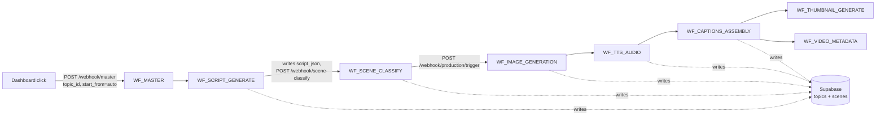
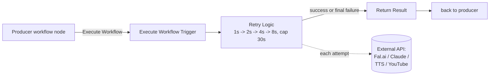

# Workflow architecture (self-chaining + retry)

Vision GridAI's pipeline is implemented as ~50 narrow n8n workflows that
**chain into each other by webhook**, plus one reusable retry sub-workflow.
There is no orchestrator service holding state — Supabase rows are the
state, and each workflow's last act is to POST to the next workflow's
webhook URL. A topic that's halfway through production is just a
`topics` row whose `pipeline_stage` says where it stopped.

This page covers the four invariants every workflow must obey:

1. [Self-chaining](#self-chaining)
2. [`WF_MASTER` as the resume launcher](#wf_master-the-resume-launcher)
3. [`WF_RETRY_WRAPPER` as a sub-workflow, not a webhook](#wf_retry_wrapper-the-sub-workflow-pattern)
4. [Webhook bearer auth + the missing-`=` expression trap](#webhook-bearer-auth-the-missing-expression-trap)

For the per-workflow card list, see the [workflow reference](reference.md).
For active/inactive state, see [workflow status](status.md).

## Self-chaining

Every production workflow ends by firing the next one. The producer
workflow finishes its work, writes its result to Supabase
(`scenes`/`topics`/`production_logs`), and then makes one final
authenticated `POST` to the next workflow's webhook with `topic_id` in the
body. There is no centralized scheduler.



**What this buys us:**

- Crashes are recoverable. If `WF_TTS_AUDIO` dies mid-run, the topic row
  still says `audio_progress = 'pending'` for the unfinished scenes, and
  re-firing `WF_MASTER` resumes from the right stage (see below).
- Each workflow stays small enough to own one concern. Audio failures
  don't leak into image-generation logs.
- We can re-run a single stage by hand: `curl -X POST` against the right
  webhook with the right `topic_id` is the operational equivalent of
  "step the pipeline forward."

**The contract every chained workflow must satisfy:**

1. **Idempotent on re-fire.** Reads its own scenes/topic row first and
   skips work already marked done. Detail in
   [Resume / Retry](../subsystems/resume-retry.md).
2. **Writes status before chaining.** Update Supabase (`audio_progress`,
   `images_progress`, `assembly_status`, etc.) **before** posting to the
   next webhook, so the next workflow can read consistent state.
3. **Logs every external call to `production_logs`.** Stage, action,
   status, duration, cost, retry count.
4. **Authenticates the outbound `POST`.** Bearer-token header bound to a
   stored credential (see below).

## `WF_MASTER` — the resume launcher

`WF_MASTER` is **not** an orchestrator. It is an entry point that figures
out which stage to fire and then fires it. From its `Determine Start
Stage` node:

```js
if (startFrom === 'auto') {
  if (!topic.script_json || topic.status === 'pending' || topic.status === 'approved') {
    nextStage = 'script';
  } else if (topic.script_json && topic.scene_count > 0 && topic.status === 'script_approved') {
    nextStage = 'classify';
  } else if (topic.images_progress === 'pending' || topic.images_progress === null) {
    nextStage = 'images';
  } else if (topic.audio_progress === 'pending' || topic.audio_progress === null) {
    nextStage = 'tts';
  } else if (topic.assembly_status === 'pending' || topic.assembly_status === null) {
    nextStage = 'assembly';
  } else if (!topic.thumbnail_url) {
    nextStage = 'thumbnail';
  } else {
    nextStage = 'complete';
  }
}
```

Three caller patterns end up here:

- **Dashboard "Generate Next Video"** — `start_from = 'auto'`, master picks
  the right stage based on topic state.
- **Manual recovery after a crash** — `start_from = 'auto'` again. The
  topic's column state is the truth; `WF_MASTER` resumes wherever the
  last successful workflow stopped.
- **Forced re-run of a specific stage** — `start_from = 'tts'` (or any
  named stage). Used during debugging.

After determining `nextStage`, `WF_MASTER` `POST`s to that stage's webhook
with the topic ID. From there, the chain takes over.

`WF_MASTER` does **not** wait for downstream completion. It returns
`HTTP 202 Accepted` to the caller and lets the chain run asynchronously.
The dashboard reads progress through Supabase Realtime, not through the
webhook response.

## `WF_RETRY_WRAPPER` — the sub-workflow pattern

External APIs fail. Fal.ai timeouts, Anthropic 529 overload, YouTube
quota exhaustion, transient Google TTS network errors. Every external
call is wrapped in `WF_RETRY_WRAPPER` — a 3-node n8n workflow with an
`executeWorkflowTrigger` (not a webhook) and a code node that retries
with exponential backoff:



The retry node's contract:

```js
const maxRetries = input.maxRetries || 4;
const baseDelay = 1000;
for (let attempt = 1; attempt <= maxRetries; attempt++) {
  try {
    const response = await this.helpers.httpRequest({ method, url, headers, body, returnFullResponse: true });
    return [{ json: { success: true, data: response.body, attempts: attempt } }];
  } catch (error) {
    if (attempt < maxRetries) {
      const delay = Math.min(baseDelay * Math.pow(2, attempt - 1), 30000);
      await new Promise(r => setTimeout(r, delay));
    }
  }
}
return [{ json: { success: false, attempts: maxRetries } }];
```

Backoff schedule for the default `maxRetries = 4`: **1s → 2s → 4s → 8s**
(no fifth retry; 30s cap only matters if `maxRetries > 5`). Total
worst-case wall-clock for a failed call: ~15s of waiting plus the four
HTTP timeouts.

**Important: `WF_RETRY_WRAPPER` must be called as a sub-workflow** (n8n's
`Execute Workflow` node), not as a webhook. Calling it as a webhook from
inside another workflow doubles the auth surface and breaks state passing
between attempts. The trigger is `n8n-nodes-base.executeWorkflowTrigger`,
not `webhook`.

A producer that wraps a Fal.ai call looks like:

```text
[Build Fal.ai request] -> [Execute Workflow: WF_RETRY_WRAPPER] -> [If success] -> [Write scene]
                                                                  [If failed]  -> [Mark scene failed + log]
```

## Webhook bearer auth + the missing-`=` expression trap

After the 2026-04-21 security rotation, every internal webhook (the
`/webhook/*` endpoints n8n exposes) requires:

```
Authorization: Bearer {{ $env.DASHBOARD_API_TOKEN }}
```

The producer workflow includes this header on every chained `POST`. The
target workflow's first node is an `IF` that checks `Authorization`
against the same env-var; mismatch returns `401`. Both sides resolve
`$env.DASHBOARD_API_TOKEN` from the n8n container's environment, set in
`/docker/n8n/docker-compose.override.yml`.

> **The missing-`=` bug (Session 38).** n8n string parameters that begin
> with `=` are evaluated as expressions; everything else is a literal. So
>
> ```
> "value": "=Bearer {{ $env.DASHBOARD_API_TOKEN }}"   // expression — resolves
> "value": "Bearer {{ $env.DASHBOARD_API_TOKEN }}"    // literal — sends the braces
> ```
>
> The second form was present on **17 HTTP nodes** across `WF_SUPERVISOR`
> (11 nodes) and `WF_ANALYTICS_CRON` (6 nodes). They had been silently
> failing for ~30 days — Supabase rejected the literal `{{ ... }}` JWT
> with `CompactDecodeError (got 2 parts)` and the workflows reported
> generic auth failures. Detection only happened when JWT rotation
> changed the failure shape. See `MEMORY.md` "2026-04-23 follow-up patch"
> for the audit + fix.
>
> **Lint rule.** `tools/lint_n8n_workflows.py` enforces `AUTH-01`
> (warning) — every `Authorization` header value containing `{{` must
> start with `=`. CI runs the linter on every PR.

For workflows that authenticate to **external** APIs (Anthropic, Fal.ai,
YouTube, Google TTS), the pattern is different. Those use n8n stored
credentials, referenced by `credentials.id` on the HTTP node — not raw
`$env`. The post-rotation cleanup audit (`MEMORY.md` "Family A") found
~65 nodes still bound to stale credential IDs after the rotation; lint
rule `CRED-01` catches those by checking that every external HTTP node
uses a stored credential rather than a raw `Authorization` header.

The chain pattern, the retry wrapper, the webhook bearer, and the lint
rules together form the structural guarantee that the next rotation
won't quietly break the pipeline again.
