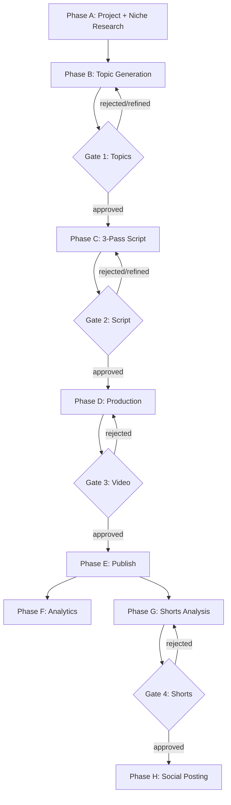
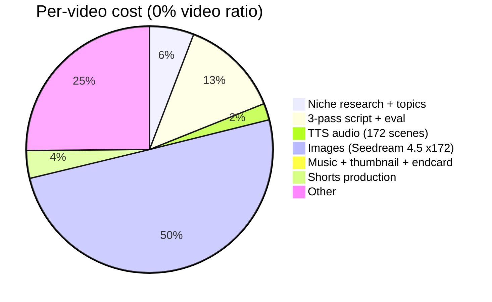

# Platform Docs Site Implementation Plan

> **For agentic workers:** REQUIRED SUB-SKILL: Use superpowers:subagent-driven-development (recommended) or superpowers:executing-plans to implement this plan task-by-task. Steps use checkbox (`- [ ]`) syntax for tracking.

**Goal:** Ship an MkDocs Material static site at `https://akinwunmi-akinrimisi.github.io/vision-gridai-platform/` that explains the entire Vision GridAI platform end-to-end, auto-deployed from `main`.

**Architecture:** New top-level `docs-site/` folder containing `mkdocs.yml` + ~37 markdown pages + Mermaid diagrams. GitHub Action triggers on push to `main` when `docs-site/**` changes; builds with `mkdocs gh-deploy --force` and pushes to `gh-pages` branch which GitHub Pages serves.

**Tech Stack:** MkDocs 1.6+, mkdocs-material 9.5+, mkdocs-mermaid2-plugin, Python 3.11 (CI) / 3.13 (local), GitHub Actions.

**Source spec:** `docs/superpowers/specs/2026-04-24-platform-docs-site-design.md` (commit `b54706b`)

**Source-of-truth precedence (when writing content):** see spec §6. Summary: `memory/` > `supabase/migrations/` > `docs/SECURITY_*` > `directives/` > `dashboard/src/` > `execution/` > `workflows/*.json` (snapshots) > `CLAUDE.md` / `Agent.md` / `Dashboard_Implementation_Plan.md` (cross-check before stating as fact).

---

## File Structure

**Created (new):**
```
docs-site/
├── mkdocs.yml
├── requirements.txt
└── docs/
    ├── index.md
    ├── stylesheets/extra.css                 (one small override file)
    ├── concepts/
    │   ├── why.md
    │   ├── gates.md
    │   ├── economics.md
    │   └── glossary.md
    ├── pipeline/
    │   ├── phase-a-project-creation.md
    │   ├── phase-b-topic-generation.md
    │   ├── phase-c-script-generation.md
    │   ├── phase-d-production.md
    │   ├── phase-e-review-publish.md
    │   ├── phase-f-analytics.md
    │   ├── phase-g-shorts.md
    │   └── phase-h-social.md
    ├── subsystems/
    │   ├── topic-intelligence.md
    │   ├── registers.md
    │   ├── style-dna.md
    │   ├── caption-burn.md
    │   ├── music-lyria.md
    │   └── resume-retry.md
    ├── dashboard/
    │   ├── page-map.md
    │   ├── page-reference.md
    │   └── realtime-patterns.md
    ├── database/
    │   ├── schema-overview.md
    │   ├── table-reference.md
    │   └── migration-history.md
    ├── workflows/
    │   ├── architecture.md
    │   ├── reference.md
    │   └── status.md
    ├── prompts/
    │   ├── where-they-live.md
    │   ├── system-prompts.md
    │   └── templates.md
    ├── infrastructure/
    │   ├── vps-layout.md
    │   ├── service-mesh.md
    │   └── auth-secrets.md
    └── operations/
        ├── cost-economics.md
        ├── debugging-recipes.md
        └── incident-log.md

.github/workflows/
└── deploy-docs.yml
```

**Modified:**
- `.gitignore` — add `docs-site/site/` (mkdocs build output) and `docs-site/.cache/`

**Total:** 37 content pages + 1 index + 1 stylesheet + 2 config + 1 CI workflow = 42 new files; 1 modified.

**Test strategy:** No unit tests. Verification gate is `mkdocs build --strict` — fails on dead links, missing nav targets, malformed frontmatter, broken Mermaid blocks. Each content task adds `mkdocs build --strict` as the green check before commit.

---

## Phase 1 — Scaffold + verify auto-deploy

Goal: get a stub site live on GitHub Pages with the full nav tree, before writing real content. This proves the deploy pipeline end-to-end first; content fills in afterward.

### Task 1: Create `requirements.txt`

**Files:**
- Create: `docs-site/requirements.txt`

- [ ] **Step 1: Create requirements file**

```
mkdocs==1.6.1
mkdocs-material==9.5.40
mkdocs-mermaid2-plugin==1.1.1
```

- [ ] **Step 2: Install locally**

Run: `cd docs-site && pip install -r requirements.txt`
Expected: pip installs the three packages without errors.

- [ ] **Step 3: Verify mkdocs is on PATH**

Run: `mkdocs --version`
Expected: `mkdocs, version 1.6.x from ...`

### Task 2: Create `mkdocs.yml` with full nav tree pointing to stubs

**Files:**
- Create: `docs-site/mkdocs.yml`

- [ ] **Step 1: Write mkdocs.yml**

```yaml
site_name: Vision GridAI Platform
site_description: Operator reference for the Vision GridAI multi-niche AI video production platform
site_url: https://akinwunmi-akinrimisi.github.io/vision-gridai-platform/
repo_url: https://github.com/akinwunmi-akinrimisi/vision-gridai-platform
repo_name: akinwunmi-akinrimisi/vision-gridai-platform
edit_uri: edit/main/docs-site/docs/
docs_dir: docs

theme:
  name: material
  palette:
    - media: "(prefers-color-scheme: light)"
      scheme: default
      primary: deep purple
      accent: indigo
      toggle:
        icon: material/brightness-7
        name: Switch to dark mode
    - media: "(prefers-color-scheme: dark)"
      scheme: slate
      primary: deep purple
      accent: indigo
      toggle:
        icon: material/brightness-4
        name: Switch to light mode
  features:
    - navigation.instant
    - navigation.tracking
    - navigation.tabs
    - navigation.sections
    - navigation.expand
    - navigation.indexes
    - navigation.top
    - search.suggest
    - search.highlight
    - content.code.copy
    - content.action.edit
    - toc.integrate
  icon:
    repo: fontawesome/brands/github

plugins:
  - search
  - mermaid2

markdown_extensions:
  - admonition
  - attr_list
  - def_list
  - footnotes
  - tables
  - toc:
      permalink: true
  - pymdownx.details
  - pymdownx.highlight:
      anchor_linenums: true
  - pymdownx.inlinehilite
  - pymdownx.snippets
  - pymdownx.superfences:
      custom_fences:
        - name: mermaid
          class: mermaid
          format: !!python/name:mermaid2.fence_mermaid_custom
  - pymdownx.tabbed:
      alternate_style: true

extra_css:
  - stylesheets/extra.css

nav:
  - Home: index.md
  - Concepts:
    - Why this platform exists: concepts/why.md
    - The 4 approval gates: concepts/gates.md
    - Pipeline economics: concepts/economics.md
    - Glossary: concepts/glossary.md
  - End-to-End Pipeline:
    - Phase A · Project Creation: pipeline/phase-a-project-creation.md
    - Phase B · Topic Generation (Gate 1): pipeline/phase-b-topic-generation.md
    - Phase C · 3-Pass Script (Gate 2): pipeline/phase-c-script-generation.md
    - Phase D · Production: pipeline/phase-d-production.md
    - Phase E · Review & Publish (Gate 3): pipeline/phase-e-review-publish.md
    - Phase F · Analytics: pipeline/phase-f-analytics.md
    - Phase G · Shorts (Gate 4): pipeline/phase-g-shorts.md
    - Phase H · Social Posting: pipeline/phase-h-social.md
  - Subsystems:
    - Topic Intelligence: subsystems/topic-intelligence.md
    - Production Registers: subsystems/registers.md
    - Style DNA + Composition: subsystems/style-dna.md
    - Caption Burn Service: subsystems/caption-burn.md
    - Background Music (Lyria): subsystems/music-lyria.md
    - Resume / Retry: subsystems/resume-retry.md
  - Dashboard:
    - Page map: dashboard/page-map.md
    - Page reference: dashboard/page-reference.md
    - Realtime patterns: dashboard/realtime-patterns.md
  - Database:
    - Schema overview: database/schema-overview.md
    - Table reference: database/table-reference.md
    - Migration history: database/migration-history.md
  - n8n Workflows:
    - Architecture: workflows/architecture.md
    - Reference (~50 cards): workflows/reference.md
    - Status: workflows/status.md
  - Prompts:
    - Where prompts live: prompts/where-they-live.md
    - System prompts: prompts/system-prompts.md
    - Prompt templates: prompts/templates.md
  - Infrastructure:
    - VPS layout: infrastructure/vps-layout.md
    - Service mesh: infrastructure/service-mesh.md
    - Auth + secrets: infrastructure/auth-secrets.md
  - Operations:
    - Cost economics: operations/cost-economics.md
    - Debugging recipes: operations/debugging-recipes.md
    - Incident log: operations/incident-log.md
```

### Task 3: Create one-line stubs for every nav target (37 pages)

**Files:**
- Create: all 37 files listed in File Structure above + `docs-site/docs/index.md`
- Create: `docs-site/docs/stylesheets/extra.css`

- [ ] **Step 1: Write `docs-site/docs/index.md`**

```markdown
# Vision GridAI Platform

> Operator reference for the multi-niche AI video production platform.

This site is under construction. Use the left navigation to explore.

**Last built:** *(injected by GitHub Action)*
```

- [ ] **Step 2: Write `docs-site/docs/stylesheets/extra.css`**

```css
/* Wider Mermaid diagrams */
.mermaid {
  text-align: center;
}

/* Reference table tweaks */
.md-typeset table:not([class]) {
  font-size: 0.75rem;
}

/* Prevent absurdly tall tables */
.md-typeset table:not([class]) {
  display: block;
  max-width: 100%;
  overflow-x: auto;
}
```

- [ ] **Step 3: Write all 37 stub pages (one shell command, one file each)**

Each file contains a single H1 + a `Stub` admonition. Use this template, substituting the page title:

```markdown
# {Page Title}

!!! info "Stub"
    This page is scaffolded but not yet written. See [the design spec](https://github.com/akinwunmi-akinrimisi/vision-gridai-platform/blob/main/docs/superpowers/specs/2026-04-24-platform-docs-site-design.md) for what will go here.
```

Page-title mapping:
- `concepts/why.md` → "Why this platform exists"
- `concepts/gates.md` → "The 4 approval gates"
- `concepts/economics.md` → "Pipeline economics"
- `concepts/glossary.md` → "Glossary"
- `pipeline/phase-a-project-creation.md` → "Phase A · Project Creation + Niche Research"
- `pipeline/phase-b-topic-generation.md` → "Phase B · Topic Generation (Gate 1)"
- `pipeline/phase-c-script-generation.md` → "Phase C · 3-Pass Script Generation (Gate 2)"
- `pipeline/phase-d-production.md` → "Phase D · Production Pipeline"
- `pipeline/phase-e-review-publish.md` → "Phase E · Video Review (Gate 3) + Publish"
- `pipeline/phase-f-analytics.md` → "Phase F · Analytics"
- `pipeline/phase-g-shorts.md` → "Phase G · Shorts (Gate 4)"
- `pipeline/phase-h-social.md` → "Phase H · Social Posting"
- `subsystems/topic-intelligence.md` → "Topic Intelligence (5-source research)"
- `subsystems/registers.md` → "Production Registers (5 visual styles)"
- `subsystems/style-dna.md` → "Style DNA + Composition System"
- `subsystems/caption-burn.md` → "Caption Burn Service"
- `subsystems/music-lyria.md` → "Background Music (Lyria + ducking)"
- `subsystems/resume-retry.md` → "Resume / Retry Architecture"
- `dashboard/page-map.md` → "Dashboard page map"
- `dashboard/page-reference.md` → "Dashboard page reference"
- `dashboard/realtime-patterns.md` → "Realtime data patterns"
- `database/schema-overview.md` → "Database schema overview"
- `database/table-reference.md` → "Table reference"
- `database/migration-history.md` → "Migration history"
- `workflows/architecture.md` → "Workflow architecture (self-chaining + retry)"
- `workflows/reference.md` → "Workflow reference"
- `workflows/status.md` → "Workflow status (active vs deprecated)"
- `prompts/where-they-live.md` → "Where prompts live"
- `prompts/system-prompts.md` → "System prompt reference"
- `prompts/templates.md` → "Prompt templates (Style DNA, composition, negative)"
- `infrastructure/vps-layout.md` → "VPS layout"
- `infrastructure/service-mesh.md` → "Service mesh"
- `infrastructure/auth-secrets.md` → "Auth + secrets architecture"
- `operations/cost-economics.md` → "Cost economics"
- `operations/debugging-recipes.md` → "Debugging recipes"
- `operations/incident-log.md` → "Incident log"

### Task 4: Local strict-build smoke test

- [ ] **Step 1: Run strict build from `docs-site/`**

Run: `cd docs-site && mkdocs build --strict`
Expected: builds to `docs-site/site/` with zero warnings (since every nav entry resolves to a stub).

- [ ] **Step 2: Open built site in browser to eyeball nav tree**

Run: `cd docs-site && mkdocs serve`
Open: `http://127.0.0.1:8000/`
Verify: full nav tree visible on left, all 37+ stubs render their "Stub" admonition.
Stop server with Ctrl-C.

### Task 5: Update `.gitignore`

**Files:**
- Modify: `.gitignore`

- [ ] **Step 1: Append entries**

Add at the bottom of `.gitignore`:

```
# MkDocs build output
docs-site/site/
docs-site/.cache/
```

### Task 6: Create GitHub Action

**Files:**
- Create: `.github/workflows/deploy-docs.yml`

- [ ] **Step 1: Write the workflow**

```yaml
name: Deploy docs site

on:
  push:
    branches: [main]
    paths:
      - 'docs-site/**'
      - '.github/workflows/deploy-docs.yml'
  workflow_dispatch:

permissions:
  contents: write

concurrency:
  group: docs-deploy
  cancel-in-progress: false

jobs:
  deploy:
    runs-on: ubuntu-latest
    steps:
      - name: Checkout
        uses: actions/checkout@v4
        with:
          fetch-depth: 0

      - name: Set up Python
        uses: actions/setup-python@v5
        with:
          python-version: '3.11'

      - name: Cache pip
        uses: actions/cache@v4
        with:
          path: ~/.cache/pip
          key: ${{ runner.os }}-pip-${{ hashFiles('docs-site/requirements.txt') }}

      - name: Install dependencies
        run: pip install -r docs-site/requirements.txt

      - name: Configure git author
        run: |
          git config user.name "github-actions[bot]"
          git config user.email "41898282+github-actions[bot]@users.noreply.github.com"

      - name: Build & deploy to gh-pages
        working-directory: docs-site
        run: mkdocs gh-deploy --force --clean --verbose
```

### Task 7: First commit + push, verify deploy

- [ ] **Step 1: Stage scaffold + commit**

```bash
git add docs-site .github/workflows/deploy-docs.yml .gitignore
git commit -m "feat(docs-site): scaffold MkDocs Material site with full nav stubs

- 37 page stubs + index, full nav tree in mkdocs.yml
- Deep-purple Material theme, dark/light auto-toggle
- Mermaid plugin enabled
- GitHub Action auto-deploys to gh-pages on push to main when docs-site/** changes

Spec: docs/superpowers/specs/2026-04-24-platform-docs-site-design.md"
```

- [ ] **Step 2: Push and watch the Action run**

```bash
git push
```

Expected: GitHub Action `Deploy docs site` runs (~90s). Once green, the `gh-pages` branch is created.

- [ ] **Step 3: One-time GitHub Pages enable (user action)**

GitHub web → repo Settings → Pages → Source: Deploy from a branch → Branch: `gh-pages` / root → Save.

Expected: `https://akinwunmi-akinrimisi.github.io/vision-gridai-platform/` returns the stub home page within 1-2 minutes.

- [ ] **Step 4: Stop here if anything is broken**

If the Action fails or the site doesn't load, fix the scaffold before any content task. The whole point of Phase 1 is "deploy pipeline works" before investing in content.

---

## Phase 2 — Concepts pages

Goal: write the four conceptual entry pages.

### Task 8: `concepts/why.md`

**Files:**
- Modify: `docs-site/docs/concepts/why.md`

**Sources to read:** `CLAUDE.md` §"What This Is", `Dashboard_Implementation_Plan.md` §1, `VisionGridAI_Platform_Agent.md` opening section.

- [ ] **Step 1: Replace stub with full page**

Sections (in order):
1. **What this is** (1 paragraph) — multi-niche AI video production: input niche → research → topics → 2hr documentary → publish.
2. **Why this design** — separation of agentic stages (research, topics, scripts) from deterministic production (TTS, images, FFmpeg, assembly).
3. **The 3 invariants** — (a) audio is the master clock (b) write to Supabase after every asset (c) 4 approval gates pause the pipeline.
4. **What it is NOT** — not a real-time editing tool, not a one-shot generator, not human-free (gates are mandatory).

Cite source files (e.g., `CLAUDE.md:1-50`) where relevant.

- [ ] **Step 2: Verify build**

Run: `cd docs-site && mkdocs build --strict`
Expected: PASS, no warnings.

- [ ] **Step 3: Commit**

```bash
git add docs-site/docs/concepts/why.md
git commit -m "docs(site): write concepts/why.md"
```

### Task 9: `concepts/gates.md`

**Files:**
- Modify: `docs-site/docs/concepts/gates.md`

**Sources:** `CLAUDE.md` "4 approval gates" rule, `directives/01-topic-generation.md`, `directives/02-script-generation.md`, `directives/09-shorts-pipeline.md`, `Dashboard_Implementation_Plan.md` §4.

- [ ] **Step 1: Replace stub with full page**

Sections:
1. **The 4 gates table** (Gate, What's reviewed, Where, Auto-pilot behavior, Why human required).
2. **Mermaid flowchart** showing the pipeline with the 4 gates marked as diamond decision nodes:



3. **Auto-pilot mode** — what changes per gate when enabled (per-gate threshold + UNLISTED publish never public).
4. **Resumption** — if a gate is paused, where the state is stored (`topics.review_status`, `topics.script_review_status`, `topics.video_review_status`, `shorts.review_status`).

- [ ] **Step 2: Verify build**

Run: `cd docs-site && mkdocs build --strict`

- [ ] **Step 3: Commit**

```bash
git add docs-site/docs/concepts/gates.md
git commit -m "docs(site): write concepts/gates.md with master pipeline diagram"
```

### Task 10: `concepts/economics.md`

**Files:**
- Modify: `docs-site/docs/concepts/economics.md`

**Sources:** `CLAUDE.md` "Pipeline Quick Reference" table + cost rows, `Dashboard_Implementation_Plan.md` §10.

- [ ] **Step 1: Replace stub with full page**

Sections:
1. **Per-video cost table** — copy/refine the Pipeline Quick Reference cost column from `CLAUDE.md`. Phase | Type | Cost. Total range $13.76–$76.65 per video depending on I2V ratio.
2. **Cost drivers** — what makes a video cheap (0% video ratio, 100% Ken Burns) vs expensive (15% Seedance I2V at $0.2419/s).
3. **Topic Intelligence cost** — ~$0.13 per run.
4. **Monthly fixed costs** — Supervisor + comment sync ~$14/mo.
5. **Cost calculator gate** — Stage 7.5 pause for ratio selection.

Include a Mermaid pie chart for a representative $13.76 (0% video) breakdown:



- [ ] **Step 2: Verify build**

Run: `cd docs-site && mkdocs build --strict`

- [ ] **Step 3: Commit**

```bash
git add docs-site/docs/concepts/economics.md
git commit -m "docs(site): write concepts/economics.md"
```

### Task 11: `concepts/glossary.md`

**Files:**
- Modify: `docs-site/docs/concepts/glossary.md`

**Sources:** terminology scattered across `CLAUDE.md` "Critical Rules" + "Gotchas".

- [ ] **Step 1: Replace stub with definition list**

Use Markdown definition lists (`def_list` extension is enabled). Include at minimum: Style DNA, Composition Prefix, Universal Negative Prompt, Ken Burns, Color Mood, Selective Color, Hybrid Scene, Auto-Pilot Mode, Force Pass, Master Clock, Self-chaining, Resume/Checkpoint, Approval Gate, Production Register, Topic Intelligence, Caption Burn Service, Lyria, Seedream, Seedance, RPM, PPS, Hook Score, Outlier Score, SEO Score.

Each entry: 1-3 lines. Cite source file where useful.

- [ ] **Step 2: Verify build**

Run: `cd docs-site && mkdocs build --strict`

- [ ] **Step 3: Commit**

```bash
git add docs-site/docs/concepts/glossary.md
git commit -m "docs(site): write concepts/glossary.md"
```

---

## Phase 3 — Pipeline pages (8 phases)

Each phase page follows **Template 1** from the spec: Goal · Sequence diagram · Inputs · Outputs · Gate behavior · Workflows · Failure modes · Code refs.

### Task 12: `pipeline/phase-a-project-creation.md`

**Files:**
- Modify: `docs-site/docs/pipeline/phase-a-project-creation.md`

**Sources:** `directives/00-project-creation.md`, `Dashboard_Implementation_Plan.md` §4 Phase A, `workflows/WF_PROJECT_CREATE.json` (snapshot — read but treat as drift-prone).

- [ ] **Step 1: Replace stub with full page following Template 1**

- One-line header: purpose (`Create project + research the niche → generate dynamic prompts`), cost (~$0.60), duration (~3-5 min).
- Goal: 2-3 sentences.
- Sequence diagram (Mermaid `sequenceDiagram`): User → Dashboard → /webhook/project/create → WF_PROJECT_CREATE → Anthropic API (niche research) → Supabase (write project, niche_profiles, prompt_configs).
- Inputs: webhook payload shape (niche, niche_description, target_video_count).
- Outputs: rows written to `projects`, `niche_profiles`, `prompt_configs`.
- Gate behavior: N/A (no human gate).
- Workflows involved: link to WF_PROJECT_CREATE in workflows/reference.md.
- Failure modes: Anthropic API timeout → retry via WF_RETRY_WRAPPER; logged to `production_logs`.
- Code refs: `workflows/WF_PROJECT_CREATE.json`, `dashboard/src/components/projects/CreateProjectModal.jsx`.
- Footer: `⚠ Needs verification` if any claim isn't backed by source.

- [ ] **Step 2: Verify build**

Run: `cd docs-site && mkdocs build --strict`

- [ ] **Step 3: Commit**

```bash
git add docs-site/docs/pipeline/phase-a-project-creation.md
git commit -m "docs(site): write pipeline/phase-a-project-creation.md"
```

### Task 13: `pipeline/phase-b-topic-generation.md`

**Files:**
- Modify: `docs-site/docs/pipeline/phase-b-topic-generation.md`

**Sources:** `directives/01-topic-generation.md`, `Dashboard_Implementation_Plan.md` §4 Phase B, `workflows/WF_TOPICS_GENERATE.json`.

- [ ] **Step 1: Replace stub with Template 1 page**

Cover: 25 topics generated per project, avatars (10 fields each), Gate 1 actions (approve / reject / refine / edit), refinement considers all 24 other topics, viability scoring, outlier scoring, SEO scoring trigger chain.

Sequence diagram covers WF_TOPICS_GENERATE → WF_OUTLIER_SCORE + WF_SEO_SCORE + WF_NICHE_VIABILITY (parallel).

Document the Gate 1 dashboard route (`/project/:id/topics`).

- [ ] **Step 2: Verify build + commit**

```bash
cd docs-site && mkdocs build --strict
git add docs-site/docs/pipeline/phase-b-topic-generation.md
git commit -m "docs(site): write pipeline/phase-b-topic-generation.md"
```

### Task 14: `pipeline/phase-c-script-generation.md`

**Files:**
- Modify: `docs-site/docs/pipeline/phase-c-script-generation.md`

**Sources:** `directives/02-script-generation.md`, `CLAUDE.md` "3-pass script generation" rule, `workflows/WF_SCRIPT_GENERATE.json` + `WF_SCRIPT_PASS.json` + `WF_SCRIPT_APPROVE.json`.

- [ ] **Step 1: Replace stub with Template 1 page**

Cover: 3-pass architecture, Pass 1 (Foundation 5-7K) → eval → Pass 2 (Depth 8-10K, Pass 1 as context) → eval → Pass 3 (Resolution 5-7K, summaries) → eval → combined eval. Per-pass threshold 6.0, combined threshold 7.0, max 3 regen attempts. Force-pass mechanism. Style DNA generated and locked here.

Sequence diagram showing the 3-pass loop with eval gates and retry path.

Gate 2 (script review) — actions, dashboard route (`/project/:id/topics/:topicId/script`).

- [ ] **Step 2: Verify build + commit**

```bash
cd docs-site && mkdocs build --strict
git add docs-site/docs/pipeline/phase-c-script-generation.md
git commit -m "docs(site): write pipeline/phase-c-script-generation.md"
```

### Task 15: `pipeline/phase-d-production.md`

**Files:**
- Modify: `docs-site/docs/pipeline/phase-d-production.md`

**Sources:** `CLAUDE.md` Pipeline Quick Reference rows D1-D7, `directives/03-tts-audio.md` through `directives/07-music-endcard.md`, `workflows/WF_TTS_AUDIO.json`, `WF_IMAGE_GENERATION.json`, `WF_KEN_BURNS.json`, `WF_CAPTIONS_ASSEMBLY.json`, `WF_MUSIC_GENERATE.json`, `WF_ENDCARD.json`.

- [ ] **Step 1: Replace stub with Template 1 page**

This is the meaty one. Cover sub-stages D1–D7 each with a brief subsection. Single end-to-end sequence diagram + per-stage inputs/outputs table.

Highlights to include:
- Audio is master clock; FFprobe measures duration before any visual is built.
- Cost Calculator pause (Stage 7.5) — 4 video-ratio options 100/0, 95/5, 90/10, 85/15.
- Hybrid scene assembly (Ken Burns + xfade + I2V + xfade + Ken Burns) for selected scenes.
- 15-20 scene batched assembly for memory safety.
- Caption burn via host-side service `:9998` (links to subsystems/caption-burn.md).
- Background music ducked to volume=0.12, NOT 0.5 (Lyria-generated).

- [ ] **Step 2: Verify build + commit**

```bash
cd docs-site && mkdocs build --strict
git add docs-site/docs/pipeline/phase-d-production.md
git commit -m "docs(site): write pipeline/phase-d-production.md"
```

### Task 16: `pipeline/phase-e-review-publish.md`

**Files:**
- Modify: `docs-site/docs/pipeline/phase-e-review-publish.md`

**Sources:** `directives/08-platform-publish.md`, `Dashboard_Implementation_Plan.md` §4 Phase E, `workflows/WF_QA_CHECK.json`, `WF_VIDEO_METADATA.json`, `WF_THUMBNAIL_GENERATE.json`, YouTube upload workflows.

- [ ] **Step 1: Replace stub with Template 1 page**

Cover: WF_QA_CHECK 13 automated checks (visual, caption, audio, platform compliance), Gate 3 dashboard route (`/project/:id/topics/:topicId/video`), publish actions (Approve & Publish / Approve & Schedule / Reject), default UNLISTED for auto-pilot, YouTube + TikTok + Instagram upload paths, thumbnail regeneration, SEO metadata generation.

- [ ] **Step 2: Verify build + commit**

```bash
cd docs-site && mkdocs build --strict
git add docs-site/docs/pipeline/phase-e-review-publish.md
git commit -m "docs(site): write pipeline/phase-e-review-publish.md"
```

### Task 17: `pipeline/phase-f-analytics.md`

**Files:**
- Modify: `docs-site/docs/pipeline/phase-f-analytics.md`

**Sources:** `workflows/WF_ANALYTICS_CRON.json`, `Dashboard_Implementation_Plan.md` Page 6 Analytics, `dashboard/src/pages/Analytics.jsx`, `dashboard/src/hooks/useAnalytics.js`.

- [ ] **Step 1: Replace stub with Template 1 page**

Cover: daily cron pulls YouTube/TikTok/Instagram metrics, writes to `topics.yt_*` columns + analogous social tables, dashboard renders trends. List specific KPIs tracked: views, watch hours, CTR, avg view %, subscribers gained, estimated revenue, actual CPM.

- [ ] **Step 2: Verify build + commit**

```bash
cd docs-site && mkdocs build --strict
git add docs-site/docs/pipeline/phase-f-analytics.md
git commit -m "docs(site): write pipeline/phase-f-analytics.md"
```

### Task 18: `pipeline/phase-g-shorts.md`

**Files:**
- Modify: `docs-site/docs/pipeline/phase-g-shorts.md`

**Sources:** `directives/09-shorts-pipeline.md`, `workflows/WF_SHORTS_ANALYZE.json`, `WF_SHORTS_PRODUCE.json`, `Dashboard_Implementation_Plan.md` Page 8, `MEMORY.md` shorts caption + thumbnail style preferences.

- [ ] **Step 1: Replace stub with Template 1 page**

Cover: clip from long-form (start_scene, end_scene), virality scoring 1-10, Gate 4 review (`/shorts/:projectId/:topicId`), fresh TTS (rewritten narration), 9:16 native images (NOT cropped), thumbnail style (diagonal slant, 70-80% text, question format, 2-4 keywords in contrasting color), caption style (kinetic ASS, dynamic positioning, emphasis-driven). Cost ~$0.50 per video for analysis + $22+ for production.

- [ ] **Step 2: Verify build + commit**

```bash
cd docs-site && mkdocs build --strict
git add docs-site/docs/pipeline/phase-g-shorts.md
git commit -m "docs(site): write pipeline/phase-g-shorts.md"
```

### Task 19: `pipeline/phase-h-social.md`

**Files:**
- Modify: `docs-site/docs/pipeline/phase-h-social.md`

**Sources:** `workflows/WF_SCHEDULE_PUBLISHER.json`, `WF_SOCIAL_POSTER.json`, `WF_SOCIAL_ANALYTICS.json`, `Dashboard_Implementation_Plan.md` Page 9.

- [ ] **Step 1: Replace stub with Template 1 page**

Cover: Content Calendar dashboard route (`/project/:id/calendar`), WF_SCHEDULE_PUBLISHER 15-min cron, peak-hour AI scheduling (TikTok 6/8/10pm EST, IG 12/6pm), per-platform metadata customization, posting history with engagement metrics.

- [ ] **Step 2: Verify build + commit**

```bash
cd docs-site && mkdocs build --strict
git add docs-site/docs/pipeline/phase-h-social.md
git commit -m "docs(site): write pipeline/phase-h-social.md"
```

---

## Phase 4 — Subsystem deep-dives (6 pages)

These follow **Template 4** (free-form 800-1500 words + multiple diagrams).

### Task 20: `subsystems/topic-intelligence.md`

**Files:**
- Modify: `docs-site/docs/subsystems/topic-intelligence.md`

**Sources:** `directives/topic-intelligence/`, all 7 `WF_RESEARCH_*.json` workflows, `supabase/migrations/002_research_tables.sql` + `006_research_enhancements.sql`, `dashboard/src/pages/Research.jsx`.

- [ ] **Step 1: Write the page**

Sections:
1. What it is (5-source mining: Reddit, YouTube comments, TikTok, Google Trends + PAA, Quora) — globally accessible at `/research`, results feed CreateProjectModal.
2. Mermaid flowchart of the parallel-fetch architecture (orchestrator → 5 parallel scrapers → categorize → display).
3. Per-source breakdown: tool used (PRAW, YouTube Data API, Apify, pytrends + SerpAPI, Apify), ranking criteria (e.g., upvotes + comments×2), top-10 cap.
4. AI categorization (Haiku, organic clustering).
5. Cost (~$0.13 per run, monthly ~$2.08 for 16 runs).
6. Schema: `research_runs`, `research_results`, `research_categories`.
7. Dashboard integration: dropdown in CreateProjectModal pulls from latest complete run.

- [ ] **Step 2: Verify build + commit**

```bash
cd docs-site && mkdocs build --strict
git add docs-site/docs/subsystems/topic-intelligence.md
git commit -m "docs(site): write subsystems/topic-intelligence.md"
```

### Task 21: `subsystems/registers.md`

**Files:**
- Modify: `docs-site/docs/subsystems/registers.md`

**Sources:** `video_production/REGISTER_01_THE_ECONOMIST.md` through `REGISTER_05_ARCHIVE.md`, `image_creation_guidelines_prompts/REGISTER_01_IMAGE_PROMPTS.md` through `05`, `supabase/migrations/023_production_register.sql` + `024_register_specs.sql` + `025_pipeline_stage_register_flow.sql`.

- [ ] **Step 1: Write the page**

For each of the 5 registers: name, intended emotional/visual tone, color palette summary, composition tendencies, example titles/topics it suits.

Diagram: how WF_SCENE_CLASSIFY routes scenes to register-specific image generation logic.

- [ ] **Step 2: Verify build + commit**

```bash
cd docs-site && mkdocs build --strict
git add docs-site/docs/subsystems/registers.md
git commit -m "docs(site): write subsystems/registers.md"
```

### Task 22: `subsystems/style-dna.md`

**Files:**
- Modify: `docs-site/docs/subsystems/style-dna.md`

**Sources:** `CLAUDE.md` "Style DNA is LOCKED per project" rule, `image_creation_guidelines_prompts/REGISTER_01_IMAGE_PROMPTS.md` lines 23-84, `directives/04-image-generation.md`.

- [ ] **Step 1: Write the page**

Cover: locked Style DNA per project (stored in `projects.style_dna`), 8-prefix composition library (wide_establishing, medium_closeup, over_shoulder, extreme_closeup, high_angle, low_angle, symmetrical, leading_lines), universal negative prompt, selective color exception (skip color grading when `selective_color_element IS NOT NULL`).

Show the prompt assembly formula: `composition_prefix + scene_subject + style_dna`.

- [ ] **Step 2: Verify build + commit**

```bash
cd docs-site && mkdocs build --strict
git add docs-site/docs/subsystems/style-dna.md
git commit -m "docs(site): write subsystems/style-dna.md"
```

### Task 23: `subsystems/caption-burn.md`

**Files:**
- Modify: `docs-site/docs/subsystems/caption-burn.md`

**Sources:** `execution/caption_burn_service.py`, `execution/generate_kinetic_ass.py`, `execution/burn_captions.sh`, `execution/whisper_align.py`, `MEMORY.md` Session 32 + 34 + 35 caption-burn details, `CLAUDE.md` "Captions burn via FFmpeg libass" rule.

- [ ] **Step 1: Write the page**

Cover: end-to-end flow from Whisper forced alignment → `generate_kinetic_ass.py` (word-by-word pop-in, center screen, emphasis in yellow/red) → `caption_burn_service.py` HTTP service on port `:9998` (host-side, NOT in n8n container, to bypass n8n OOM) → systemd `caption-burn.service` → uses `docker exec n8n-n8n-1 ffmpeg ...` for libass burn → uploads via WF_KINETIC_DRIVE_UPLOAD webhook.

3-hour timeout, idempotent via `os.replace`. Sequence diagram of the chunked-SRT (10 words) caption flow.

- [ ] **Step 2: Verify build + commit**

```bash
cd docs-site && mkdocs build --strict
git add docs-site/docs/subsystems/caption-burn.md
git commit -m "docs(site): write subsystems/caption-burn.md"
```

### Task 24: `subsystems/music-lyria.md`

**Files:**
- Modify: `docs-site/docs/subsystems/music-lyria.md`

**Sources:** `directives/07-music-endcard.md`, `workflows/WF_MUSIC_GENERATE.json`, `CLAUDE.md` "Background music ducking uses volume=0.12" gotcha, `supabase/migrations/014_music_settings.sql`.

- [ ] **Step 1: Write the page**

Cover: Vertex AI Lyria (lyria-002) generates 30s clips per mood section, Anthropic Claude Haiku analyzes script for mood/tempo/instruments, FFmpeg merges + loops to match video duration, ducked under voiceover at `volume=0.12` (NOT 0.5 — common mistake), crossfade between sections at chapter boundaries.

- [ ] **Step 2: Verify build + commit**

```bash
cd docs-site && mkdocs build --strict
git add docs-site/docs/subsystems/music-lyria.md
git commit -m "docs(site): write subsystems/music-lyria.md"
```

### Task 25: `subsystems/resume-retry.md`

**Files:**
- Modify: `docs-site/docs/subsystems/resume-retry.md`

**Sources:** `workflows/WF_RETRY_WRAPPER.json`, `CLAUDE.md` "Resume/checkpoint" + "Exponential backoff" rules, all production workflows that check status before processing.

- [ ] **Step 1: Write the page**

Cover: WF_RETRY_WRAPPER sub-workflow (1s→2s→4s→8s, max 4 attempts, capped at 30s), per-scene status fields (`audio_status`, `image_status`, `clip_status`), `topics.pipeline_stage` global tracker, parallel completion sync (per visual_type). Mermaid sequence showing happy path + failure → retry → eventual success → log to `production_logs`.

- [ ] **Step 2: Verify build + commit**

```bash
cd docs-site && mkdocs build --strict
git add docs-site/docs/subsystems/resume-retry.md
git commit -m "docs(site): write subsystems/resume-retry.md"
```

---

## Phase 5 — Dashboard pages (3 pages)

### Task 26: `dashboard/page-map.md`

**Files:**
- Modify: `docs-site/docs/dashboard/page-map.md`

**Sources:** `dashboard/src/pages/`, `dashboard/src/components/layout/Sidebar.jsx`, `Dashboard_Implementation_Plan.md` §5.

- [ ] **Step 1: Write the page**

Mermaid `graph LR` showing all 9+ dashboard routes and how they navigate to each other (Projects Home → Project Dashboard → Topics → Script Review → Production Monitor → Video Review → Analytics; sidebar items: Calendar, Engagement, Shorts, Social, Research, Settings).

- [ ] **Step 2: Verify build + commit**

```bash
cd docs-site && mkdocs build --strict
git add docs-site/docs/dashboard/page-map.md
git commit -m "docs(site): write dashboard/page-map.md"
```

### Task 27: `dashboard/page-reference.md`

**Files:**
- Modify: `docs-site/docs/dashboard/page-reference.md`

**Sources:** `dashboard/src/pages/*.jsx`, corresponding hooks in `dashboard/src/hooks/`.

- [ ] **Step 1: Write the page**

One **Template 5** card per page (~9–12 pages):

```
### /route/path
- **Component:** dashboard/src/pages/Name.jsx
- **Hooks:** useFoo, useBar
- **Reads tables:** table.col (via Realtime / via REST)
- **Calls webhooks:** /webhook/X
```

Cover at minimum: `/`, `/project/:id`, `/project/:id/topics`, `/project/:id/topics/:topicId`, `/project/:id/topics/:topicId/script`, `/project/:id/production`, `/project/:id/topics/:topicId/video`, `/project/:id/analytics`, `/project/:id/settings`, `/project/:id/calendar`, `/project/:id/engagement`, `/research`, `/shorts`, `/social`. Verify each route exists by reading `dashboard/src/App.jsx` (or wherever routes are defined).

- [ ] **Step 2: Verify build + commit**

```bash
cd docs-site && mkdocs build --strict
git add docs-site/docs/dashboard/page-reference.md
git commit -m "docs(site): write dashboard/page-reference.md"
```

### Task 28: `dashboard/realtime-patterns.md`

**Files:**
- Modify: `docs-site/docs/dashboard/realtime-patterns.md`

**Sources:** `dashboard/src/hooks/useRealtimeSubscription.js`, `Dashboard_Implementation_Plan.md` §6, `MEMORY.md` Session 25/26 (sb_query handler, supabase-js shim), `CLAUDE.md` "REPLICA IDENTITY FULL" gotcha.

- [ ] **Step 1: Write the page**

Cover: Supabase Realtime subscription pattern, REPLICA IDENTITY FULL requirement, the sb_query handler (recent fix), webhook-based health (Realtime autoconnect was killed per Session 26), tables that broadcast: scenes, topics, projects, production_logs, shorts. Code snippet showing the standard subscription pattern from `useRealtimeSubscription.js`.

- [ ] **Step 2: Verify build + commit**

```bash
cd docs-site && mkdocs build --strict
git add docs-site/docs/dashboard/realtime-patterns.md
git commit -m "docs(site): write dashboard/realtime-patterns.md"
```

---

## Phase 6 — Database pages (3 pages)

### Task 29: `database/schema-overview.md`

**Files:**
- Modify: `docs-site/docs/database/schema-overview.md`

**Sources:** `supabase/migrations/001_initial_schema.sql`, `Dashboard_Implementation_Plan.md` §3, plus migrations adding key relations.

- [ ] **Step 1: Write the page**

Mermaid `erDiagram` of the core tables and relationships:
- projects → niche_profiles (1:1)
- projects → prompt_configs (1:N)
- projects → topics (1:N)
- topics → avatars (1:1)
- topics → scenes (1:N)
- topics → shorts (1:N)
- shorts → social_accounts (M:1 via project)

Show only top-level columns, not exhaustive. Reference the table-reference.md for full column lists.

- [ ] **Step 2: Verify build + commit**

```bash
cd docs-site && mkdocs build --strict
git add docs-site/docs/database/schema-overview.md
git commit -m "docs(site): write database/schema-overview.md"
```

### Task 30: `database/table-reference.md`

**Files:**
- Modify: `docs-site/docs/database/table-reference.md`

**Sources:** `supabase/migrations/001_initial_schema.sql` + later additive migrations (002, 003, 004, 010, 011, 012, 013, 014, 016, 017, 020, 021, 022, 023, 024, 025).

- [ ] **Step 1: Write the page**

One **Template 3** section per significant table:
- projects, niche_profiles, prompt_configs, prompt_templates, system_prompts, register_specs, topics, avatars, scenes, shorts, social_accounts, scheduled_posts, platform_metadata, comments, music_library, renders, production_logs, research_runs, research_results, research_categories, analysis_groups, niche_viability_*, channel_*, audience_insights, daily_ideas, ab_tests, plus intelligence-layer tables.

For each: purpose, key columns, RLS status (locked-down post migration 030), realtime enabled, written by, read by, migration history. Skip exhaustive column listing — note "see migration X for full schema."

- [ ] **Step 2: Verify build + commit**

```bash
cd docs-site && mkdocs build --strict
git add docs-site/docs/database/table-reference.md
git commit -m "docs(site): write database/table-reference.md"
```

### Task 31: `database/migration-history.md`

**Files:**
- Modify: `docs-site/docs/database/migration-history.md`

**Sources:** `supabase/migrations/001` through `031`.

- [ ] **Step 1: Write the page**

Chronological table: migration number | date (from filename or commit) | what it added | status (current / superseded by N / kept for history).

Explicitly call out:
- The three competing `007_*.sql` files (`007_grand_master_integration`, `007_seed_system_prompts`, `007_seo_metadata_columns`) and Postgres lex-order resolution.
- Migration 009 superseding 005 + 008 (Remotion + Kinetic typography removal).
- Migration 030 locking down RLS (was permissive `FOR ALL USING (true)`).
- Migration 031 sanitizing caption_highlight_word (shell-injection mitigation).

- [ ] **Step 2: Verify build + commit**

```bash
cd docs-site && mkdocs build --strict
git add docs-site/docs/database/migration-history.md
git commit -m "docs(site): write database/migration-history.md"
```

---

## Phase 7 — Workflow pages (3 pages)

### Task 32: `workflows/architecture.md`

**Files:**
- Modify: `docs-site/docs/workflows/architecture.md`

**Sources:** `CLAUDE.md` "Self-chaining architecture" rule, `directives/` collectively, `workflows/WF_RETRY_WRAPPER.json`, `workflows/WF_MASTER.json`.

- [ ] **Step 1: Write the page**

Cover: self-chaining (each workflow fires the next on completion), WF_MASTER as launcher, sub-workflow pattern (WF_RETRY_WRAPPER reusable), webhook bearer auth pattern (post-rotation), n8n credential references vs raw `$env` (the "missing-`=`" auth bug from Session 38). Mermaid showing the chain pattern + retry wrapper inline.

- [ ] **Step 2: Verify build + commit**

```bash
cd docs-site && mkdocs build --strict
git add docs-site/docs/workflows/architecture.md
git commit -m "docs(site): write workflows/architecture.md"
```

### Task 33: `workflows/reference.md`

**Files:**
- Modify: `docs-site/docs/workflows/reference.md`

**Sources:** `workflows/*.json` (all ~50), `MEMORY.md` "Production Workflow IDs" table, `workflows/WEBHOOK_ENDPOINTS.md`.

- [ ] **Step 1: Write the page**

~50 **Template 2** workflow cards grouped by H2 sections:
- **Production:** WF_PROJECT_CREATE, WF_TOPICS_GENERATE, WF_SCRIPT_GENERATE, WF_SCRIPT_PASS, WF_SCRIPT_APPROVE, WF_SCRIPT_REJECT, WF_TTS_AUDIO, WF_IMAGE_GENERATION, WF_SCENE_IMAGE_PROCESSOR, WF_SCENE_I2V_PROCESSOR, WF_SCENE_T2V_PROCESSOR, WF_KEN_BURNS, WF_CAPTIONS_ASSEMBLY, WF_MUSIC_GENERATE, WF_ENDCARD, WF_THUMBNAIL_GENERATE, WF_VIDEO_METADATA, WF_QA_CHECK, WF_PLATFORM_METADATA, WF_RETRY_WRAPPER, WF_ASSEMBLY_WATCHDOG, WF_SCENE_CLASSIFY.
- **Research / Intelligence:** WF_RESEARCH_ORCHESTRATOR, WF_RESEARCH_REDDIT, WF_RESEARCH_YOUTUBE, WF_RESEARCH_TIKTOK, WF_RESEARCH_GOOGLE_TRENDS, WF_RESEARCH_QUORA, WF_RESEARCH_CATEGORIZE, WF_YOUTUBE_DISCOVERY, WF_YOUTUBE_ANALYZE, WF_AUDIENCE_INTELLIGENCE, WF_CHANNEL_ANALYZE, WF_CHANNEL_COMPARE, WF_DISCOVER_COMPETITORS, WF_COMPETITOR_MONITOR, WF_DAILY_IDEAS, WF_KEYWORD_SCAN, WF_NICHE_HEALTH, WF_NICHE_VIABILITY, WF_OUTLIER_SCORE, WF_SEO_SCORE, WF_HOOK_ANALYZER, WF_PPS_CALIBRATE, WF_PREDICT_PERFORMANCE, WF_RPM_CLASSIFY, WF_REVENUE_ATTRIBUTION, WF_AB_TEST_ROTATE, WF_CTR_OPTIMIZE.
- **Analytics / Engagement:** WF_ANALYTICS_CRON, WF_COMMENTS_SYNC, WF_COMMENT_ANALYZE, WF_AI_COACH.
- **Social:** WF_SCHEDULE_PUBLISHER, WF_SOCIAL_POSTER, WF_SOCIAL_ANALYTICS.
- **Utility / Webhook:** WF_DASHBOARD_READ, WF_WEBHOOK_PRODUCTION, WF_MASTER, WF_SHORTS_ANALYZE, WF_SHORTS_PRODUCE, WF_CREATE_PROJECT_FROM_ANALYSIS.

For each card, populate fields from MEMORY's workflow ID table (where listed), and from reading the JSON for the rest. Mark cards "snapshot, may differ from live" where the JSON is the only source.

- [ ] **Step 2: Verify build + commit**

```bash
cd docs-site && mkdocs build --strict
git add docs-site/docs/workflows/reference.md
git commit -m "docs(site): write workflows/reference.md (~50 cards)"
```

### Task 34: `workflows/status.md`

**Files:**
- Modify: `docs-site/docs/workflows/status.md`

**Sources:** `MEMORY.md` "Production Workflow IDs" table, `workflows/deprecated/`.

- [ ] **Step 1: Write the page**

Single sortable table: Workflow | n8n ID | Active | Trigger type | Last verified date | Notes.

Explicitly include the WF_I2V_GENERATION + WF_T2V_GENERATION discrepancy: **locally** in `workflows/deprecated/` but **MEMORY says active on n8n VPS** — flag for reconciliation.

- [ ] **Step 2: Verify build + commit**

```bash
cd docs-site && mkdocs build --strict
git add docs-site/docs/workflows/status.md
git commit -m "docs(site): write workflows/status.md"
```

---

## Phase 8 — Prompts pages (3 pages)

### Task 35: `prompts/where-they-live.md`

**Files:**
- Modify: `docs-site/docs/prompts/where-they-live.md`

**Sources:** Earlier audit findings in this conversation (already documented in chat) + `supabase/migrations/007_seed_system_prompts.sql` + `image_creation_guidelines_prompts/` + `directives/` + workflow JSONs for inline prompts.

- [ ] **Step 1: Write the page**

The full prompt-location matrix table (already structured during brainstorming). Rows: prompt category. Columns: location, seed migration, local reference file, dashboard UI, workflow nodes that use it.

Plus a "Where prompts are NOT" sub-section.

- [ ] **Step 2: Verify build + commit**

```bash
cd docs-site && mkdocs build --strict
git add docs-site/docs/prompts/where-they-live.md
git commit -m "docs(site): write prompts/where-they-live.md"
```

### Task 36: `prompts/system-prompts.md`

**Files:**
- Modify: `docs-site/docs/prompts/system-prompts.md`

**Sources:** `supabase/migrations/007_seed_system_prompts.sql` (the seed text).

- [ ] **Step 1: Write the page**

For each system prompt (`topic_generator_master`, `script_system_prompt`, `script_pass1`, `script_pass2`, `script_pass3`, `script_evaluator`, `script_retry_template`, `script_metadata_extractor`):

- Heading with the prompt key.
- Purpose (1-2 lines).
- Where used (workflow + node).
- Full text in a fenced code block (from migration 007).
- Footer: `⚠ Verify against live DB — may have been edited via dashboard PromptCard since migration was applied.`

- [ ] **Step 2: Verify build + commit**

```bash
cd docs-site && mkdocs build --strict
git add docs-site/docs/prompts/system-prompts.md
git commit -m "docs(site): write prompts/system-prompts.md"
```

### Task 37: `prompts/templates.md`

**Files:**
- Modify: `docs-site/docs/prompts/templates.md`

**Sources:** `image_creation_guidelines_prompts/REGISTER_*.md`, `directives/04-image-generation.md`, `prompt_templates` table seeds (search migrations for inserts into `prompt_templates`).

- [ ] **Step 1: Write the page**

Three sections:
1. **Style DNA templates** — the 4 (Historical, Finance, Tech, Inspirational) plus per-register variants. Show full text or excerpt + reference to register file.
2. **Composition prefix library** — all 8 prefixes with example use case for each.
3. **Universal negative prompt** — full text + rationale.

- [ ] **Step 2: Verify build + commit**

```bash
cd docs-site && mkdocs build --strict
git add docs-site/docs/prompts/templates.md
git commit -m "docs(site): write prompts/templates.md"
```

---

## Phase 9 — Infrastructure pages (3 pages)

### Task 38: `infrastructure/vps-layout.md`

**Files:**
- Modify: `docs-site/docs/infrastructure/vps-layout.md`

**Sources:** `MEMORY.md` "VPS Layout" + "Docker Infra" sections.

- [ ] **Step 1: Write the page**

Cover: SSH endpoint, key file path, container directory layout (`/docker/n8n/`, `/docker/supabase/`), key containers (n8n-n8n-1, supabase-db-1, supabase-realtime-1, supabase-rest-1, supabase-kong-1, caption-burn host-side service), host-side `/opt/dashboard/` (Traefik + nginx:alpine static) + `/opt/caption-burn/` (systemd `caption-burn.service`), n8n-production volume `/data/n8n-production`, Docker bridge gateway 172.18.0.1.

- [ ] **Step 2: Verify build + commit**

```bash
cd docs-site && mkdocs build --strict
git add docs-site/docs/infrastructure/vps-layout.md
git commit -m "docs(site): write infrastructure/vps-layout.md"
```

### Task 39: `infrastructure/service-mesh.md`

**Files:**
- Modify: `docs-site/docs/infrastructure/service-mesh.md`

**Sources:** `MEMORY.md` (Traefik + nginx + n8n + Supabase wiring), nginx config in `dashboard/nginx.conf`, MEMORY Session 32+ infra notes.

- [ ] **Step 1: Write the page**

Mermaid `flowchart LR` showing the request paths:
- Browser → Traefik (https) → nginx → static `/opt/dashboard/`
- Browser → Traefik → nginx `/webhook/` → n8n container :5678
- n8n → Supabase REST (Kong)
- n8n → caption-burn host service :9998 → docker exec → n8n container ffmpeg
- n8n → external APIs (Anthropic, Fal.ai, Google TTS, Lyria, YouTube, etc.)
- Dashboard browser → Supabase Realtime (WSS through Traefik)

Include port numbers, hostnames, internal vs external paths.

- [ ] **Step 2: Verify build + commit**

```bash
cd docs-site && mkdocs build --strict
git add docs-site/docs/infrastructure/service-mesh.md
git commit -m "docs(site): write infrastructure/service-mesh.md"
```

### Task 40: `infrastructure/auth-secrets.md`

**Files:**
- Modify: `docs-site/docs/infrastructure/auth-secrets.md`

**Sources:** `MEMORY.md` Auth section (post 2026-04-21 + 2026-04-23 rotations), `docs/SECURITY_REMEDIATION_2026_04_21_STATUS.md`.

- [ ] **Step 1: Write the page**

Cover: post-rotation state. JWT secret rotation flow (`.env` → propagate to n8n override + `_realtime.tenants.jwt_secret` (BOTH tenants) + Kong consumer keys → `kong reload`). Key locations: `/docker/supabase/.env`, `/root/keys_new.env` (root-only chmod 600). Backups at `/docker/.../backups/`. Webhook bearer token pattern + the missing-`=` n8n authoring bug. Lessons learned from the post-rotation 401 sweep (Session 38 part 8) + the `tools/lint_n8n_workflows.py` lint guard.

⚠ Do NOT include any actual key material in this file (just the rotation procedure and the locations).

- [ ] **Step 2: Verify build + commit**

```bash
cd docs-site && mkdocs build --strict
git add docs-site/docs/infrastructure/auth-secrets.md
git commit -m "docs(site): write infrastructure/auth-secrets.md"
```

---

## Phase 10 — Operations pages (3 pages)

### Task 41: `operations/cost-economics.md`

**Files:**
- Modify: `docs-site/docs/operations/cost-economics.md`

**Sources:** `CLAUDE.md` Pipeline Quick Reference, `Dashboard_Implementation_Plan.md` §10, `skills.md` cost section.

- [ ] **Step 1: Write the page**

Detailed cost economics, expanding on `concepts/economics.md`. Per-API line items: Anthropic per script pass, per evaluation; Google TTS per scene; Fal.ai Seedream per image; Fal.ai Seedance per second; Lyria per generation. Monthly fixed costs. Quota constraints (YouTube 10K units/day → max 6 uploads/day).

- [ ] **Step 2: Verify build + commit**

```bash
cd docs-site && mkdocs build --strict
git add docs-site/docs/operations/cost-economics.md
git commit -m "docs(site): write operations/cost-economics.md"
```

### Task 42: `operations/debugging-recipes.md`

**Files:**
- Modify: `docs-site/docs/operations/debugging-recipes.md`

**Sources:** `MEMORY.md` "Key Learnings" + Session 32-38 fixes, `CLAUDE.md` "Gotchas" section.

- [ ] **Step 1: Write the page**

One section per recurring class of bug:
- **Assembly truncation** (mixed fps/sample_rate scenes — Session 35 fix). Symptom, diagnosis steps, fix.
- **JWT 401s after rotation** (Session 38 — 3-cred sweep + missing-`=` bug). Symptom, recovery procedure.
- **n8n MCP corrupting Code nodes** (use raw REST instead).
- **Caption burn timeout** (3hr limit, host-side service).
- **Realtime not updating** (REPLICA IDENTITY FULL requirement).
- **Supabase return=minimal returning {}** (use return=representation for 0-match detection).
- **Concat with `-c copy` truncating** (homogenize specs first).
- **n8n Docker localhost::1** (use 172.18.0.1 for host services).
- **Topics not getting scored** (credential type mismatch: `DASHBOARD_API_TOKEN` vs `Authorization`).

For each: symptom, root cause, fix, prevention (lint rule / guardrail).

- [ ] **Step 2: Verify build + commit**

```bash
cd docs-site && mkdocs build --strict
git add docs-site/docs/operations/debugging-recipes.md
git commit -m "docs(site): write operations/debugging-recipes.md"
```

### Task 43: `operations/incident-log.md`

**Files:**
- Modify: `docs-site/docs/operations/incident-log.md`

**Sources:** `MEMORY.md` Sessions 32-38 + topic files (e.g., `session-32-fixes.md`, `session-35-assembly-truncation.md`).

- [ ] **Step 1: Write the page**

Reverse-chronological log. One entry per session:
- Date, session #, summary headline, root cause (one line), fix (one line), reference to detailed memory file (`memory/session_38_security_audit.md`, etc.).

This page is a pointer/index — actual incident details live in the memory files. Aim: reader can find "when did we last touch X" in 30 seconds.

- [ ] **Step 2: Verify build + commit**

```bash
cd docs-site && mkdocs build --strict
git add docs-site/docs/operations/incident-log.md
git commit -m "docs(site): write operations/incident-log.md"
```

---

## Phase 11 — Home page + final verification

### Task 44: Rewrite `index.md` as the master entry point

**Files:**
- Modify: `docs-site/docs/index.md`

**Sources:** the now-complete site structure.

- [ ] **Step 1: Write the home page**

Sections:
1. **What this is** — 2-3 sentences identical in spirit to `concepts/why.md` opener.
2. **Master pipeline diagram** — the same Mermaid flowchart from `concepts/gates.md` (the master pipeline with 4 gates), as the visual centerpiece.
3. **Where to start** — three quick links: "I want to understand the platform end-to-end" → Pipeline; "I want to look up a specific workflow" → Workflows / Reference; "I want to debug something" → Operations / Debugging recipes.
4. **Last built timestamp + commit SHA** — these can be hand-edited or just say "see footer / GitHub Action."
5. **Source-of-truth note** — short paragraph: this site is hand-curated from repo state; some pages carry `⚠ Needs verification` if not fully resolvable from canonical sources.

- [ ] **Step 2: Verify build + commit**

```bash
cd docs-site && mkdocs build --strict
git add docs-site/docs/index.md
git commit -m "docs(site): write home page with master pipeline diagram"
```

### Task 45: Final strict build + local serve sanity check

- [ ] **Step 1: Strict build**

Run: `cd docs-site && mkdocs build --strict`
Expected: zero warnings.

- [ ] **Step 2: Local serve + click-through**

Run: `cd docs-site && mkdocs serve`
Open: `http://127.0.0.1:8000/`
Click through every section in the sidebar. Verify:
- All 37+ pages load.
- Every Mermaid diagram renders (not raw code blocks).
- Search returns results for terms like "Ken Burns", "Gate 3", "Lyria", "RLS".
- Dark/light toggle works.
- "Edit this page" links go to correct GitHub URLs.

Stop server with Ctrl-C.

- [ ] **Step 3: If anything is broken, fix inline**

Common failures:
- Mermaid syntax error → diagram shows as raw code → fix the fence syntax.
- Dead link → strict build fails → fix the link.
- Missing page in nav → strict build fails → add stub or remove from nav.

### Task 46: Push (auto-deploys via Action)

- [ ] **Step 1: Push to origin**

```bash
git push
```

- [ ] **Step 2: Watch the Action**

GitHub web → Actions tab → `Deploy docs site` run. ~90 seconds.

- [ ] **Step 3: Verify live URL**

Open: `https://akinwunmi-akinrimisi.github.io/vision-gridai-platform/`
Verify: home page loads, master diagram renders, sidebar nav works, deep-link to `/operations/debugging-recipes/` works.

- [ ] **Step 4: If live site is broken but local was fine**

- Check Action logs for build errors.
- Check `gh-pages` branch has the built `site/` content.
- Check Settings → Pages source is set to `gh-pages` / root.

### Task 47: Post-launch — add `⚠ Needs verification` audit pass

- [ ] **Step 1: Grep for verification flags**

Run: `grep -rn "Needs verification" docs-site/docs/`
Note every page that flagged uncertainty.

- [ ] **Step 2: Decide for each**

Either resolve the uncertainty by checking against live state (n8n / Supabase) and removing the flag, OR leave the flag for future-you. Don't silently remove.

- [ ] **Step 3: Final commit if any flags resolved**

```bash
git add docs-site/docs/
git commit -m "docs(site): resolve Needs-verification flags from initial pass"
git push
```

---

## Self-Review Notes

### Spec coverage check
- §3 Goals (single browsable site, ~40 pages, traceable to source, AI-ingestible, Tier-B depth) → all covered by tasks 1–46.
- §6 Source-of-truth precedence → enforced as a global note in plan header + repeated in per-content tasks.
- §7 Site Structure → mirrored exactly in Task 2's `mkdocs.yml` nav + Task 3's stub creation list.
- §8 Page Templates → each content task references its template (T1 / T2 / T3 / T4 / T5).
- §9 Diagram Inventory → distributed across tasks (master diagram in 9 + 44; ER in 29; service mesh in 39; etc.).
- §10 File Layout → matches Task 1-3 outputs.
- §13 Open Question 1 (Pages enable) → handled in Task 7 Step 3 as a one-time user action.
- §13 Open Question 2 (live-prompt fetch) → explicitly out-of-scope per spec §16; system-prompts page (Task 36) carries `⚠ Verify against live DB` footer.
- §14 Risks → workflow snapshot drift labelled in Task 33; conflicting 007 migrations covered in Task 31; broken `@Agent.md` reference flagged but NOT fixed (per spec §16).
- §15 Success Criteria → final verification (Task 45-47) covers each criterion.

### Placeholder scan
- No "TBD", "TODO" leaked into task steps.
- Every code-creation step contains the actual code (mkdocs.yml, deploy-docs.yml, gitignore additions, stub template).
- Content pages are NOT pre-written (would inflate plan to 5K+ lines); each content task instead specifies sources + sections + diagrams to include. This is the intended granularity — the executor reads sources and writes prose.

### Type / name consistency
- File paths consistent across all tasks (`docs-site/` everywhere, never `docs/site/`).
- nav entries in Task 2 match exactly the file paths created in Task 3.
- Workflow names referenced (WF_KEN_BURNS, WF_RETRY_WRAPPER, etc.) match MEMORY's listed names.

### Scope check
- One implementation plan, one feature: ship the docs site.
- 47 tasks. Largest task is content writing for the workflow reference page (~50 cards). All others are focused.
- No drift into modifying workflows / dashboard / supabase.

---

## Execution handoff

Plan complete and saved to `docs/superpowers/plans/2026-04-24-platform-docs-site.md`. Two execution options:

**1. Subagent-Driven (recommended)** — I dispatch a fresh subagent per task, review between tasks, fast iteration. Good for the content-heavy phases where each page benefits from focused context.

**2. Inline Execution** — Execute tasks in this session using executing-plans, batch execution with checkpoints. Faster for the scaffold (Phase 1) but my context will fill up quickly during content phases.

**Recommendation:** Inline for Phase 1 (Tasks 1-7, the scaffold) so we verify deploy works end-to-end fast. Then Subagent-Driven for Phase 2-10 content (Tasks 8-43) — each subagent reads the source files for its page without polluting my main context. Final verification (Tasks 44-47) inline again.

**Which approach?**
